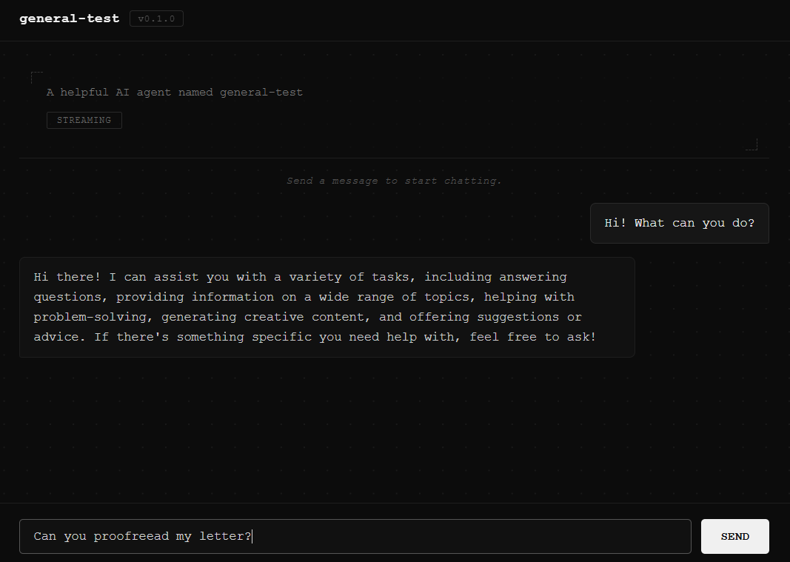

---
sidebar_position: 5
---

import Tabs from '@theme/Tabs';
import TabItem from '@theme/TabItem';

# Test the Agent locally

## Overview

After [creating a Warden Agent](create-a-new-agent), you can **run it locally** and interact with it using the CLI and other methods. The sections below explain how to do it.

## 1. Run the Agent

1. In a new terminal window, navigate to your Agent directory and compile TypeScript:

   ```bash
   npm run build
   ```

2. Now you can run the Agent:

   ```bash
   npm start
   ```
   
   Congratulations! Your Agent is available on `http://localhost:3000`. While it's running, you can interact with it as shown below.

   :::tip
   To stop the Agent, press CTRL+C. Don't forget to rebuild it each time you update the code.
   :::

## 2. Interact with the Agent

### Chat using the UI

The fastest way to make sure your Agent is running opening the local host URL:

```text
http://localhost:3000
```

If everything is fine, you'll be able to chat with your Agent through the **user interface** provided by Warden Code:



### Chat using the CLI

- /build -> /chat
- /chat + URL

### Chat using the API

Every new Agent is immediately accessible through **A2A** and **LangGraph** server endpoints exposed by Warden Code.

:::tip
For a full list, see [A2A endpoints](../developer-tools/warden-code#a2a-endpoints) and [LangGraph endpoints](../developer-tools/warden-code#langgraph-endpoints).
:::

After running your Agent, you can try any of these endpoints locally. For example, you can prompt the Agent using the [A2A POST endpoint](../developer-tools/warden-code#post-methods) with the `send` method.

In the request below, replace `AGENT_API_KEY` with your Agent API key for [authentication](../developer-tools/warden-code#authentication), which you can find in the `.env` file:

<Tabs>
<TabItem value="postman" label="Postman" default>
**POST** `http://localhost:3000`  
**Headers**: `Content-Type`: `application/json`  
**Authorization**: Type: Bearer Token, Token: `AGENT_API_KEY`  
**Body**:

```json
{
  "jsonrpc": "2.0",
  "id": "",
  "method": "message/send",
  "params": {
    "message": {
      "role": "user",
      "parts": [
        {
          "kind": "text",
          "text": "What can you do?"
        }
      ],
      "messageId": ""
    },
    "thread": {
      "threadId": ""
    }
  }
}
``` 
</TabItem>
<TabItem value="curl" label="cURL" default>

```bash
curl http://localhost:3000 \
  --request POST \
  --header 'Content-Type: application/json' \
  --header 'Authorization: Bearer AGENT_API_KEY' \
  --data '{
    "jsonrpc": "2.0",
    "id": "",
    "method": "message/send",
    "params": {
      "message": {
        "role": "user",
        "parts": [
          {
            "kind": "text",
            "text": "What can you do?"
          }
        ],
        "messageId": ""
      },
      "thread": {
        "threadId": ""
      }
    }
  }'
```
</TabItem>    
</Tabs>

If everything is fine, you'll receive a response including your prompt, assistant's reply, and other data:

```json
{
    "jsonrpc": "2.0",
    "result": {
        "id": "task-2",
        "context_id": "da79d131-143c-4154-b617-c25945774648",
        "status": {
            "state": "completed",
            "timestamp": "2026-02-09T08:03:07.107Z"
        },
        "kind": "task",
        "history": [
            {
                "role": "user",
                "parts": [
                    {
                        "kind": "text",
                        "text": "What can you do?"
                    }
                ],
                "messageId": "",
                "kind": "message",
                "message_id": "5646cc50-ae72-40a9-87e6-99477e050a4f"
            },
            {
                "role": "agent",
                "parts": [
                    {
                        "kind": "text",
                        "text": "I can assist with a variety of tasks, including but not limited to:\n\n1. Answering questions and providing information on a wide range of topics.\n2. Assisting with problem-solving and brainstorming ideas.\n3. Offering writing support, including proofreading, editing, and generating text.\n4. Providing summaries and explanations of complex concepts.\n5. Helping with language translation and learning.\n6. Offering recommendations for resources, books, or tools.\n7. Engaging in casual conversation and providing companionship.\n\nIf you have a specific request or need assistance with something else, feel free to ask!"
                    }
                ],
                "kind": "message",
                "message_id": "d187905d-2ded-41e5-87ae-db02ee011d88"
            }
        ]
    },
    "id": ""
}
```

### Check the Agent Card

As part of the A2A protocol support, Warden Code exposes an endpoint for the **A2A Agent Card**, which advertises your Agent's skills. It allows other Agents and clients to discover your Agent once you [publicly host it](../host-your-agent#check-the-agent-card).

To check the Agent Card accessibility, run this:
   
```text
http://localhost:3000/.well-known/agent-card.json
```
The card will display your Agent's name and capabilities, along with other information:

```json
{
    "name": "general-test",
    "description": "A helpful AI agent named general-test",
    "url": "http://localhost:3000",
    "version": "0.1.0",
    "capabilities": {
        "streaming": true,
        "multiTurn": false
    },
    "skills": [],
    "defaultInputModes": [
        "text"
    ],
    "defaultOutputModes": [
        "text"
    ]
}
```

:::tip
You can edit the Agent Card at any time. Use the [`/config`](implement-custom-logic#build-with-ai) command or update the card directly in `public/.well-known/agent-card.json`.
:::

## Next steps

After local testing, you can [host your Agent](../host-your-agent) to make it publicly available.
