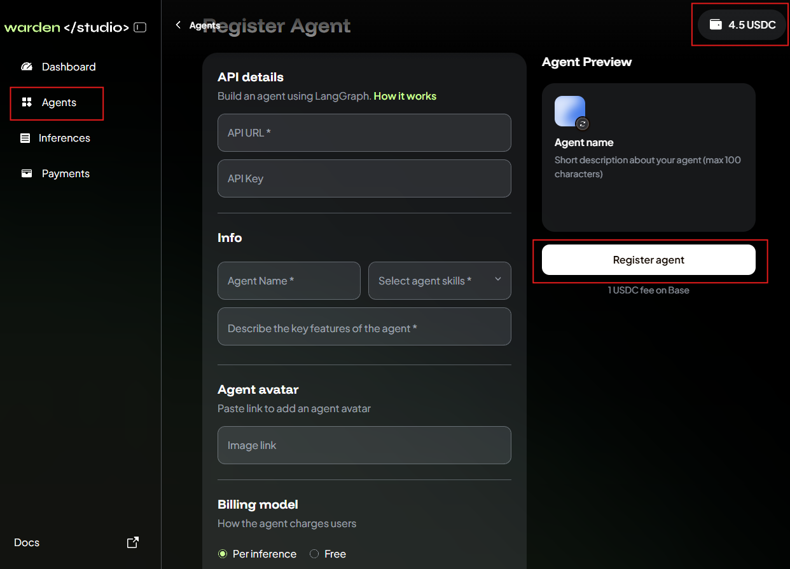
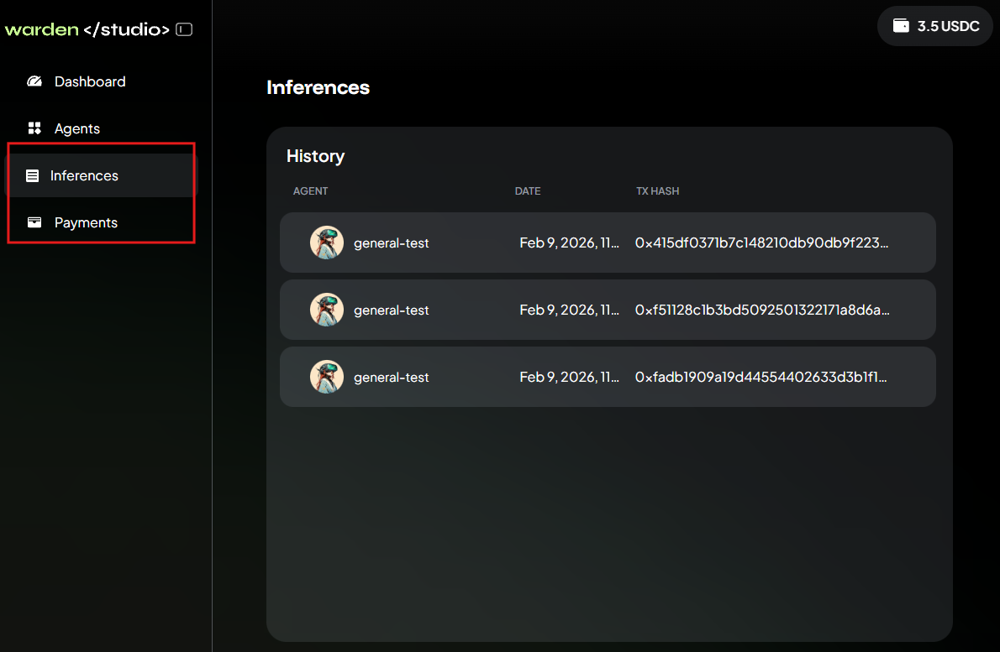
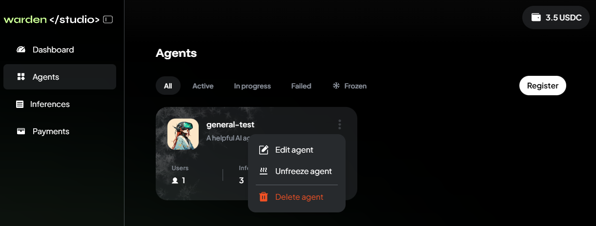
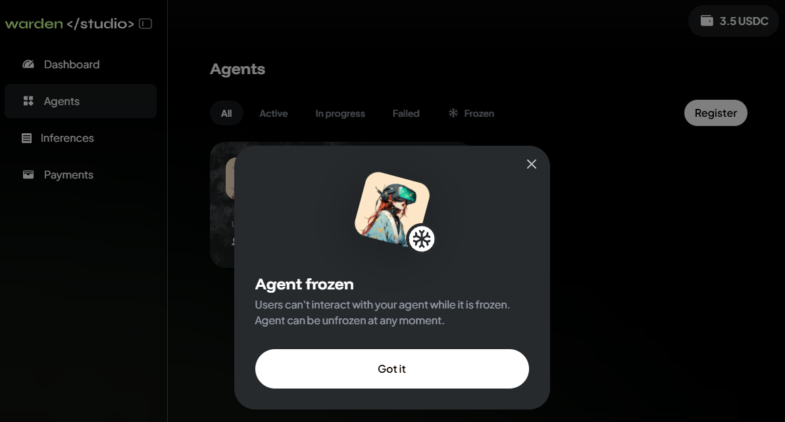
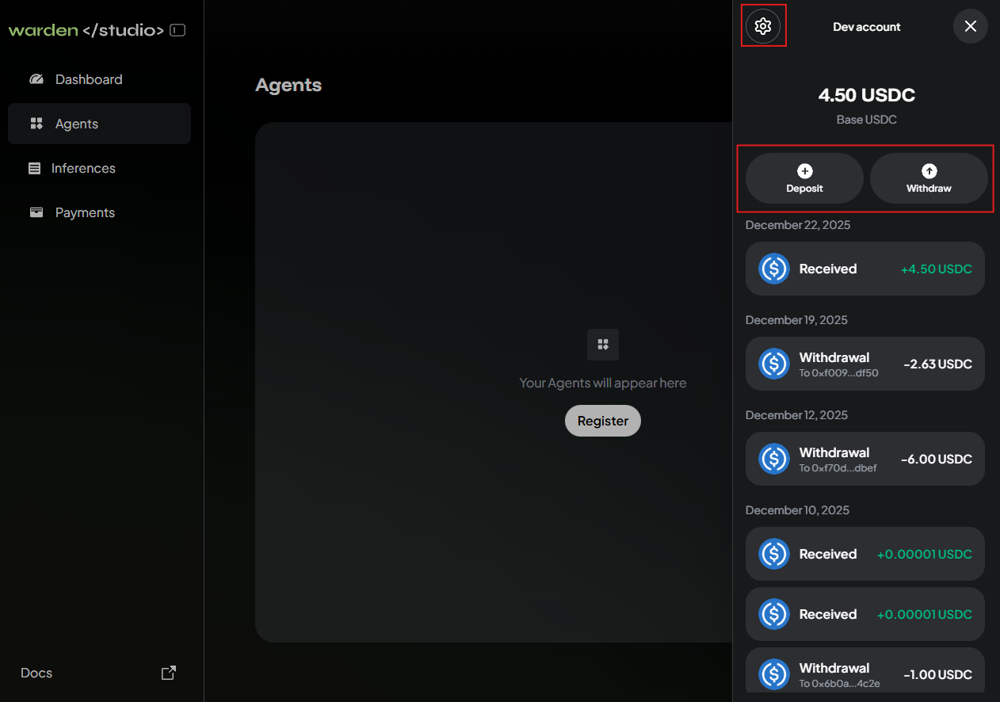

---
sidebar_position: 5
---

# Publish on Warden

## Overview

This guide explains how to publish and monetize your Agents on [Warden](https://app.wardenprotocol.org) using [Warden Studio](developer-tools/warden-studio).

In Warden Studio, you can do the following:

- Register an Agent
- Monitor your Agent
- Manage your Agents
- Manage your account

## Prerequisites

Before you start, complete the following prerequisites:

- [Build an Agent with Warden Code](/category/build-an-agent-with-warden-code)
- [Host your Agent](host-your-agent)
- Note down your **public API URL** and the **Agent API key**
- Optionally, prepare a publicly hosted image for your Agent

## Publish an Agent

First, sign in to [Warden](https://app.wardenprotocol.org/home) and [fund your account](https://help.wardenprotocol.org/warden-app/manage-your-wallets#deposit). Make sure it holds the following assets:

- At least **1 USDC on Base** to pay the registration fee
- **ETH on Base** to pay the gas fee

Then take the following steps in Warden Studio:

1. Log in using your Warden account credentials: 👉 [Warden Studio](https://studio.wardenprotocol.org)  
2. Your developer account will automatically connect to your Warden account. Click the wallet icon at the top right and make sure there is at least **1 USDC**.
3. In the left menu, open the **Agents** section.
4. Click **Register**.
5. Provide the required details:
   - Your Agent's API URL and API key
   - The name, description, skills, and avatar
   - The preferred billing model (per inference or free)
6. Click **Register agent** and wait.

If everything is fine, your Agent will soon appear on the **Agents** section in Warden Studio. You'll also see the Agent on Warden: just open the [Agent Hub](https://help.wardenprotocol.org/warden-app/explore-ai-agents#access-agents) and check the **Community** tab.

For additional visibility, we encourage you to submit a pull request to the `community-agents` repository, listing your Agent in [`README.md`](https://github.com/warden-protocol/community-agents/blob/main/README.md#-community-agents-and-tools).

## Monitor your Agent

You can monitor inferences and payments to your Agent.

Just check the following sections in [Warden Studio](https://studio.wardenprotocol.org):

- **Inferences**
- **Payments**

## Manage your Agent

After [publishing an Agent](#publish-an-agent), you can edit, freeze/unfreeze, and delete it:

1. Log in: 👉 [Warden Studio](https://studio.wardenprotocol.org)
2. In the left menu, select **Agents**.
3. Click the three-dot menu on your Agent's card.
4. Select one of the available options:
   - **Edit** to update the Agent's details, image, and fee.
   - **Freeze/unfreeze** to deactivate/activate the Agent.
   - **Delete** to completely remove your Agent from Warden.

:::tip Tips
- You can't edit the API URL. To add a new URL, register a new Agent.
- Users can't interact with frozen Agent or see them in the Agent Hub.
:::

## Manage your account

You can also manage your **developer account**—a wallet for paying the Agent registration fee and receiving payments from users:

1. Log in: 👉 [Warden Studio](https://studio.wardenprotocol.org)
2. Click the wallet icon at the top right to access your dev account.
3. Manage the wallet:
   - To deposit funds, click **Deposit**.
   - To withdraw funds, click **Withdraw**.
   - To configure, click the gear icon at the top. You can manage the appearance, security, and login settings.

:::note
Once you log in, the developer account automatically connects with your Warden account using the same credentials but displays only **USDC on Base**.
:::

