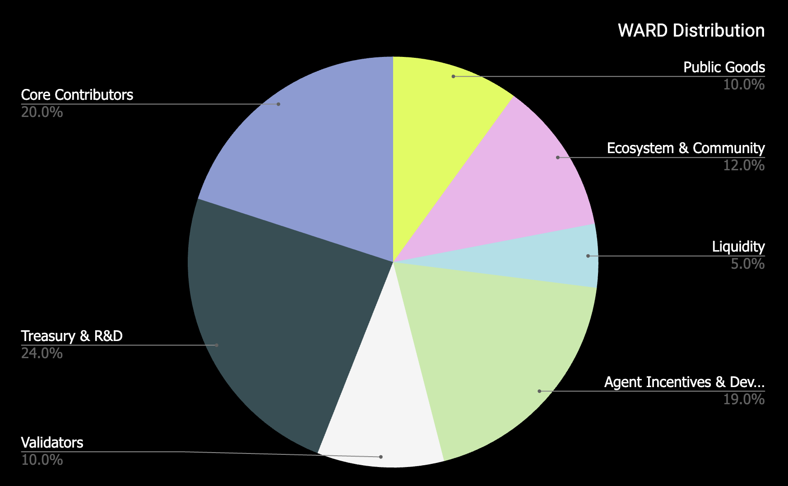
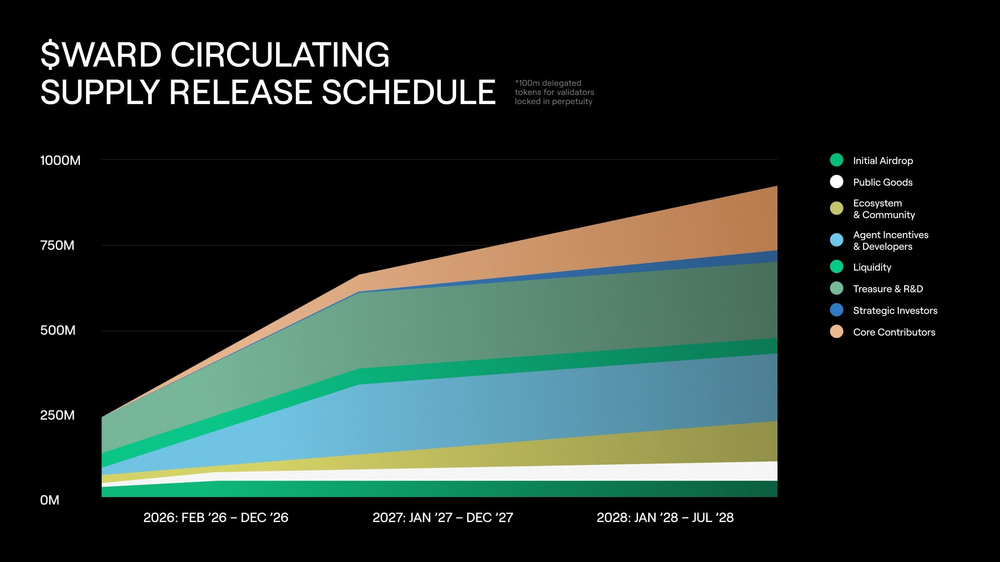

---
sidebar_position: 3
---

# $WARD

## 개요

**$WARD**는 Warden Protocol 생태계의 네이티브 유틸리티 토큰으로, Warden Chain과 [Warden](https://wardenprotocol.org/)의 중심에 위치합니다.

$WARD는 거버넌스, 스테이킹, 보상과 같은 다양한 운영을 용이하게 하고, Warden에 에이전트(Agent)를 배포하는 개발자를 위한 결제 수단으로 사용되도록 설계되었습니다. Warden에서는 가스 추상화 토큰으로 작동하며, 향후 구독 계층을 포함한 제한 기능을 잠금 해제하는 역할도 합니다.

| 속성 | 세부 내용 |
| --- | --- |
| 토큰 | WARD |
| 초기 총 공급량 | 1,000,000,000 WARD |
| 소수점 자리수 | 6 |

## 에어드롭 단계

### 1단계

$WARD 일부 에어드롭을 위한 첫 스냅샷이 Warden 테스트넷 참가자, WARP 보유자, 그리고 기타 생태계 사용자를 대상으로 완료되었습니다. 이는 $WARD 에어드롭에 접근할 수 있는 다양한 잠재적 방법 중 첫 번째 단계에 불과합니다.

**후속 단계**에서는 최종 테스트넷 **Docas** 참가자와 Warden 사용자를 포함할 예정입니다.

### 2단계

이 글을 보고 있다면, 이미 시작된 것입니다. 힌트: Warden.

우리의 핵심 원칙은 **개발자와 실제 사용자를 보상**하는 것입니다.

Sybil 농부 주의. 당신은 제거될 것입니다.

## 수요

### 수요 동인

Warden Protocol은 $WARD의 공급과 수요 사이에 지속 가능한 균형을 만드는 것을 목표로 합니다. $WARD 수요를 촉진하기 위해, 생태계에는 여러 내재적 수요 동인이 구축될 예정입니다:

### 수수료

- **거래 수수료(Transaction fees)**: $WARD는 Warden Chain과 Warden 모두에서 주요 가스/수수료 토큰으로 사용됩니다.
- **에이전트 수수료(Agent fees)**: $WARD는 Warden Agent Hub에서 제한/프리미엄 에이전트를 잠금 해제하는 통화로 사용됩니다.
- **앱 구독(App subscriptions)**: $WARD 스테이크를 보유하거나 월별 $WARD 구독을 통해 Warden의 프리미엄 버전을 이용할 수 있습니다.
- **에이전트 배포 수수료(Publish an Agent fee)**: 제3자가 Warden에 자신의 에이전트를 배포하려면, 즉시 온체인 신원과 지갑을 제공받기 위해 $WARD로 고정 수수료를 지불해야 합니다.
- **서비스로서의 검증(Verification as a service)**: 모든 모델의 검증 서비스는 $WARD로 결제됩니다.
- **가스 추상화(Gas abstraction)**: $WARD는 Warden 생태계에서 가스 결제의 범용 토큰이 됩니다.
- **운영자 채권(Operator bonds)**: 특정 서비스 운영자는 $WARD를 채권으로 걸어야 하며, 이는 유통 공급량을 줄이고 프로토콜의 집단적 보안과 안정성을 강화합니다.
- **거버넌스(Governance)**: $WARD는 커뮤니티 거버넌스 이니셔티브에 사용되어, Warden에서 의미 있는 지분의 지속적인 필요를 창출합니다.

### 검증자 채권(Validator bonds)

Warden Chain에서 검증자를 운영하려면, 검증자는 $WARD의 의미 있는 지분을 보유해야 합니다.

## 배포(Distribution)

### 주요 특징

$WARD 배포는 다음과 같은 특징을 갖습니다:

- **공정 출시 메커니즘(Fair launch mechanism)**: WARD 토큰 배포는 공정 출시 메커니즘을 채택합니다. 이 접근 방식은 토큰의 폭넓고 공평한 분배를 보장하며, 시장 조작을 방지하고 이해관계자 및 커뮤니티 거버넌스의 빠른 확산을 가능하게 합니다.
- **활성 사용자 및 지지자 우선순위(Prioritization of active users and supporters)**: Warden 생태계 내 애플리케이션이나 인프라의 활성 사용자는 지속적인 지원을 인정받으며, Warden Protocol이 출시될 수 있는 기반과 문화를 구축하는 데 기여한 기타 적격 프로토콜과 플랫폼도 포함됩니다.

### WARD 주요 배포

**10억 WARD (1B WARD)**

### 배포 설명

| 카테고리 | % | 설명 | 유통(Circulating) |
| --- | --- | --- | --- |
| 공공재(Public goods) | 10% | 인센티브 테스트넷과 제네시스 에어드롭, 지속적인 공공재 프로젝트 | 제네시스 시 1,940만 WARD 제공, 초기 6개월 동안 6,400만으로 가속 베스팅, 30개월 내 1억 WARD 완전 베스팅 |
| 생태계 및 커뮤니티(Ecosystem & community) | 12% | Warden Protocol 생태계와 커뮤니티 프로젝트에 기여하는 이니셔티브에 할당 | 제네시스 시 2,000만 WARD, 30개월 동안 선형 베스팅 |
| 유동성(Liquidity) | 5% | 상장일 거래소 유동성 제공 | 제네시스 시 제공 |
| 에이전트 인센티브 & 개발자(Agent incentives & developers) | 19% | 에이전트, 개발자 및 기타 빌더 인센티브 | 제네시스 시 2,000만 WARD, 12개월 동안 선형 베스팅 |
| 검증자 및 운영자(Validators and operators) | 10% | 메인넷 검증자 및 운영자에게 초기 배정 | 위임되지만 영구 잠금 |
| 재무 & 연구개발(Treasury & R&D) | 24% | 장기 재무 및 연구 프로그램 | 제네시스 시 1억 2,000만 WARD 제공, 12개월 동안 선형 베스팅 |
| 핵심 기여자(Core contributors) | 20% | 개발 팀, 자문, 초기 기여자용 예약 | 6개월 클리프, 2년 선형 베스팅 |

### 출시 일정(Release schedule)

## 공급(Supply)

### $WARD 공급 세부 정보

| 속성 | 세부 내용 |
| --- | --- |
| 토큰 | WARD |
| 초기 총 공급량 | 1,000,000,000 WARD |
| 소수점 자리수 | 6 |

### $WARD 발행(Emissions)

메인넷 출시 시, Proof-of-Authority(권위 증명) 체계 하에서는 토큰 발행이 없습니다.

Proof-of-Stake(지분 증명) 체계로 전환되면, $WARD 토큰의 **발행(emission)**이 시작되며, 총 공급량 대비 스테이킹된 $WARD 비율에 따라 프로그램적으로 발행됩니다. 이는 사전 설정된 매개변수를 기반으로 작동합니다:

| 매개변수(Parameter) | 값(Value) |
| --- | --- |
| 초기 발행(Initial issuance) | 8% |
| 최대 연간 발행(Maximum annual issuance) | 10% |
| 최소 연간 발행(Minimum annual issuance) | 1% |
| 목표 스테이킹 비율(Target $WARD staked) | 65% |
| 인플레이션 변화율(Inflation rate of change) | 100% |

### 발행률(Issuance rate)

Warden Protocol은 실제 스테이킹 비율을 목표치와 비교하여 $WARD **발행률**을 조정합니다:

- **목표치 미만 스테이킹(Below target staking)**: 스테이킹된 $WARD 비율이 목표치 65%보다 낮으면, 발행률이 점진적으로 증가합니다. 이 조정은 최대 10%에 도달하거나 스테이킹 목표가 달성될 때까지 계속됩니다.
- **목표치 스테이킹(At target staking)**: 스테이킹 비율이 목표치 65%와 일치하면, 현재 발행률은 변하지 않습니다.
- **목표치 초과 스테이킹(Above target staking)**: 스테이킹된 $WARD 비율이 목표치 65%보다 높으면, 발행률이 점진적으로 감소합니다. 이 조정은 최소 1%에 도달하거나 스테이킹 목표가 달성될 때까지 계속됩니다.

### 변화율(Rate of change)

$WARD 발행이 연간 동안 적응하는 **변화율**은 다음 공식으로 계산됩니다:

- `[1 - (현재 스테이킹 비율 / 스테이킹 목표)] x 인플레이션 변화율`

### 소각(Burns)

$WARD 토큰은 프로토콜 수수료에서 3% 커뮤니티 세금을 프로그램적으로 소각하여, 프로토콜 성장에 따라 공급을 줄입니다.
