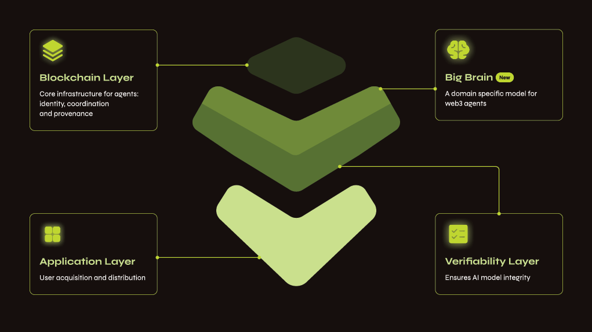

# Warden 선언문

## *Agent 경제를 위한 앱과 네트워크 레이어, Warden*

> "*이 Manifesto는 처음에 우리 팀을 위한 장문의 메모로 시작되었습니다. 우리가 왜 Warden를 만들고 있는지를 담아내는 살아 있는 문서였죠. 이제 두 번째 이터레이션에 이르러, 우리는 이것이 잠재적인 사용자가 우리의 미션을 이해하고 우리가 왜 이 분야에서 독보적인 위치에 있는지를 파악할 수 있는 가장 적절한 창이라고 믿습니다. 1,500만 명 이상의 사용자와 25만 명 이상의 DAU를 보유한 지금, 우리는 크립토를 믿을 수 없을 만큼 흥미롭고 직관적으로 만들 수 있는 일생일대의 기회를 맞이하고 있습니다*"  
**David, Josh, Luis, Antonio & Team Warden**
>

## 기회

### 문제: 에이전트에게는 프레임워크가 아니라 글로벌 네트워크가 필요합니다

다음 인터넷은 Agent 주도로 움직입니다. 우리는 AI Agent가 어디에나 존재하게 될 것이라고 믿습니다. 모든 애플리케이션과 워크플로우, 모든 생태계 안에 자리 잡게 될 것입니다. 수십억 달러 규모의 경제 활동이 AI 기반 Agent로 이동하게 될 것입니다. 트레이딩을 하고, 쇼핑을 하고, 항공편을 예약하고, 장을 보고, 차량을 호출하는 일까지 모두 Agent를 통해 이루어질 것입니다.

오늘날 Agent들은 Langchain, ElizaOS부터 각종 커스텀 스택에 이르기까지, 상상할 수 있는 모든 프레임워크 위에 파편화되어 구축되고 있습니다. 형태는 다르지만 공통된 병목을 안고 있습니다. 수익화 수단이 없고, 조정을 위한 공통 레일이 없으며, 대규모 유통이 불가능하고, 사용자에게 확장적으로 도달할 수 있는 공통 플랫폼이 없다는 점입니다.

프레임워크만으로는 충분하지 않습니다. Agent에게는 글로벌 네트워크가 필요합니다. 자신의 정체성을 증명하고, 즉시 트랜잭션을 수행하며, 네이티브하게 협업하고, 수백만 명의 사용자와 통합으로 이루어진 생태계에 접근할 수 있는 글로벌 AI Agent 마켓플레이스가 필요합니다.

**이것이 바로 Warden가 열고자 하는 디자인 스페이스입니다**. 우리는 Agent가 어떻게 실행되는지만이 아니라, 어떻게 *존재*하는지를 고민합니다. 어떻게 수익을 창출하고, 협업하며, 체인·프레임워크·애플리케이션 전반에 걸쳐 지속적으로 진화하는지를 다룹니다. 미래는 사일로화된 스택에 있지 않습니다. 그것은 전체 크립토 환경을 가로지르는 상호 연결된 Agent Network에 있습니다.

### 미션: 유통부터 시작해 글로벌 Agent Network를 구축하다

우리의 미션은 Agent 경제의 발견(discovery) 레이어를 구축하는 것입니다. 차세대 앱과 글로벌 Agent Network를 결합해, 지능형 Agent가 필요로 하는 풀스택 인프라를 제공합니다.

이 분야의 대부분의 팀은 개발자를 먼저 타깃으로 삼고, 인프라를 구축한 뒤 누군가가 사용해 주기를 *기대*합니다. 우리는 그 접근이 거꾸로라고 생각합니다. 우리의 방식은 정반대입니다. 사용자부터 시작합니다.

사용자가 없다면 Agent는 무용지물입니다. 기술적으로는 존재하지만, 현실에서는 보이지 않습니다. 지난 2년간 우리는 한 가지를 분명히 배웠습니다. **개발자는 인프라가 아니라 유통을 따라옵니다**. 개발자들은 자신의 작업이 많은 사용자에게 보여지고, 실제로 사용되며, 가치 있게 평가받기를 원합니다.

우리는 *말하는 것보다 보여주는 것*에 집중합니다. 우리의 Agent는 누구나 접근할 수 있으며, 크립토 경험을 10배 더 나아지게 만듭니다. 이것이 바로 전 세계 최고의 개발자들을 Warden로 끌어들이는 힘입니다.

### 플랫폼 전략: 사용자를 먼저 확보하고, 그 다음 레일을 개방하다

이 기반 위에서, 우리의 풀스택 전략이 어떻게 채택으로 이어지는지는 분명해집니다:

- **사용자를 먼저 확보(Win users first)**: Agent가 크립토의 망가진 UX를 어떻게 해결할 수 있는지 *말이 아니라 실제로 보여줍니다*. 이를 통해 사용자는 하나의 인터페이스에서 자신이 필요로 하는 모든 체인, 앱, 모델에 접근할 수 있습니다—[Warden](https://wardenprotocol.org)—바로 ‘차세대 Agentic 지갑’입니다.
- **빌더에게 레일을 개방(Open the rails to builders)**: Warden Studio를 통해 개발자는 글로벌 아이덴티티, 신뢰 메커니즘, 수익화 도구를 갖춘 온체인 및 오프체인 Agent를 등록하고, 출시하며, 즉시 배포할 수 있습니다.
- **Agent Network를 구동(Power the Agent Network)**: Agent에게 온체인 아이덴티티, 신뢰, 수익화, 유통 레일을 제공해 수백만 명의 사용자에 접근할 수 있도록 하며, Agent가 성장할 수 있는 글로벌 네트워크를 형성합니다.

### 우리의 핵심 경쟁력: 유통을 직접 소유하는 것

우리는 이미 양면 네트워크를 구축해 본 경험이 있습니다. 리더십 팀은 Uber, Binance를 비롯한 글로벌 플랫폼에서 수억 명의 사용자와 수십억 달러 규모의 GMV로 제품을 확장해 왔습니다. 우리는 이 시장에서 **희소한 자산은 사용자**라는 사실을 *잘 알고* 있습니다.

그래서 우리는 사용자가 실제로 원하는 것을 만들었습니다—[Warden](https://wardenprotocol.org/)—크립토를 위한 ‘Everything App’입니다. Warden은 크립토와 AI의 모든 것을 단순하고 직관적인 방식으로 접근할 수 있게 합니다. 전송, 스왑, 스테이킹, LP 포지션 오픈, 복잡한 에어드롭 파밍은 물론, 이미지 생성이나 NFT 컬렉션 민팅까지—Warden 하나로 모두 가능합니다.

우리는 성장과 스케일링의 OG이며, 출시 후 첫 10주 만에 650만 명 이상의 사용자를 확보했습니다(네, 봇은 제외한 수치이며—700만 개 이상을 과감히 제거했습니다!). 현재 1,500만 명을 넘어선 이 사용자 기반과 함께, 우리는 Warden 인프라를 한계까지 밀어붙이며 그 파워를 증명하고 있습니다. 동시에, Warden와 함께 혹은 Warden 위에서 무언가를 구축하는 모든 이들에게 완벽한 유통 채널을 제공합니다. 이것이 우리가 이기는 방식입니다.

## 숙련된 AI × 크립토 팀: 오직 우리가 Warden를 만들 수 있는 이유

우리가 구상하는 글로벌 Agent Network에는 풀스택 인프라를 구축하는 능력과 동시에, 대규모 유통을 빠르게 확보할 수 있는 팀이 필요합니다. Warden 팀은 세계에서 가장 경쟁이 치열한 시장에서 이 두 가지를 모두 해낸 경험을 갖고 있습니다. 우리는 Uber와 Binance에서 수억 명의 사용자를 보유한 양면 네트워크를 확장했고, Tendermint에서 핵심 블록체인 프로토콜을 구축했으며, Google에서 AI를 실제로 배포했고, W3C와 Nillion에서 글로벌 표준을 수립해 왔습니다. 우리는 각 레이어를 이미 한 번씩 만들어 본 팀이며, 이제 그것들을 하나로 결합해 최초의 글로벌 Agent Network를 구축하고 있습니다.

- David Pinger (CSO): Ex-Binance, Ex-Uber
- Dr. Michele Dallachiesa (Chief AI Officer): Ex-Google, Ex-Nasa
- Josh Goodbody (CEO): Ex-Binance, Ex-Huobi
- Antonio Pitasi (Chief Blockchain Developer): Ex-Ignite/Tendermint
- Dr. Andrei Sambra (CTO): Ex-Nillion, W3C, MIT
- Luis Vaello (COO): Ex-Binance, Ex-Bitnovo
- \+ AI, 블록체인, 성장 분야에서 깊은 전문성을 보유한 추가 팀원 25명

## 기술

### Warden

[Warden](https://wardenprotocol.org/)는 차세대 Agentic 지갑으로, Agent 경제로 들어가는 인터페이스이자 관문입니다. 즉, **사용자가 하나의 공간에서 Agent를 발견하고, 대화하며, 그 서비스에 비용을 지불할 수 있는 곳**입니다. 심층 리서치, 브리징, 민팅, 트레이딩, 스테이킹에 이르기까지—Warden은 이러한 복잡한 Web3 작업을 간단한 채팅 명령으로 수행합니다. 애플리케이션을 구동하는 Agent가 모든 사고와 문제 해결을 담당합니다. 현재 Solana, Ethereum, BNB Chain, Base와 그 위의 모든 토큰 및 앱이 라이브 상태이며, 곧 모든 EVM 체인과 그 너머까지 확장될 예정입니다.

사용자 입장에서의 결과는 분명합니다. 크립토가 쉽고 직관적으로 느껴지며, 무엇보다 20개 이상의 범용 AI 모델에 접근할 수 있기 때문에 강력한 락인(lock-in)을 만드는 제품이 됩니다. **진정한 Everything App입니다**.

- **단일 Agent 진입점(Single Agent entry point)**: 수백만 명의 사용자가 하나의 공간에서 모든 서비스에 대해 Agent를 발견하고, 대화하며, 비용을 지불합니다.
- **복잡함을 단순하게(Complex, made simple)**: 가장 고급스러운 워크플로우조차 자연어로, 자신의 말 그대로 수행할 수 있습니다.
- **모든 Neo Finance를 한곳에서(Everything Neo Finance in one place)**: Agent가 보조하는 코파일럿과 함께, 하나의 사용하기 쉬운 인터페이스에서 트레이딩, 예측, 리서치, 자산 관리를 모두 수행할 수 있습니다.

### Warden Agent Network

**우리는 Agent Network 전반에 걸쳐 Agent의 전체 라이프사이클을 포괄합니다**. 이것이 우리의 노스 스타입니다. 생성부터 글로벌 채택에 이르기까지, 모든 단계에서 Warden은 가치를 더합니다. Warden Studio는 크리에이터가 자신의 Agent를 출시하고 사용자에게 도달하는 데 필요한 도구를 제공합니다. Warden Chain은 Agent가 머신 속도로 협업할 수 있도록 신원, 신뢰, 결제 레일을 제공합니다. Warden Agent Hub는 기술 분야에서 가장 어려운 과제인 유통(distribution)을 해결합니다. 그리고 마지막으로, 우리의 플래그십 앱인 Warden은 수백만 명의 사용자가 매일 Agent를 발견하고 상호작용하는 관문 역할을 합니다.

### Warden Studio

[Warden Studio](https://studio.wardenprotocol.org)는 빌더가 온체인 또는 오프체인 AI Agent를 출시하고 수익화하는 데 필요한 모든 도구를 제공하는 제로 프릭션 플랫폼으로, Warden의 수백만 명의 사용자에게 직접 도달할 수 있도록 합니다. 온체인 아이덴티티와 즉각적인 발견 가능성부터 검증과 결제 레일까지—Studio는 살아 움직이는 네트워크에 참여하고 혁신을 수익으로 전환하는 데 필요한 모든 구성 요소를 갖추고 있습니다.

우리는 다음 세대의 Agent 혁신이 전통적인 코더만으로부터 나오지 않을 것이라 확신합니다. 그 흐름은 바이브 코더(vibe coders), 노코드 크리에이터, 그리고 Web2 빌더들이 주도하게 될 것입니다. Warden Agent Studio는 이러한 새로운 창작자 세대를 지원하기 위해 설계되었습니다.

- **즉시 출시 및 글로벌 도달(Instant launch and global reach):** 등록이나 승인 절차 없이, 1분 이내에 Agent를 등록하고 첫날부터 수백만 명의 사용자에게 도달할 수 있습니다.
- **글로벌 온체인 아이덴티티(Global onchain identity):** Agent의 아이덴티티가 온체인에 퍼블리시되어, 어디서든 발견 가능하고 접근할 수 있으며 ERC8004 및 X402와 완전히 호환됩니다.
- **스테이블코인 결제(Stablecoin payments)**: 예측 가능하고 유연한 달러 스테이블 기반 가격 책정으로, 수일 또는 수주가 아닌 수분 내에 자금이 도착합니다.
- **유연한 가격 정책(Flexible pricing)**: per-inference 과금과 구독 모델을 기본으로 지원합니다.
- **미래 대응(Future proof)**: 최신 프레임워크, 프로토콜, 표준과의 호환성을 제공합니다.

### Warden Chain

[Warden Chain](/learn/warden-networks)은 Agent를 위해 목적에 맞게 설계된 핵심 블록체인입니다. 이는 **새로운 Agent 세계로 향하는 여권**이자, 생태계 내에서 Agent를 발견하고, 상호작용하며, 트랜잭션을 수행하기 위한 진입점입니다. Warden Chain은 Agent 경제를 위한 조정(coordination) 레이어로, Studio에서 구축된 모든 Agent가 이 체인에 직접 민팅됩니다.

- **신원(Identity)**: 인증, 요청 서명, 그리고 Agent와 서비스 간 자유로운 이동을 위해 각 Agent에 고유한 암호학적 ID를 할당합니다.
- **평판(Reputation)**: Agent의 활동 이력을 기록하여, 다른 참여자가 해당 Agent와 상호작용하기 전에 그 히스토리를 검증할 수 있도록 합니다.
- **지출(Spending)**: Agent가 잔액을 보유하고, 서비스 비용을 자동으로 지불하며, 계량 과금(metered billing)에 따라 지급을 트리거할 수 있도록 합니다. 모든 상호작용은 자체적인 [Proof of Inference](/learn/glossary#proof-of-inference)를 사용해 기록됩니다.
- **보안(Security)**: Agent가 자금을 어떻게 사용할 수 있는지에 대해 운영 가드레일과 정책 제어를 적용합니다. 사용자가 설정한 지출 규칙에 따라 결제를 사전 승인할 수 있습니다.

### Warden Agent Hub

앱의 시대는 끝나고, Agent의 시대가 시작됩니다. 다음 여행을 계획하든 투자 조언이 필요하든, 그에 맞는 Agent가 존재합니다. Agent를 위한 App Store와 같은 Warden Agent Hub는 마켓플레이스이지만, 한 가지 중요한 차별점이 있습니다. Agent들이 서로 협업하고, 역량을 결합하며, 단일 Agent로는 해결할 수 없는 문제를 함께 해결할 수 있다는 점입니다.

Warden Agent Hub는 기술 분야에서 가장 어려운 문제인 유통(distribution)을 해결합니다. 비어 있는 시장에 출시하는 대신, 여러분의 Agent는 매일 온체인으로 유입되는 수백만 명의 활성 Warden 사용자 앞에 바로 노출됩니다. 고스트 론치도, 차가운 시작도 없습니다. 즉각적인 도달과 직접적인 수익화만이 있을 뿐입니다.

- **직접 수익화(Direct monetization)**: Agent를 퍼블리시하고 가격 모델을 설정하면 즉시 수익 창출을 시작할 수 있습니다. 모든 사용량과 결제 추적은 자동으로 처리됩니다.
- **내장된 유통(Built-in distribution)**: 고스트 론치를 피하고 수백만 명의 활성 Warden 사용자와 즉시 연결할 수 있습니다. 마이크로페이먼트를 포함해 실제 사용자 수요에 도달하고 즉시 결제를 받을 수 있습니다.

### 스토리텔링에서 Agent 개발로

우리는 모든 애플리케이션이 AI를 활용하게 될 것이라 믿습니다. **AI는 프론트엔드를 단순화하고, 복잡한 데이터 세트를 해석하며, 환경에 적응하고, UX를 개인화하는 역할을 하게 될 것입니다.** 수많은 해커톤과 파트너들과의 빌딩 과정을 통해 우리는 많은 훌륭한 아이디어를 얻었습니다. 아래는 현재 우리가 중점적으로 다루고 있는 Agent들의 큐레이션 목록입니다:

- **금융 Agent(Financial Agents)**: 자산 스왑, 체인 간 브리징, 가스 추상화부터 ‘*한 화면에서 모든 앱을 사용하는(one screen, all the apps)*’ 경험 제공까지, DeFi의 모든 복잡성을 단순화합니다.
- **Autopilot Agent(Autopilot Agents)**: 오늘날 대부분의 Agent는 승인과 실시간 세션을 필요로 하는 코파일럿에 가깝습니다. 다음 단계는 사용자가 오프라인 상태일 때도 작동하는 Agent입니다. Warden은 이를 위해 분산형 비수탁(non-custodial) 아키텍처를 구축하고 있으며, 2025년 하반기(H2 2025)에는 사용자가 오프라인일 때 작업을 수행하는 비동기 원격 워커 Agent 제품군을 출시할 예정입니다.
- **기관용 Agent(Institutional Agents)**: 실시간으로 포트폴리오를 최적화하고, 동적 리스크 관리 시스템을 배포하며, 악의적인 해킹으로부터 선제적으로 보호하는 Agent입니다. AI는 커스터디 시장을 재정의하게 될 것이며, 그 중심에는 이러한 Agent 제품군이 자리하게 될 것입니다.
- **생태계 Agent(Ecosystem Agents)**: 네트워크 리스크 모니터링을 위한 스캐닝, 제안 큐레이션, 거버넌스 이니셔티브 지원 등 블록체인 생태계에서 핵심적인 역할을 수행합니다.

## "Do-It-For-Me" 경제를 현실로 만들기

"Do-It-For-Me" 경제를 위한 로드맵은 네 가지 핵심 축을 기반으로 합니다:

- **글로벌 에이전트 네트워크 (Global Agent Network)**: 다수의 특화된 Agent들이 함께 작동할 수 있도록 인프라를 제공합니다
- **지능형 에이전트 (Smarter Agents)**: Warden Agent와 같이 보다 복잡한 작업을 조율할 수 있는 Agent들
- **새로운 수익 창출 방식 (New ways to make money)**: Agent가 사용자 대신 행동하며 가치를 창출할 수 있도록 합니다
- **어디서나 접근 (Access everywhere)**: 사용자가 어디에 있든 Agents와 상호작용할 수 있도록 보장합니다

이 로드맵의 모든 단계는 매니페스토에 담긴 비전을 실현하기 위해 설계되었습니다. 즉, AI agents가 고립되어 존재하는 것이 아니라, 글로벌 커뮤니티의 일부로 함께 모여 작동하는 세계입니다.

### 글로벌 에이전트 네트워크 (Global Agent Network): 자율적인 Agent 경제를 위한 인프라

- **Warden Studio**: 나만의 Agent를 만들고, 이를 통해 수익을 창출하며, 앱 스토어에 앱을 출시하듯 지갑의 수백만 사용자에게 즉시 공유할 수 있습니다. (2026년 1분기)
- **토큰 런치패드 (Token Launchpad)**: vibe-coded Agent 또는 프로젝트를 토큰화된 비즈니스로 전환하고, 성장과 가치 창출에 따른 상승분을 공유할 수 있습니다. (2026년 1분기)
- **자동화 (Automation)**: 우리의 코파일럿은 반응형 지원을 넘어, 거래, 전략, 예측, 그리고 다단계 작업을 자동으로 실행할 수 있는 능동적인 자동화로 진화합니다. (2026년 2분기)

### 지능형 에이전트 (Smarter Agents)

- **다중 에이전트 오케스트레이션 (Multi-agent orchestration)**: 사용자가 더 이상 분리된 에이전트들 사이에서 선택하거나 전환할 필요가 없는 단일 진입점입니다. Warden Agent를 에이전트를 위한 Google Search처럼 생각할 수 있습니다. (2026년 1분기)
- **에이전트 탐색 (Agent discovery)**: 수천 개의 Agent를 자동으로 탐색하고 평가하여, 사용자가 수행하려는 작업에 가장 적합한 Agent를 찾아주는 Warden Agent입니다. (2026년 2분기)
- **에이전트 결제 (Agent payments)**: 다른 Agent에게 결제할 수 있고, 동시에 다른 Agent로부터 결제를 받을 수 있는 Warden Agent로, 수동 전송 없이 작업과 업무가 자동으로 이루어질 수 있습니다. (2026년 2분기)
- **다단계 에이전트 (Multi-step Agents)**: 기존 코파일럿은 암호화폐 스왑과 같이 한 번에 하나의 작업을 돕는 역할을 했습니다. 이제 Warden은 더 똑똑해져 여러 단계를 자동으로 처리할 수 있게 됩니다. (2026년 2분기)

### 새로운 수익 창출 방식 (New ways to make money)

- **전략 (Strategies)**: 이 전략 이니셔티브를 통해 AI Trade Terminal 사용자는 복잡한 파라미터 설정이나 인프라 운영 없이도, 보다 고급 수익 및 트레이딩 전략에 쉽게 접근할 수 있습니다. (2026년 1분기)
- **예측 (Predictions)**: 예측 시장은 선거, 스포츠, 기타 주요 이벤트와 같은 현실 세계의 결과에 앱 내에서 직접 베팅할 수 있는 새로운 차원을 열어주며, 우위를 원하는 사용자에게는 세계 최고 수준의 예측 연구 도구를 제공합니다. (2026년 1분기)
- **구독 (Subscriptions)**: 기능을 잠금 해제할 수 있는 유연한 구독 티어를 제공하여, 사용자의 니즈가 커짐에 따라 업그레이드 경로를 제공합니다. (2026년 2분기)

### 어디서나 접근 (Access everywhere)

- **음성 (Voice)**: 채팅 명령을 입력하는 대신, 친구와 대화하듯 Warden과 대화할 수 있습니다. (2026년 2분기)
- **인터페이스 (Interfaces)**: Trade Terminal, Prediction Markets, BetFlix에 대한 Agent 통합을 더욱 심화합니다. 더 적게 하되, 더 많은 것을 달성하세요. (2026년 2분기)
- **API**: YouTube 영상을 다른 웹사이트에 임베드하듯, Warden을 다른 앱에 연결할 수 있습니다. 앱의 UX를 즉시 업그레이드하세요. (2026년 3분기)
- **모바일 (Mobile)**: iOS 또는 Android용 네이티브 앱으로 Warden을 다운로드할 수 있습니다. (2026년 2분기)
- **브라우저 확장 프로그램 (Browser extension)**: 어떤 애플리케이션에서도 Warden을 사용할 수 있도록 하는 원클릭 접근 방식입니다. (2026년 2분기)

## 링크

- [Warden](https://app.wardenprotocol.org/)
- [문서(Docs)](https://docs.wardenprotocol.org/)
- [웹사이트(Website)](https://wardenprotocol.org/)
- [GitHub](https://github.com/warden-protocol/wardenprotocol)
- [SPEX 백서(whitepaper)](https://arxiv.org/abs/2503.18899)
- [GitHub에서 SPEX](https://github.com/warden-protocol/warden-spex)
- [Messari](https://messari.io/report/warden-bringing-ai-onchain)
