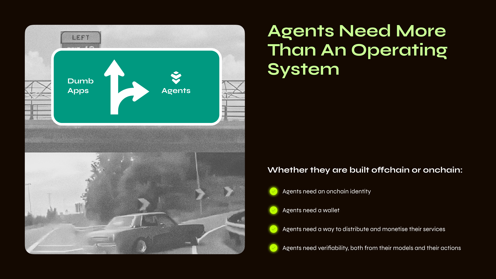

# Warden 선언문

## *Warden—에이전트 경제를 위한 네트워크*

> "이 선언문은 처음에 우리 팀을 위한 장문의 메모로 시작되었습니다. Warden을 구축하는 이유를 담은 지속적인 문서였죠. 이번 두 번째 버전에서는, 잠재 사용자나 투자자가 우리의 미션과 우리가 독보적으로 성공할 수 있는 이유를 이해할 수 있는 이상적인 창이라고 믿습니다. 650만 명 이상의 사용자와 35만 명 이상의 일일 활성 사용자를 보유한 우리는 암호화폐를 믿을 수 없을 만큼 흥미롭고 직관적으로 만들 수 있는 일생일대의 기회를 가지고 있습니다."—David, Josh, Luis, Antonio & Warden 팀
>

## 기회

### 문제: 에이전트는 단순한 프레임워크가 아닌 글로벌 네트워크가 필요하다

다음 인터넷은 에이전트 중심이 될 것입니다. 우리는 AI 에이전트가 어디에나 존재하게 될 것이라고 믿습니다. 에이전트는 모든 애플리케이션, 워크플로, 생태계 안에 존재할 것입니다. 수십억 달러 규모의 경제 활동이 AI 기반 에이전트로 이동할 것입니다. 거래를 하고, 쇼핑을 하고, 항공편을 예약하고, 장을 보고, 차량 호출을 모두 에이전트를 통해 수행하게 될 것입니다.

오늘날 에이전트들은 분산되어 있으며 모든 가능한 프레임워크에서 개발되고 있습니다—Langchain, ElizaOS부터 맞춤형 스택까지. 차이점에도 불구하고, 이들은 모두 동일한 병목 현상을 겪고 있습니다: 수익화 방법 없음, 조정을 위한 공통 레일 없음, 대규모 배포 불가, 사용자에게 도달할 공통 플랫폼 없음.

단순히 프레임워크만으로는 충분하지 않습니다. 에이전트는 글로벌 네트워크가 필요합니다. 자신의 신원을 증명하고, 즉시 거래하며, 네이티브 방식으로 협업하고, 수백만 사용자와 통합된 생태계에 접근할 수 있는 글로벌 AI 에이전트 마켓플레이스가 필요합니다.

**이것이 Warden에서 우리가 열고자 하는 설계 공간입니다**. 우리는 단순히 에이전트가 어떻게 작동하는지뿐만 아니라, 에이전트가 *어떻게 살아가는지*—어떻게 수익을 창출하고, 협업하며, 체인, 프레임워크, 애플리케이션 전반에서 지속적으로 개선되는지—까지 고민합니다. 미래는 고립된 스택에 있는 것이 아니라, 전체 암호화폐 생태계를 아우르는 상호 연결된 에이전트 네트워크에 있습니다.

### 미션: 배포에서 시작하여 글로벌 에이전트 네트워크 구축

우리의 미션은 단순합니다: **글로벌 에이전트 네트워크 구축**—에이전트 경제를 위한 풀스택 기반을 만드는 것입니다.

이 분야의 대부분 팀은 개발자를 대상으로 인프라를 구축하고, *누군가 사용해주길* 바라면서 시작합니다. 우리는 이것이 잘못된 접근이라고 생각합니다. 우리는 반대 접근을 취합니다: 사용자부터 시작합니다.

사용자가 없으면 에이전트는 쓸모가 없습니다. 기술적으로 존재하더라도 실제로는 보이지 않게 됩니다. 지난 16개월 동안 우리는 배웠습니다: **개발자는 인프라가 아니라 배포를 따른다**는 것을. 그들은 자신의 작업이 많은 사용자에게 보여지고, 사용되며, 가치 있게 여겨지기를 원합니다.

우리는 *말하기보다 보여주기*에 집중합니다. 우리의 에이전트는 누구나 접근할 수 있으며, 암호화폐 경험을 10배 더 좋게 만듭니다. 이것이 전 세계 최고의 개발자들이 Warden으로 모이게 만드는 원동력이 됩니다.

### 플랫폼 전략: 사용자를 확보하고, 그 다음 레일을 개방

이 기반 위에서 우리의 풀스택 전략 채택 방식이 명확해집니다:

- **먼저 사용자를 확보(Win users first)**: 에이전트가 깨진 암호화폐 UX를 어떻게 해결할 수 있는지 보여줍니다 (*단순히 말하는 것이 아니라 보여주기*). 이를 통해 사용자는 단일 인터페이스에서 모든 체인, 앱, 모델에 접근할 수 있으며—진정한 AI 기반 암호화폐 만능 앱을 제공합니다.
- **개발자를 위해 레일 개방(Open the rails to builders)**: 큰 규모의 참여 사용자 기반을 확보한 후, Warden Studio를 개방합니다: 에이전트를 만드는 허브입니다. 개발자는 여기서 신원, 지갑 접근, 신뢰 메커니즘, 수익화 도구를 갖춘 온체인 또는 오프체인 에이전트를 구축하고 배포할 수 있습니다. 사용된 프레임워크와 관계없이, 이 에이전트들은 즉시 우리의 네트워크에 연결될 수 있습니다.
- **에이전트 네트워크 활성화(Power the Agent network)**: 에이전트에게 온체인 신원, 신뢰, 수익화, 배포 레일을 제공하여 수백만 사용자가 접근할 수 있게 합니다—에이전트가 번영하는 데 필요한 글로벌 네트워크를 구축하는 것입니다.

### 우리의 비밀 무기: 배포를 장악하다

우리는 이전에도 양면 네트워크를 구축한 경험이 있습니다. 우리 리더십 팀은 Uber, Binance, 그리고 기타 글로벌 플랫폼에서 제품을 수억 명의 사용자와 수십억 달러 규모의 GMV로 확장한 경험이 있습니다. 우리는 이 시장에서 사용자가 가장 희소한 자원임을 *잘 알고* 있습니다.

그래서 우리는 사용자가 원하는 것을 만들었습니다—[Warden](https://wardenprotocol.org/)—암호화폐용 "만능 앱(Everything App)"입니다. 이 앱은 사용자가 암호화폐와 AI의 모든 기능을 직관적이고 간단하게 접근할 수 있도록 해줍니다. 송금, 스왑, 스테이킹, LP 포지션 개설, 복잡한 에어드롭 파밍, 이미지 생성, NFT 컬렉션 민팅 등 무엇이든 Warden이 지원합니다.

우리는 성장과 확장의 OG입니다. 출시 후 첫 10주 만에 650만 명 이상의 사용자를 확보했습니다 (네, 봇은 제외—총 700만 이상을 제어했습니다!). 이 증가하는 사용자 기반과 함께 우리는 Warden의 인프라를 한계까지 밀어내며 그 성능을 보여주고, Warden에서 혹은 Warden과 함께 개발하는 누구에게나 완벽한 배포 채널을 제공합니다. 이것이 우리가 승리하는 방식입니다.

## 숙련된 AI x 암호화폐 팀: 왜 우리만 Warden을 구축할 수 있는가

우리가 구상하는 글로벌 에이전트 네트워크는 풀스택 인프라를 구축하고, 대규모 배포를 빠르게 성공시킬 수 있는 팀이 필요합니다. Warden 팀은 지구상에서 가장 어려운 시장에서도 두 가지를 모두 수행한 경험이 있습니다. 우리는 Uber와 Binance에서 양면 네트워크를 수억 명의 사용자로 확장했으며, Tendermint에서 핵심 블록체인 프로토콜을 구축하고, Google에서 AI를 배포했으며, W3C와 Nillion에서 글로벌 표준을 설정했습니다. 각 계층을 이전에 구축한 경험을 바탕으로, 이제 이를 결합하여 최초의 글로벌 에이전트 네트워크를 만들고 있습니다.

- David Pinger (CEO): 전 Binance, 전 Uber
- Dr. Michele Dallachiesa (Chief AI Officer): 전 Google, 전 NASA
- Josh Goodbody (Executive Chairman): 전 Binance, 전 Huobi
- Antonio Pitasi (Chief Blockchain Developer): 전 Ignite/Tendermint
- Dr. Andrei Sambra (CTO): 전 Nillion, W3C, MIT
- Luis Vaello (COO): 전 Binance, 전 Bitnovo
- \+ AI, 블록체인, 성장 분야의 전문성을 가진 추가 25명 팀원

## 기술

### 에이전트 네트워크

우리는 에이전트 네트워크에서 에이전트의 전체 라이프사이클을 포착합니다. 이것이 우리의 북극성입니다: 생성에서 글로벌 채택에 이르기까지, 모든 단계에서 Warden은 가치를 더합니다. Warden Studio는 창작자에게 자신의 에이전트를 개발하고 출시하는 데 필요한 도구를 제공합니다. Warden Chain은 에이전트에 신원, 신뢰, 결제 레일을 제공하여 기계 속도로 협업할 수 있게 합니다. Warden Agent Hub는 기술에서 가장 어려운 과제인 배포 문제를 해결합니다. 마지막으로, Warden 우리의 플래그십 앱은 전면 창구로서 수백만 명의 사용자가 매일 에이전트를 발견하고 상호작용하는 곳입니다.

### Warden Studio

현재 알파 버전으로 제공되는 Warden Studio는 개발자가 에이전트를 온체인 또는 오프체인으로 개발, 테스트, 배포할 수 있는 모든 도구를 제공하며, 이를 Warden의 수백만 사용자에게 직접 제공할 수 있습니다. 분산형 검증 가능한 추론부터 도메인 특화 대형 언어 모델, 검증 시스템, 프리미티브까지, Studio에는 차세대 자율 에이전트를 위한 모든 구성 요소가 포함되어 있습니다.

우리는 차세대 에이전트 혁신이 전통적인 코더만으로 이루어지지 않을 것이라고 확신합니다—이것은 바이브 코더, 노코드 창작자, Web2 빌더가 주도할 것입니다. Warden Agent Studio는 이러한 새로운 창작자 세대를 지원하도록 설계될 것입니다.

- **에이전트 생성 툴킷(Agent creation toolkit)**: 온체인 또는 오프체인 에이전트를 개발, 테스트, 배포합니다.
- **즉시 배포(Instant distribution)**: 수백만 명의 활성 Warden 사용자에게 바로 배포합니다.
- **창작자 친화적(Flexible for creators)**: Web3 개발자, 노코드 창작자, Web2 빌더를 위해 설계되었습니다.

### Warden Chain

Warden Chain은 에이전트를 위해 설계된 기본 블록체인입니다. 이는 **새로운 에이전트 세계로 가는 여권**—생태계에서 에이전트를 발견, 상호작용, 거래할 수 있는 진입점입니다. Studio에서 구축된 모든 에이전트가 Warden Chain에 직접 민팅되는 에이전트 경제의 조정 계층입니다.

- **신원(Identity)**: 각 에이전트에 고유한 암호화 ID를 부여하여 인증, 요청 서명, 에이전트 및 서비스 간 자유로운 이동을 가능하게 합니다.
- **평판(Reputation)**: 에이전트의 활동 기록을 기록하여, 다른 사용자가 에이전트와 상호작용하기 전에 이력을 검증할 수 있도록 합니다.
- **지출(Spending)**: 에이전트가 잔액을 보유하고, 서비스를 자동으로 결제하며, 계량 청구 기반으로 지급을 트리거할 수 있게 합니다. 모든 상호작용은 자체 추론 증명(Proof of Inference를 통해 기록됩니다.
- **보안(Security)**: 에이전트가 자금을 사용할 수 없는 범위를 규정하는 운영 가드레일과 정책 제어를 적용합니다. 자체 지출 규칙에 따라 결제를 사전 승인할 수 있습니다.

### Warden Agent Hub

앱은 이제 그만, 에이전트와 인사하세요. 다음 여행을 계획하든 투자 조언이 필요하든, 그에 맞는 에이전트가 있습니다. 에이전트를 위한 앱 스토어처럼, Warden Agent Hub는 마켓플레이스이지만 한 가지 중요한 차이가 있습니다: 에이전트들은 협업하고, 기술을 결합하며, 단일 에이전트가 혼자 해결할 수 없는 문제를 해결할 수 있습니다.

Warden Agent Hub는 기술에서 가장 어려운 문제인 배포 문제를 해결합니다. 텅 빈 시장에 출시하는 대신, 여러분의 에이전트는 매일 온체인에 접속하는 수백만 명의 활성 사용자 앞에 배치됩니다. 유령 출시 없음, 차가운 스타 없음. 즉시 도달과 직접 수익화를 제공합니다.

- **직접 수익화(Direct monetization)**: 에이전트를 배포하고, 가격 모델을 설정하며, 즉시 수익을 창출할 수 있습니다. 모든 사용량 및 결제 추적은 자동으로 처리됩니다.
- **내장형 배포(Built-in distribution)**: 유령 출시를 피하고, 수백만 명의 활성 Warden 사용자와 즉시 연결됩니다. 실제 사용자 수요에 도달하고, 마이크로결제를 포함하여 즉시 결제를 받을 수 있습니다.

### Warden

[Warden](https://wardenprotocol.org/)은 에이전트 경제로 가는 인터페이스이자 전면 창구입니다—**사용자가 한 곳에서 에이전트를 발견하고, 채팅하며, 서비스에 대해 결제할 수 있는 장소**입니다. 심층 연구, 브리징, 민팅, 거래, 스테이킹 등 복잡한 Web3 작업도 Warden에서는 간단한 채팅 명령어로 수행됩니다. 애플리케이션을 구동하는 에이전트가 모든 사고와 문제 해결을 담당합니다. 현재 Solana, Ethereum, Base와 그들의 토큰 및 앱이 라이브 상태이며, 곧 모든 EVM 체인 및 그 이상을 지원할 예정입니다.

사용자에게 주는 순효과는 암호화폐가 쉽고 직관적으로 느껴지게 만드는 것입니다. 또한, 20개 이상의 범용 AI 모델에 접근할 수 있게 해주므로, 사용자가 계속 머무르게 하는 제품이 됩니다. **진정한 만능 앱(Everything App)**입니다.

- **단일 에이전트 진입점(Single Agent entry point)**: 수백만 명의 사용자가 한 곳에서 에이전트를 발견하고, 채팅하며, 서비스에 대해 결제할 수 있습니다.
- **복잡함을 단순하게(Complex, made simple)**: 자연어를 통해 가장 고급 워크플로도 자신의 말로 수행할 수 있습니다.

스토리텔링에서 에이전트 개발로

우리의 믿음은 모든 애플리케이션이 AI를 활용하게 될 것이라는 점입니다. **이 애플리케이션들은 AI가 프론트엔드를 단순화하고, 복잡한 데이터셋을 해석하며, 환경에 적응하고, 사용자 경험을 개인화하는 곳이 될 것입니다.** 수많은 해커톤과 파트너와의 협업 과정에서 우리는 많은 훌륭한 아이디어를 받았습니다. 아래는 현재 우리가 집중하고 있는 에이전트 목록입니다:

- **금융 에이전트(Financial Agents)**: DeFi의 모든 복잡성을 단순화—자산 스왑, 체인 간 브리징, 가스 추상화, 그리고 "*한 화면에서 모든 앱*" 경험 제공.
- **자동 조종 에이전트(Autopilot Agents)**: 현재 대부분의 에이전트는 공동 조종사로, 승인이 필요하고 실시간 세션이 필요합니다. 다음 단계는 사용자가 오프라인일 때 작동하는 에이전트입니다. Warden은 이를 위해 분산형 비보관 아키텍처를 구축 중이며, 2025년 하반기에는 사용자가 오프라인일 때 작업을 수행하는 비동기 원격 작업 에이전트 스위트를 출시할 예정입니다.
- **기관용 에이전트(Institutional Agents)**: 실시간으로 포트폴리오를 최적화하고, 동적 위험 관리 시스템을 배포하며, 악의적 해킹으로부터 적극적으로 보호하는 에이전트. AI는 커스터디 시장을 재정의할 것이며, 그 핵심에는 에이전트 스위트가 이를 지원할 것입니다.
- **생태계 에이전트(Ecosystem Agents)**: 블록체인 생태계에서 핵심 역할 수행—리스크 모니터링을 위해 네트워크 스캔, 제안서 큐레이션, 거버넌스 이니셔티브 지원.

## Warden 로드맵

우리는 야심찬 로드맵을 가지고 있습니다:

- **Warden**: 더 많은 에이전트, 향상된 조정, 사용자가 오프라인일 때 작동하는 자동 조종 에이전트, 더 많은 체인 지원.
- **Warden Protocol**: 메인넷 곧 출시 예정, 검증 계층(go-live) 가동.
- **Warden Studio**: 온체인 여권, 즉시 결제 기능, 내장형 신뢰 및 조정 프로토콜을 갖춘 에이전트 원장을 통해 모든 에이전트를 배포할 수 있는 최고의 개발자 도구 출시.
- **Big Brain**: Warden에서 1조 토큰으로 학습된 프로토콜 기반 도메인 특화 LLM으로, 진화하는 집단 지성으로 에이전트 성능을 촉진. Big Brain은 모든 Warden 상호작용에서 학습하며, 이를 개선하는 사람들에게 보상을 제공합니다. 업계 리더들과 함께 개발되었으며, 2025년 말에 에이전트 개발자에게 제공될 예정입니다.

## 링크

- [Warden](https://app.wardenprotocol.org/)
- [문서(Docs)](https://docs.wardenprotocol.org/)
- [웹사이트(Website)](https://wardenprotocol.org/)
- [GitHub](https://github.com/warden-protocol/wardenprotocol)
- [SPEX 백서(whitepaper)](https://arxiv.org/abs/2503.18899)
- [GitHub에서 SPEX](https://github.com/warden-protocol/warden-spex)
- [Messari](https://messari.io/report/warden-bringing-ai-onchain)

## 자주 묻는 질문(FAQs)

1. **Warden의 현재 상태는 어떤가요?**
    
    거의 650만 명의 사용자가 활동 중입니다—Warden은 백서용 아이디어나 "구상"이 아닙니다. 블록체인, 검증, 애플리케이션 계층 등 핵심 인프라가 모두 라이브 상태이며, 4개의 테스트넷에서 검증되고 감사되었습니다. 팀은 구성되어 있고, 운영 자금은 2026년 1분기까지 확보되어 있습니다. 우리는 끊임없이 실행하고 있습니다.
    
2. **모델 AVR을 간단히 이해하는 방법은 무엇인가요?**
    
    이를 플러그인/애드온/확장 기능처럼 생각하면 됩니다. Google Sheet에서 확장 기능을 설치하는 것처럼, 검증 가능한 모델을 애플리케이션에 추가할 수 있습니다.
    
3. **에이전트 배포는 어떻게 작동하나요?**
    
    Warden Studio에서는 간단한 배포 흐름이 제공되어 즉시 온체인 신원, 지갑, 조정 및 배포 수단을 제공합니다.
    
4. **토큰 WARD의 역할은 무엇인가요?**
    
    WARD는 다음을 위해 사용됩니다:
    
    - Warden Chain에서의 수수료 결제
    - Warden의 제한 기능 잠금 해제(Q3)
    - 개발자에 대한 지급 및 인센티브
5. **Warden에서 새로 만들 수 있는 애플리케이션은 무엇이 있나요?**
    
    Warden은 완전히 새로운 애플리케이션을 가능하게 합니다. 팀이 흥미를 느끼는 앱 카테고리는 다음과 같습니다:
    
    - **개인화된 DeFi(Personalized DeFi)**: 간단하고 개인화된 경험. 맞춤형 포트폴리오 분석, 거래 추천, 포트폴리오 최적화, 위험 관리 도구.
    - **의도 해석 애플리케이션(Intent-parsing applications)**: 사용자의 의도를 해석하여 정확한 온체인 행동으로 변환하는 애플리케이션.
    - **모델 학습(Model training)**: Warden을 컴퓨트 자원 간 조정 계층으로 활용. 해커톤 참가자와 함께 이를 적극적으로 탐구 중입니다.
    - **DAO 거버넌스(DAO governance)**: DAO-에이전트 거버넌스를 통해 인간 조정의 복잡성과 관료주의를 추상화.
