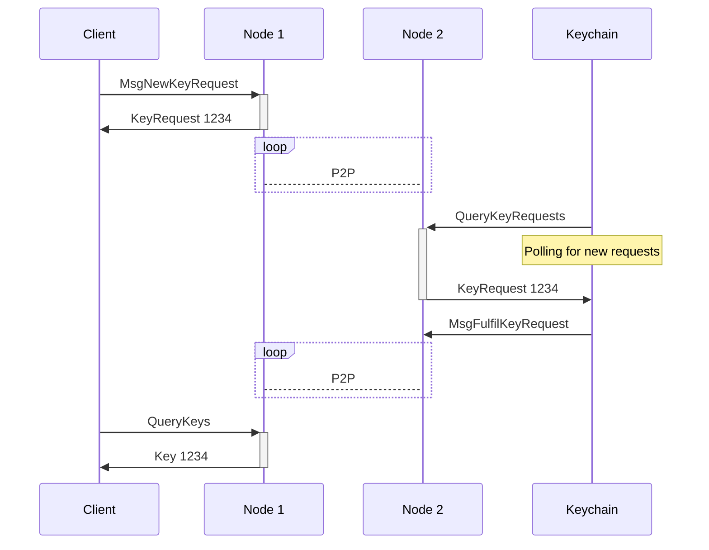
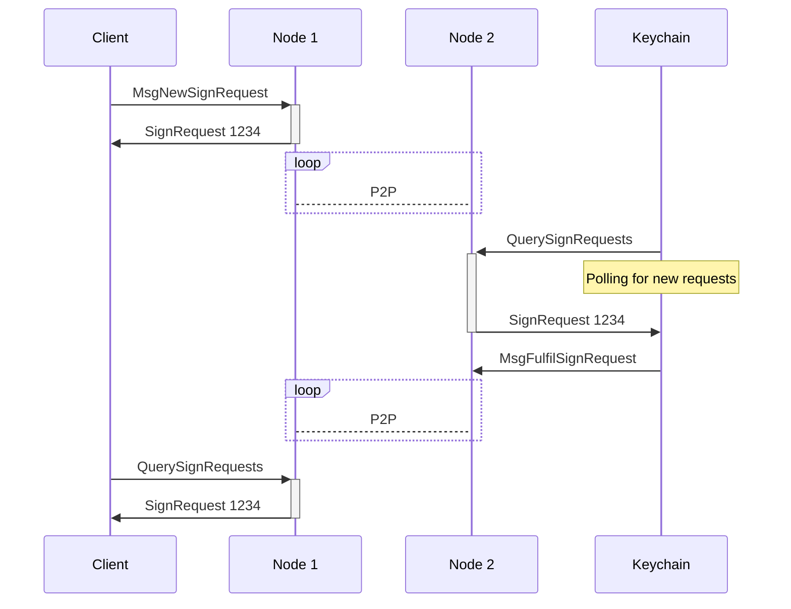

---
sidebar_position: 6
---

# Request flow

## Overview

Warden Protocol is a system that manages keys for [blockchain nodes](/learn/glossary#node). Warden users can request [Keychains](/learn/glossary#keychain) to generate pairs of private and public [keys](/learn/glossary#key) and sign transactions with private keys.

This section explains how Warden Protocol processes these two types of transactions: [key requests](/learn/glossary#key-request) and [signature requests](/learn/glossary#signature-request). The main steps are the following:

1. **Sending a request**: A user sends a request, specifying the preferred Keychain and the [Approval Rule](/learn/glossary#approval-rule) to apply.
2. **Checking the Rule**: Nodes check the Approval Rule and reach [consensus](/learn/glossary#staking).
3. **Fulfilling the request**: The Keychain publishes a public key or a signature to Warden Protocol.

You'll find a detailed breakdown of these steps below.

## Actors

Warden Protocol includes three types of actors participating in sending and processing transactions:

- **Node**: A server running the Warden Protocol software
- **Keychain**: Software for generating keys and signing transactions, running on a Keychain operator's server
- **Client**: Software for interacting with the protocol, running on a user's machine (such as [SpaceWard](/learn/glossary#spaceward))

## Key request flow

The flow for generating a private/public key pair includes the following steps:

### 1. Sending a request

1. The Client sends a `MsgNewKeyRequest` transaction to its Node, specifying these details:

- The key type—for example, ECDSA secp256k1
- The Keychain ID
- The Approval Rule ID

2. A `KeyRequest` object is created and stored in the onchain database.

### 2. Checking the Rule

1. The Node checks the Approval Rule: if the conditions specified in the Rule are satisfied, the [Intent Engine](/learn/glossary#intent-engine) returns `true`.

2. The transaction gets included in a block and broadcast to the P2P network.

3. All nodes in the network reach consensus on the validity of the transaction and re-evaluate the Approval Rule check.

**Note**: 1/3 of the voting power has to agree on the outcome of evaluation. Otherwise, the request is never broadcast to the Keychain. If an attacker wants to abuse the system, they need to obtain more than 1/3 of the voting power.

### 3. Fulfilling the request

1. The Keychain queries its Node for pending requests and picks up the `KeyRequest` object, identified by its unique ID.

2. The Keychain's MPC network generates a new private/public key pair and stores it. The new public key inherits its ID from the `KeyRequest` ID. 

3. A [Keychain Writer](/learn/glossary#keychain-writer) sends a `MsgFulfilKeyRequest` transaction with the public key to the Node.

**Note**: Currently all Keychains available in Warden are MPC-based: each Keychain operator runs a network of MPC nodes. Potentially, a Keychain can be operated without an MPC network—Warden isn't in charge of it.

### Diagram

This diagram represents the key request flow:

## Signature request flow

The flow for requesting a signature includes the following steps:

### 1. Sending a request

1. The Client sends a `MsgNewSignRequest` transaction to its Node, specifying these details:

- Raw data bytes
- The key ID
- The Approval Rule ID

2. A `SignRequest` object is created and stored in the onchain database.

**Note**: While key requests directly indicate the [Keychain ID](/learn/glossary#keychain-id) in the request, signature requests contain the Keychain ID inside the `keys` object.

### 2. Checking the Rule

1. The Node checks the Approval Rule: if the conditions specified in the Rule are satisfied, the [Intent Engine](/learn/glossary#intent-engine) returns `true`.

2. The transaction is included in a block and broadcast to the P2P network.  

3. All nodes in the network reach consensus on the validity of the transaction and re-evaluate the Approval Rule check.

**Note**: 1/3 of the voting power has to agree on the outcome of evaluation. Otherwise, the request is never broadcast to the Keychain. If an attacker wants to abuse the system, they need to obtain more than 1/3 of the voting power.

### 3. Fulfilling the request

1. The Keychain queries its Node for pending requests and picks up the `SignRequest` object, identified by its unique ID.  

2. The Keychain's MPC network generates a signature using the specified private key.  

3. A [Keychain Writer](/learn/glossary#keychain-writer) sends a `MsgFulfilSignRequest` transaction with the signature to the Node.

**Note**: Currently all Keychains available in Warden are MPC-based: each Keychain operator runs a network of MPC nodes. Potentially, a Keychain can be operated without an MPC network—Warden isn't in charge of it.

### Diagram

This diagram represents the signature request flow:

