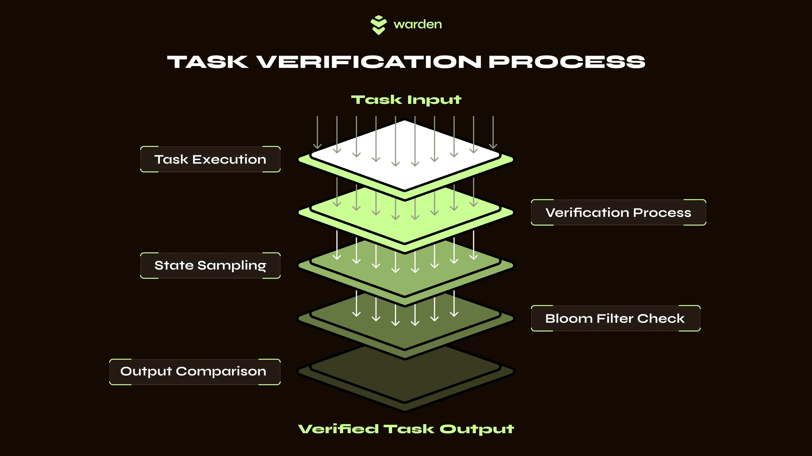

---
sidebar_position: 3
---

# SPEX

## Statistical Proof of Execution

**Statistical Proof of Execution (SPEX)** is a sampling-based verifiable computing protocol that ensures the integrity of computational tasks through probabilistic guarantees. This includes tasks with potentially non-deterministic outputs, such as those involving large language models (LLMs) or stochastic training pipelines.

On Warden, SPEX is used as a **verifiability layer** for AI. This protocol verifies that the selected model was actually used and that its outputs haven’t been tampered with, mitigating the risk of dishonest execution by operators or compromised infrastructure. Our network of validators uses SPEX to reach consensus on the full execution process, turning AI outputs into provable and accountable artifacts.

## Key features

The SPEX framework introduces the following features:
- A formal definition of verifiable computing tailored for modern compute pipelines.
- A sampling-based verification protocol with low overhead and high parallelizability.
- Support for non-deterministic computational states, which is critical for AI/ML and LLMs.
- Use of Bloom filters to encode and verify computational states.
- An open-source reference implementation: [`warden-spex`](https://github.com/warden-protocol/warden-spex/tree/main).

## How SPEX operates

Rather than fully re-executing computations, SPEX does the following:

- Samples full executions to defend against adversarial solvers.
- Samples intermediate states for selective re-execution to detect lazy solvers.
- Validates both using cryptographic summaries.

This protocol requires only a single pair of nodes to operate:

- **Solver**: This node executes the task and generates a cryptographic proof of execution.
- **Verifier**: It randomly samples parts of the task and checks whether the reported results are consistent with both the cryptographic proof and the final output.

## Integration with `x/async`

The [`x/async` Warden module](warden-protocol-modules/x-async) allows running offchain heavyweight computations asynchronously and storing the results onchain. Paired with SPEX, this module extends the integrity guarantees of blockchain smart contracts beyond the chain itself—into offchain, SPEX-protected tasks.

At the moment, Warden Protocol uses SPEX to verify AI-driven price predictions generated by `x/async`. However, you can extend the module with other computational tasks and use SPEX to protect them.

## Learn more

To learn more, you can do this:

- Read the whitepaper: [Statistical Proof of Execution (SPEX)](https://arxiv.org/abs/2503.18899)
- Explore examples in the SPEX repository: [`warden-spex`](https://github.com/warden-protocol/warden-spex/tree/main)
- Try out the protocol on your own tasks, as explained in the [SPEX README](https://github.com/warden-protocol/warden-spex/tree/main)
