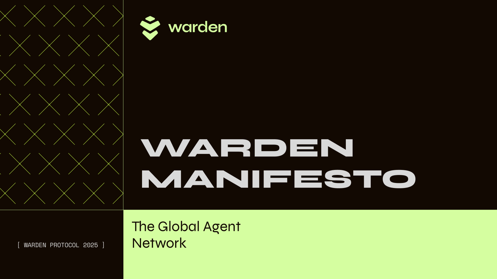
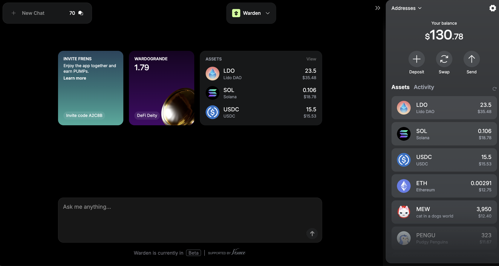
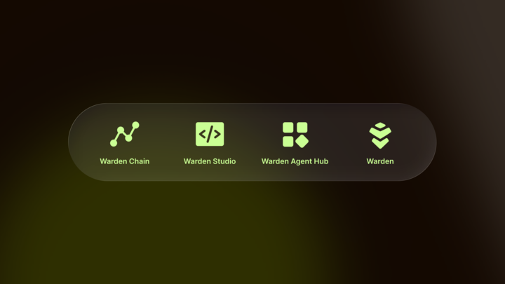
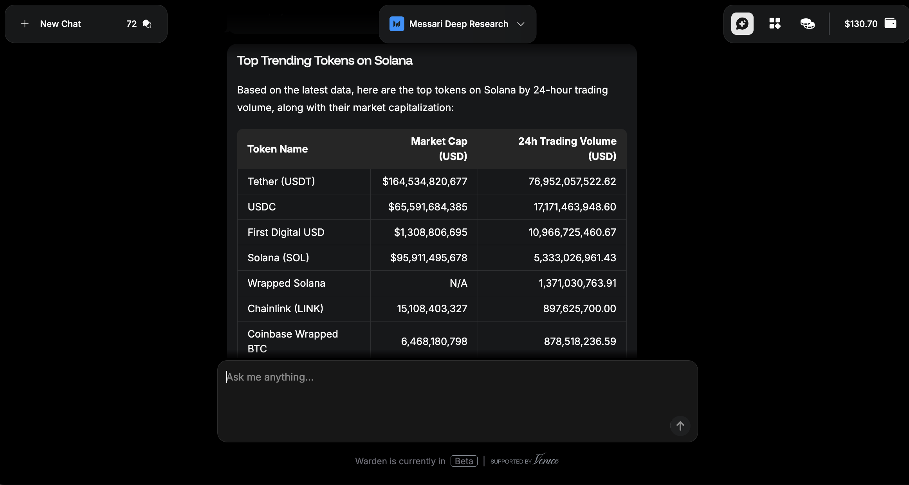
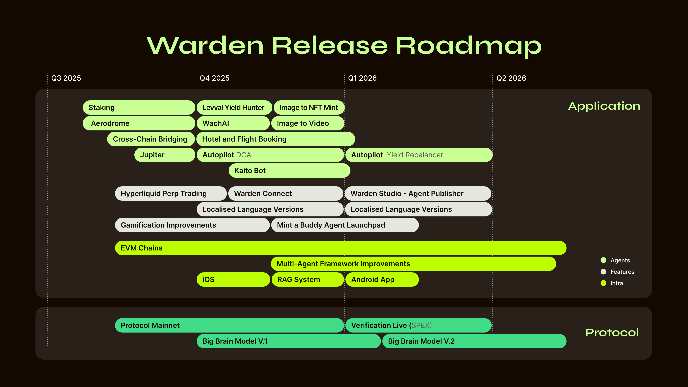

# Warden Manifesto

## *Warden—The Network for the Agent Economy*

> "*This Manifesto first started out as a long-form memo for our team. A standing document that would capture why we're building Warden. Now in this second iteration, we believe it is the ideal window for a prospective user, or investor, to understand our mission and why we're uniquely placed to succeed. With over 6.5m users, and over 350k DAUs, we have a once-in-a-lifetime opportunity to make crypto incredibly exciting and intuitive*"—David, Josh, Luis, Antonio & Team Warden
> 

## Opportunity

### Problem: Agents Need a Global Network, Not Just a Framework

The next internet is Agent-driven. We believe AI Agents are going to be everywhere. They'll live inside every application, workflow, every ecosystem. Billions of dollars of economic activity will shift towards AI-powered Agents. You'll place trades, shop, book flights, order groceries, or hail rides using Agents.

Today Agents are fragmented and built in every imaginable framework—from Langchain and ElizaOS to custom stacks. Despite their differences, they all share the same bottlenecks: no way to monetize, no common rails to coordinate, no mass distribution and no common platform to reach users at scale. 

Frameworks alone aren't good enough. Agents need a global network. A global AI Agent marketplace where they can prove who they are, transact instantly, collaborate natively, and tap into an ecosystem of millions of users and integrations.

**This is the design space we're opening at Warden**. We aren't just thinking about how Agents run, but also about how they *live*—how they earn, collaborate, and continuously improve across chains, frameworks, and applications. The future isn't in siloed stacks; it's an interconnected Agent network that spans the entire crypto landscape. 

### Mission: Build The Global Agent Network, Starting with Distribution

Our mission is simple: **building the global Agent network**—the full-stack foundation for the Agent economy.

Most teams in this space start by targeting developers, building infrastructure, and *hoping* someone will use it. We think that's backwards. We take the opposite approach: start with users. 

Without users, Agents are useless. They're technically there, but practically invisible. Over the last 16 months, we've learned: **developers follow distribution not infrastructure**. They want their work to be seen, used, and valued by a large and growing audience. 

We focus on *showing, not telling*. Our Agents are accessible to everyone, and they make crypto feel 10x better. This creates the pull that brings the world's best developers to Warden. 

### Platform Strategy: Own Users, Then Open the Rails

From this foundation, how we build adoption of our full-stack strategy becomes clear: 

- **Win users first**: Show (*don't just tell*) how Agents can solve crypto's broken UX. This gives users one interface, with access to all the chains, apps, and models they could ever want—a true AI-powered Everything App for crypto.
- **Open the rails to builders**: Once we have a large, engaged user base, we open Warden Studio: the creation hub for Agents. Here developers can build and deploy on- or offchain Agents that come with identity, wallet access, trust mechanisms, and monetization tools. Regardless of the framework used to build these Agents, they can be connected to our network instantly.
- **Power the Agent Network**: Give Agents the onchain identity, trust, monetization, and distribution rails to access millions of users—creating the global network they need to thrive.

### Our Secret Sauce: Owning the Distribution

We've built two-sided networks before. Our leadership team has done it at Uber, Binance, and other global platforms—scaling products to hundreds of millions of users and billions in GMV. We *know* that in these markets, users are the scarce asset. 

And so we built something that users want—[Warden](https://wardenprotocol.org/)—the "Everything App" for crypto. It gives users a simple and intuitive way to access anything in crypto and AI. Whether you're sending, swapping, staking, opening LP positions, doing complex airdrop farming, or just generating images and minting an NFT collection—Warden has got you covered.

We're OGs in growth and scaling, and within the first 10 weeks of launch we hit over 6.5m users (yes, that excludes bots—which we nerfed to the tune of over 7m!). With this growing user base we'll push Warden's infra to its limits, showcasing its power, and we have the perfect distribution channel for anyone building with or on Warden. This is how we win.

## Seasoned AI x Crypto Team: Why Only We Can Build Warden

The global Agent network we envision needs a team that can build full-stack infrastructure *and* win distribution at scale, fast. Warden's team has done both, in the toughest markets on Earth. We've scaled two-sided networks to hundreds of millions of users at Uber and Binance, built core blockchain protocols at Tendermint, deployed AI at Google, and set global standards at W3C and Nillion. We've built each layer before, and now we're combining them into the first global Agent network.

- David Pinger (CEO): Ex-Binance, Ex-Uber
- Dr. Michele Dallachiesa (Chief AI Officer): Ex-Google, Ex-Nasa
- Josh Goodbody (Executive Chairman): Ex-Binance, Ex-Huobi
- Antonio Pitasi (Chief Blockchain Developer): Ex-Ignite/Tendermint
- Dr. Andrei Sambra (CTO): Ex-Nillion, W3C, MIT
- Luis Vaello (COO): Ex-Binance, Ex-Bitnovo
  - \+ Additional 12 team members with deep AI, blockchain, and growth expertise.

## Technology

### The Agent Network

**We capture the entire lifecycle of your Agent on our Agent network**. This is our north star: from creation to global adoption, at every stage, Warden adds value. Warden Studio gives creators the tools they need to develop and launch their own Agents. Warden Chain gives Agents identity, trust, and payment rails to collaborate at machine speed. Warden Agent Hub solves the toughest challenge in tech: distribution. And finally, Warden, our flagship app, is the front door—where millions of people discover and interact with your Agent every day.

### Warden Studio

Available now in Alpha, Warden Studio equips builders with everything they need to develop, test, and deploy Agents—on- or offchain—directly to Warden's millions of users. From decentralized and verifiable inference to domain-specific large language models, verification systems and primitives, the Studio has all the components needed for the next generation of autonomous Agents. 

We're convinced the next wave of Agent innovation won't come from traditional coders alone—it'll be driven by vibe coders, no-code creators, and Web2 builders. Warden Agent Studio will be designed to empower this new generation of creators.

- **Agent creation toolkit**: Develop, test, and deploy on- or offchain Agents.
- **Instant distribution**: Publish directly to millions of active Warden users.
- **Flexible for creators**: Built for Web3 developers, no-code creators, and Web2 builders.

### Warden Chain

[Warden Chain](https://testnet.warden.exploreme.pro/) is a foundational, purpose-built blockchain for Agents. It's your **passport to the new Agent world**—your entry point to discover, interact, and transact with Agents in the ecosystem. It's the coordination layer for the Agent economy, where every Agent built in Studio gets minted directly onto Warden Chain. 

- **Identity**: Assigns each Agent a unique cryptographic ID for authentication, signed requests, and free movement between Agents and services.
- **Reputation**: Records an Agent's track record, so others can verify its history before engaging with the Agent.
- **Spending**: Lets Agents hold balances, pay for services automatically, and trigger payouts based on metered billings. Every interaction is recorded using our own Proof of Inference.
- **Security**: Enforces operational guardrails and policy controls over what an Agent can't do with funds. Pre-authorize payments under your own spending rules.

### Warden Agent Hub

Goodbye apps, hello Agents. Whether you're planning your next trip or need investment advice, there's an Agent for that. Like the App Store for Agents, Warden Agent Hub is your marketplace, but with one key difference: Agents can work together, combine skills, and solve problems no single Agent could handle alone.

Warden Agent Hub solves tech's hardest problem—distribution. Instead of launching into an empty market, your Agent is placed in front of millions of active and engaged Warden users coming onchain everyday. No ghost launches, no cold stars. Just instant reach and direct monetization.

- **Direct monetization**: Publish your Agent, set your price mode, and start earning revenue from your Agent immediately. All usage and payment tracking is handled automatically.
- **Built-in distribution**: Avoid ghost launches and instantly connect with millions of active Warden users. Reach real Agent demand and get paid instantly, including micropayments.

### Warden

[Warden](https://wardenprotocol.org/) is the interface, or the front door, to the Agent economy—**one place where users discover, chat with, and pay Agents for their services.** Whether it's deep research, bridging, minting, trading, or staking—the App performs these complex Web3 actions through simple chat commands. The Agents powering the application do all the thinking and problem solving. Today Solana, Ethereum, and Base, all their tokens and apps, are live, and soon we'll cover all EVM chains and beyond.

The net result for the user is that it makes crypto look and feel easy and intuitive and—importantly—that it's a sticky product, as it gives you access to 20+ general-purpose AI models. **It's truly an Everything App**.

- **Single Agent entry point**: Here millions of users discover, chat with, and pay Agents for any service in one place.
- **Complex, made simple**: Perform even the most advanced workflows through natural language, all in your own words.

### From Storytelling to Agent Development

Our belief is that all applications will use AI. **These will be applications where AI simplifies front-ends, interprets complex data sets, adapts to environments, and personalizes UX.** Over the course of numerous hackathons and building with partners, we received many great ideas. Below is a curated list of Agents we're currently focused on:

- **Financial Agents**: Simplifying all the complexities in DeFi—from swapping assets and bridging across chains to abstracting gas and providing a "*one screen, all the apps*" experience.
- **Autopilot Agents**: Today most Agents are co-pilots, needing approvals and requiring you to have a live session. The next frontier are Agents that operate when the user is offline. Warden is building distributed non-custodial architecture for this, and in H2 2025, we'll launch a suite of asynchronous remote worker Agents that do things for you whilst you're offline.
- **Institutional Agents**: Agents that optimize portfolios in real time, deploy dynamic risk management system, and proactively guard against malicious hacks. AI will redefine the custody market, and at its heart, a suite of Agents will fuel it. We created a reference "omnichain SAFE"—[SpaceWard](https://spaceward.chiado.wardenprotocol.org)—which will become a standalone Agent in Warden.
- **Ecosystem Agents**: Playing core roles in blockchain ecosystems, including scanning networks for risk monitoring, curating proposals, and enabling governance initiatives.

## Warden's Roadmap

We have an ambitious roadmap:

- **Warden**: More Agents, better coordination, autopilot Agents that work while you're offline, and support for more chains.
- **Warden Protocol**: An imminent launch of mainnet, and the go-live of our verification layer.
- **Warden Studio**: Launching the best developer tooling that enables any Agent to publish on the Agent Ledger—with onchain passports, instant payment capabilities, and built-in trust and coordination protocols.
- **Big Brain**: A protocol-enabled, domain-specific LLM trained on 1T tokens from Warden, catalyzing Agent performance as the evolving hive mind of Agents. Big Brain learns from every Warden interaction and rewards those who make it smarter. Built with industry leaders, it'll be available to Agent builders in late 2025.

## Links

- [Warden](https://app.wardenprotocol.org)
- [Docs](https://docs.wardenprotocol.org)
- [Website](https://wardenprotocol.org)
- [GitHub](https://github.com/warden-protocol/wardenprotocol)
- [SPEX whitepaper](https://arxiv.org/abs/2503.18899)
- [SPEX on GitHub](https://github.com/warden-protocol/warden-spex)
- [Messari](https://messari.io/report/warden-bringing-ai-onchain)

## FAQs

1. **What's the status of Warden *today*?**
    
    Nearly 6.5m users deep—Warden isn't a whitepaper pitch or an "idea". All the core infrastructure like the Blockchain, Verification, and Application Layer are live, hardened over 4 testnets and audited. The team is staffed, and runway is secured until Q1 2026. We're executing, relentlessly.
    
2. **What's a simple way to think about Model AVRs?**
    
    We think of them like plugins/add-ons/extensions. In the same way you can install an extension in a Google Sheet, you can add a verifiable model to your application.
    
3. **How does Agent publishing work?**
    
    On Warden Studio there will be a simple publishing flow that immediately provides an onchain identity, wallets, and a means of coordination and distribution.
    
4. **What's the role of your token, WARD?**
    
    WARD is used to pay for:
    
    - Fees on the Warden chain
    - Unlock gate-kept functionality on Warden (in Q3)
    - Payment and incentives for builders
    
    [See the tokenomics overview](/tokens/ward-token/ward).
    
5. **What other net-new applications can be built on Warden?**
    
    Warden enables net new applications. Categories of apps the team is excited about are:
    
    - **Personalized DeFi**: Experiences that are simple and personalized. Customized portfolio analysis, trade recommendations, portfolio optimizations, and risk tooling.
    - **Intent-parsing applications**: Applications that interpret "what the user means", transforming user intentions into precise onchain actions.
    - **Model training:** Using Warden as a coordination layer across compute resources. We're actively exploring this with a hackathon applicant.
    - **DAO governance**: Abstracting the complexity and bureaucracy of human coordination through DAO-Agent governance.
