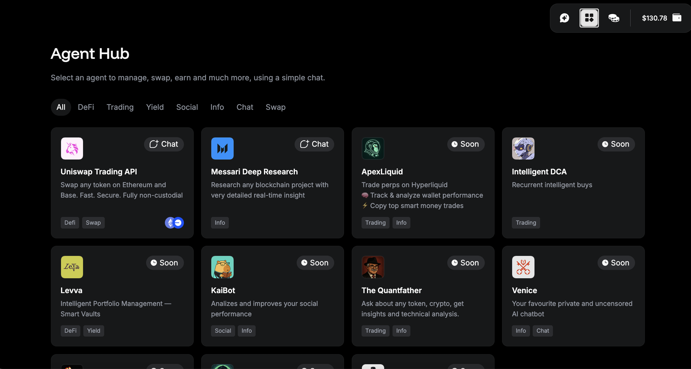

# Warden Manifesto

## *Warden—the Home of Intelligent Applications*

---

> *“This Manifesto first started out as a long-form memo for our team. A standing document that would capture why we are building Warden. As it evolved, we believe it is the ideal window for a prospective user, or investor, to understand our mission and why we are uniquely placed to succeed. With over 2.5m users, we have a once in a lifetime opportunity to make crypto incredibly exciting and intuitive”*—**David, Josh, Luis, Antonio & Team Warden**
> 

## Opportunity

### Problem: Blockchain Apps Are Dumb

We think AI will be integrated into every application. It's an inevitability. But, at the heart of most applications in crypto, there are over 600 million smart contracts. We think they're rigid, and unfairly limited by their determinism. This limited design space holds back applications from becoming more intelligent. **To enable net new applications, we need to break open a new design space.**

We believe AI will power this new design space. It will change what crypto applications are capable of—not just at the smart contract level, it will also simplify front-ends, interpret complex data, and adapt the user experience in real time. Every major blockchain application will use AI, and we are here to lead this transformation.

However, current crypto infrastructure focuses not on the user, or builder—but on niche (yes, cool) problems, like distributing model training. At Warden, we are thinking much bigger—taking AI onchain, and building with AI, is a complex deep tech challenge, and building a truly intelligent crypto app today is almost impossible. Most attempts have been surface-level—driven by buzzwords, not breakthroughs. The result? Truly intelligent crypto apps remain nearly impossible to build.

### Mission: Expand Blockchain Capabilities

Warden was built to 10x the application design space—unlocking a new wave of intelligent, adaptive applications. This isn't a marginal upgrade; it's a foundational upgrade towards what we call “**Intelligent Applications**”: systems that break free from rigid constraints, allowing developers to fully express ideas and tap into decades of established software development. In a nutshell, Warden creates a verifiable, AI-native blockchain where models are accessible to anyone, anywhere—and their outputs can directly power smarter, more expressive applications.  Our design principles are:

- **Anything:** Build without limits—our Intelligent Applications run seamlessly onchain and operate offchain, or vice versa.
- **Anyone:** Developers on Cosmos, Ethereum, or Solana can build with Warden.
- **Anywhere:** Warden is chain-agnostic and accessible everywhere. Literally.

This became our mission: to build the foundational infrastructure for Intelligent Applications. To us, Intelligent Applications are smart contracts that seamlessly integrate AI—or any offchain logic—to reason, adapt, and interact fluidly across onchain and offchain environments. Unlike traditional contracts bound by static logic, they unlock richer, more expressive, and dynamic user experiences. Our flagship app, Warden, is our testament to this, with over 2,500,000 users enjoying a radically simple crypto UX. 

### Solution: A Home for Intelligent Applications

We built Warden protocol—**a full-stack purpose-built blockchain designed for developers to create Intelligent Applications**. And **for everyday users, we built the Warden App**: free, private, and uncensored AI that lets anyone use voice or chat to do anything in crypto. Yes, anything. Our goal is to own both the infra and, with the Warden App, the application layer.

The Warden stack enables any application or smart contract to access and verify AI models, bringing AI onchain with cryptographic guarantees, and to immediately be able to surface these applications to a rich user base on the Warden App. Warden is structured across three layers: a Blockchain Layer with access to Asynchronous Verifiable Resources (“**AVRs**”), a Verifiability Layer powered by a Statistical Proof of Execution (“**SPEx**”) for verifying models and AVRs, and an Application Layer with tools and primitives to build Intelligent Applications. Making this possible meant deep **innovation**, we built:

- **A leading consumer crypto app with over 2.5m users** that lets you use natural language to do anything in crypto, and is immediate distribution for anyone building an app or agent with Warden.
- **A permissionless, EVM-compatible blockchain** that connects your app to anything digital—onchain or offchain—using scalable, programmable AVRs.
- **AVRs (Asynchronous Verifiable Resources)**: let smart contracts read from and write to the world—request AI outputs, trigger PayPal payments, mint NFTs on OpenSea, or place Amazon orders. Use 20+ pre-built AVRs or create your own.
- **A fast, low-cost Verification Layer powered by SPEx**—handling large inferences up to 1000x faster and cheaper than ZKMLs, OPMLs, or TEEs.
- **Ubiquitous access to/from 100+ protocols**, starting with all of Cosmos and Ethereum via IBC—and Hyperlane next, so developers can build on Warden or with Warden—we're chain-agnostic by design.
- **A complete developer platform** with AVR primitives, AI verification, and tools built to make blockchains invisible.

### Our Secret Sauce: Owning the Distribution

With our collective experience building and scaling at Uber, Binance and beyond, we built the [Warden App](https://app.wardenprotocol.org)—**the “everything app” for crypto**. Warden gives users a simple and intuitive way to access anything in crypto. Whether you're sending, swapping and staking, or opening LP positions, and doing complex airdrop farming, or maybe you just want to generate some images and mint an NFT collection—Warden has got you covered. Warden's team are OGs in growth and scaling, and within the first 6 weeks of launch we hit over 2.5m users. With this growing user base we'll push Warden's infra to its limits, showcasing its power, and we have the perfect distribution channel for anyone building with or on Warden. This is how we win.

## A Seasoned AI x Crypto Leadership Team

Warden's founding team consists of experienced builders from crypto, AI, and the Tech space. Together we've raised over $50m in capital, GTM'd tokens, and scaled some of the largest crypto consumer, enterprise platforms and web2 businesses. Blended with this executive experience, we have attracted a serious depth of talent in AI and ML. This forms the Core team at Warden:

- David Pinger (CEO): Ex-Binance, Ex-Uber
- Dr. Michele Dallachiesa (Chief AI Officer): Ex-Google, Ex-Nasa
- Antonio Pitasi (Chief Blockchain Developer): Ex-Ignite/Tendermint
- Dr. Andrei Sambra (Engineering Lead): Ex-Nillion, W3C, MIT
- Josh Goodbody (Executive Chairman): Ex-Binance, Ex-Huobi
- Luis Vaello (COO): Ex-Binance, Ex-Bitnovo
- \+ Additional 12 team members.

## Technology

### A Blockchain For Intelligent Apps

Warden took a full-stack approach to solve a complex challenge. When we first designed Warden our guiding question was clear: **how can we use AI to break open net net applications and experiences?** We quickly found traditional, general-purpose blockchains are not well equipped to handle inferences.

The most difficult questions we solved along the way were: how do we handle heavy, long-running computations without blocking the chain; how do we verify and reach consensus on AI models like LLMs that produce different responses each time; how can we extend blockchain's trust perimeter so Intelligent Applications can operate both onchain and offchain; and how do we turn AVRs into a low-code experience?

### A Purpose-Built Full-Stack Design

Creating a fullstack AI x Blockchain from scratch was challenging—we were able to do this through converging advances in blockchain consensus, artificial intelligence, and cryptography—it's **truly purpose-built**. Among the many things we've done, we created AVRs, built scalable verification systems, integrated smart contract platforms, customized transaction types, repurposed nodes, and invented consensus mechanisms. The outcome is an AI-ready blockchain with three layers:

- **Blockchain Layer** Warden Chain is a purpose-built blockchain that offers a unique capability not seen in other blockchains—it lets users use any arbitrary AVR response onchain, within a smart contract or application. *AVR authors* have full flexibility to build, publish, and monetize their AVRs, with the Blockchain Layer acting as a coordination, messaging, and provenance layer for their work. Using consensus advances like ABCI++, and vote extensions, AVRs can be both small and lightweight, or heavy, long-running asynchronous AI inferences. *Validators* that run AVRs can join Warden's permissionless network. Any validator can choose what AVRs to support and start earning—even on lower-spec hardware.
- **Verifiability Layer** unverified inferences are a rug waiting to happen. Our verifiability layer acts like a firewall that uses cryptography to verify AVR responses. Remarkably our verification has an extremely low overhead thanks to our core innovation “**SPEX**”; a fast and cost-efficient Verification protocol capable of handling even the largest inferences—up to 1,000x faster than ZKML—while being significantly simpler than OPML for consensus, as it avoids the need for VM-based execution of sampled code, and unlike TEE-based solutions, it requires no dedicated hardware. This means no ZK bottlenecks, TEE lock-ins or optimistic guesswork—just provable security. SPEX ensures the model you see is the model you get, and in addition it can check if the outputs are accurate and confident enough to be used in apps. It removes trust assumptions, enabling incorruptible applications that are impervious to manipulations by bad actors and malicious hackers.
- **Application Layer**  without a complete **developer platform** to build Intelligent Applications, AI is stuck in 2024—relegated to playthings, gimmicks, and chatbots instead of practical applications. Our developer platform features **two smart contract platforms**—EVM and CosmWasm—giving *anyone* the ability to build AVRs, and to use them to build the logic of their application. It provides **custom infrastructure for AI-specific needs** like automated smart contract invocations, scheduling, and data feeds to ensure apps are responsive to real-time changes. Lastly, we have introduced **interoperability tools** to make AI responses widely accessible alongside making the underlying blockchain invisible—this means users can access AVRs from anywhere and interact seamlessly with Intelligent Applications, without needing to worry about cross-chain coordination, bridging, funds, gas fees, or multiple accounts.

## From Storytelling to Application Development

Warden is built by builders, for builders—we actually use our infrastructure to build consumer applications. Nearly 2m users are using Warden today. So, instead of theoretical posturing and empty whitepaper promises, we build real-world apps with real users. Our belief is that all applications will use AI. **These will be applications where AI simplifies front-ends, interprets complex data sets, adapts to environments, and reaches intelligent decisions; while blockchain-enabled backends ensure high integrity data, decentralization, and automated execution.** Over the course of many hackathons, we received many great ideas. Below is a curated list of Intelligent Applications we are currently focused on.

- **Crypto Super Apps:** To demonstrate how powerful AI will be for crypto UX, we built the [Warden App](https://app.wardenprotocol.org). Warden makes DeFi incredibly easy—complex Web3 actions, like swaps and transfers, are now simple chat or voice commands. It does all the thinking and problem solving for you, making complex work like cross-chain transactions, portfolio management, or risk assessments easy. We see this as the first of an upcoming wave of agentic interfaces that simplify the entire Web3 experience.
- **Smart Agents:** Let's be brutally honest—true onchain agents don't exist (yet). Leading agent frameworks produced *offchain* Agents that lack utility. These agents are, by design, broken—they are easily ruggable, fraught with private key risks, and unable to live onchain. We think Agents should be smart contracts managed onchain—because this is what makes them defensibly sovereign, autonomous, and non-custodial. In H2 2025, we'll launch *Warden Buffett*—a reference trading agent made with our own Agent Kit that will be the first truly autonomous, profit-generating entity that lives onchain.
- **Intelligent Custody:** Custody today is remarkably clunky—we think machine learning, artificial intelligence, and automation will fundamentally reshape this user experience, enabling teams to leverage a suite of tools. From personalization and intelligent portfolio optimizations to dynamic risk management systems preventing exposure to hacks; AI will re-define the custody market. We created a reference “omnichain SAFE”—[SpaceWard](https://spaceward.chiado.wardenprotocol.org)—which will spin out and become a standalone app in the Warden ecosystem to build out this vision.

## Warden's Path to Mainnet by Q3, 2025

We plan to launch mainnet in Q3 2025. Before mainnet we have four engineering objectives.

- [**Warden App**](https://app.wardenprotocol.org): it's an absolute priority to acquire retail users, and mindshare, so we've acquired nearly 2.5m global users. The Warden App offers free, private, and uncensored AI to users via an intuitive web, iOS, or Android app. **Warden app lets users do complex Web3 activity, like swapping and transferring assets, using chat and voice commands**. Under the hood, Warden agents execute the complexities. Fully gamified and designed to incentivise habitual use, Warden App is the distribution hub for anyone building on or with Warden.
- **Warden Studio**: sometimes an AVR you create is just for your application. But many builders will want to share their AVRs with the rest of the community. To facilitate this, we have onboarded 20+ AVRs already. Warden Studio is the hub for builders to build AI-integrated apps and for vibe coders to launch their first agent—all of which is available in the Warden App to a captive user base.
- **Onchain agent framework**: any application can be built on Warden, however, onchain Agents that use machine learning for trading stand out as a key use case developers want to create on Warden. We have built the beginnings of an [Agent Kit](/build-an-agent/warden-agent-kit/introduction) to make Warden the best place to build agents, along with tools like our Quant Kit to enable builders to test and deploy onchain agents.

---

## Links

- [Warden App](https://app.wardenprotocol.org)
- [Docs](https://docs.wardenprotocol.org)
- [Website](https://wardenprotocol.org)
- [GitHub](https://github.com/warden-protocol/wardenprotocol)
- [SPEX whitepaper](https://arxiv.org/abs/2503.18899)
- [SPEX on GitHub](https://github.com/warden-protocol/warden-spex)
- [Messari](https://messari.io/report/warden-bringing-ai-onchain)

---

## FAQs

1. **What's the status of Warden *today*?**

   Nearly 2.5m users deep—Warden isn't a whitepaper pitch or an “idea”—and we are going to mainnet in Q3, 2025. All the core infrastructure like the Blockchain, Verification and Application Layer are live, hardened over 3 testnets and audited. The team is staffed and runway secured until Q1 2026. We are executing, relentlessly.

2. **What's a simple way to think about AVRs?**

   We think of them like plugins/add-ons/extensions. In the same way you can install an extension in a Google Sheet, you can add an AVR to a smart contract.

3. **What are the benefits of AVRs?**

   With AVRs you can read from the world and write to the world—onchain or offchain. Smart contracts can call any API—not just reading data but sending it also. And with support for broadcasting arbitrary Cosmos and Ethereum transactions, smart contracts can also write back onchain. Benefits are:

   - Incentivized self-service: AVR authors earn money from their AVRs while validators profit by running them—AVRs are accessible in Warden and across 100+ protocols.
   - Endless customization, little coding: 10 lines of code to connect to a growing ecosystem of 20+ AVRs. No need to understand Warden to use them.
   - Simple yet powerful: from simple and lightweight to complex, long-running asynchronous AVRs required for models like DeepSeek—we got it.
   - Mix and match: add, combine and chain AVRs to create feature rich crypto apps. With built-in composability and interoperability, you code less and ship in days, not months.

4. **In the Manifesto you talk about AVRs letting “*smart contracts read from and write to the world*”—what do you mean by this?**

   - ***Smart contracts reading from offchain environments***  
     As outlined above, with Warden, any smart contract can use offchain logic, such as an AI model output.

   - ***Smart contracts writing to offchain environments***  
     This is where smart contracts can trigger offchain services, like PayPal payments, place Amazon orders, or place a trade on a centralised exchange.

   - ***Smart contracts operating offchain applications***  
     The design space we are teasing here is the potential for web2 applications to be deployed onchain. Some examples:

       - Blogs, media sites—onchain guarantees permanent availability, avoids platform censorship, and ensures authorship traceability.
       - Job platforms (such as onchain Fiver, Upwork)—smart contracts can enforce fair pay, escrow, and reputation systems.
       - Identity systems—enables self-sovereign identity, verifiable credentials, all accessible to web2.

5. **If I build my app on Optimism or Arbitrum, how can I use AVRs from Warden?**

   Apps outside of Warden can access AVRs by calling Warden Chain using different general message passing protocols. Hyperlane is live today, and IBC is coming soon.

6. **How do we incentivize AVR development?**

   Our network has three participants: Validators, AVR authors, and AVR consumers. AVR authors set a fee for their AVRs—simple ones might be free, premium ones may cost more. Authors decide how to split the fee with validators that run AVRs.

7. **How does AVR publishing work?**

   A developer marketplace will serve as the central hub for Web3 developers to discover, test, and integrate hundreds of AVRs into their application.

8. **How does the verification of AVRs work?**

    Verification depends on the type of the AVR. For AVRs that use AI models we use SPEx. We'll complement SPEx to support verification for more general AVRs.

9. **What's the role of your token, WARD?**

   WARD is used to pay for:

   - Fees on the Warden chain
   - Unlock gate-kept functionality on the Warden App (in Q3)
   - Payment and incentives for builders

   Tokenomics overview [here](/tokens/ward-token/ward).

10. **What other net-new applications can be built on Warden?**

   AVRs let smart contracts read from the world and write to the world—on- or offchain. This makes them incredibly versatile. New categories will emerge. Categories of apps the team is excited about are:

   - **Personalized DeFi**: experiences that are simple and personalised. Customised portfolio analysis, trade recommendations, portfolio optimizations and risk tooling.
   - **Intent-Parsing Applications**: applications that enable “what the user means” turning user intentions into precise onchain actions.
   - **Model Training:** using Warden as a coordination layer across compute resources. We are actively exploring this with a hackathon applicant.
   - **DAO Governance**: abstracting the complexity and bureaucracy of human coordination through DAO-agent governance.

11. **What is Warden's Position in the Crypto x AI Market?**

   There are over 637 million smart contracts today, projected to top $5 trillion by 2030. With an AI mindshare of 37%—demand for robust blockchain and AI integrations is clear, present and growing. Warden is better placed to compete with many of the incumbents:

   - **Purpose-built > Retrofitted AI-chains**
    
     NEAR and ICP rebranded their L1 to focus on AI use cases. While Warden can also serve as a general-purpose blockchain, it was fully purpose-built and customized from the ground up to handle AI computations and expand into arbitrary offchain data.
    
   - **Any Offchain Data > AI Inferences**
    
      Atoma, Inference Labs, or Hyperbolic verify inferences, but not all run smart contract platforms, transform model outputs for apps, or enable self-service AVRs. Warden accrues value across the entire lifecycle: from sourcing an inference, verifying its correctness, through to the deployment of an app and the resulting user-generated fees.
    
   - **Onchain Agents > Offchain Agents**
    
      Frameworks like Eliza or Virtuals are used to create offchain Agents -  have we not learned that opaque, closed, offchain systems don't scale well in Web3? Warden is building an onchain agent framework, where agents are embodied by smart contracts. This makes them discoverable, queryable, and easily coordinated—all onchain.
    
   - **Sampling-Based Verification > Traditional Verification Methods**
    
      Technologies like zero-knowledge, trusted execution environments and optimistic machine learning have limits that can make them impractical or prohibitive for workloads that involve machine learning and artificial intelligence.
