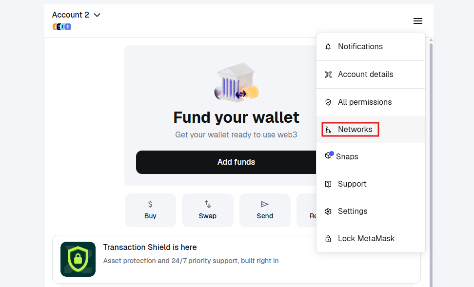
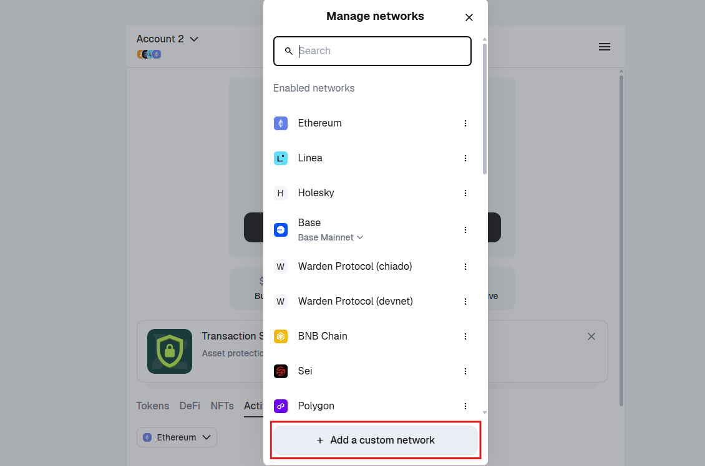
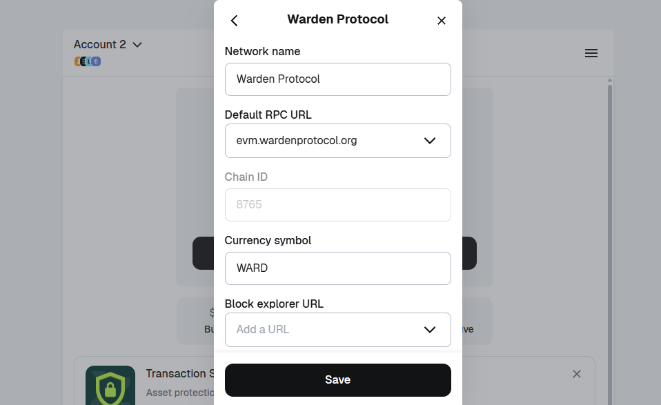

---
sidebar_position: 5
---

# Warden networks

## Overview

In this section, you'll find an overview of the available **Warden networks**.

This page lists basic chain information: the **chain IDs** and supported **endpoints**. For more detailed information, refer to our validator guides in [Operate a node](/operate-a-node/introduction).

:::note
Warden networks use two chain IDs on different layers. The Cosmos chain ID is the primary network identifier and is used by validators and Cosmos tools. EVM wallets use only the EVM chain ID.
:::

## Mainnet

<table>
  <tr>
    <td>**Binary**</td>
    <td>[v0.7.6](https://github.com/warden-protocol/wardenprotocol/releases/tag/v0.7.6)</td>
  </tr>
  <tr>
    <td>Endpoints</td>
    <td>
      EVM: `https://evm.wardenprotocol.org/` 
      EVM WSS: `https://evm-ws.wardenprotocol.org/` 
      RPC: `https://rpc.wardenprotocol.org/` 
      REST: `https://api.wardenprotocol.org/` 
      gRPC: `https://grpc.wardenprotocol.org/` 
    </td>
  </tr>
  <tr>
    <td>**Cosmos chain ID**</td>
    <td>`warden_8765-1`</td>
  </tr>
  <tr>
    <td>**EVM chain ID**</td>
    <td>`8765`</td>
  </tr>
  <tr>
    <td>**Denomination**</td>
    <td>`award` (1 award = 10^-18 [WARD](/ward/introduction))</td>
  </tr>
  <tr>
    <td>**Validator guides**</td>
    <td>[Operate a node: Mainnet](/category/mainnet)</td>
  </tr>
</table>

## Barra testnet

<table>
  <tr>
    <td>**Binary**</td>
    <td>[v0.7.6](https://github.com/warden-protocol/wardenprotocol/releases/tag/v0.7.6)</td>
  </tr>
  <tr>
    <td>Endpoints</td>
    <td>
      EVM: `https://evm.barra.wardenprotocol.org/` 
      EVM WSS: `https://evm-ws.barra.wardenprotocol.org/` 
      RPC: `https://rpc.barra.wardenprotocol.org/` 
      REST: `https://api.barra.wardenprotocol.org/` 
      gRPC: `https://grpc.barra.wardenprotocol.org/` 
    </td>
  </tr>
  <tr>
    <td>**Cosmos chain ID**</td>
    <td>`barra_9191-1`</td>
  </tr>
  <tr>
    <td>**EVM chain ID**</td>
    <td>`9191`</td>
  </tr>
  <tr>
    <td>**Denomination**</td>
    <td>`award` (1 award = 10^-18 [WARD](/ward/introduction))</td>
  </tr>
  <tr>
    <td>**Faucet**</td>
    <td>[Barra faucet](https://faucet.wardenprotocol.org)</td>
  </tr>
  <tr>
    <td>**Validator guides**</td>
    <td>[Operate a node: Barra testnet](/category/barra-testnet)</td>
  </tr>
</table>

## Connect Warden to an EVM wallet

You can connect **Warden Mainnet** to any **EVM-compatible wallet**:

1. In your preferred wallet, start adding a custom network.
2. Enter the following details:
   - **Network name**: `Warden Protocol` or `Warden Mainnet`
   - **EVM RPC URL**: `https://evm.wardenprotocol.org/`
   - **EVM chain ID**: `8765`
   - **Currency symbol**: `WARD`
3. Save.

:::tip
Your EVM wallet can display the [WARD](/ward/introduction) balance held in your [Warden](https://app.wardenprotocol.org/auth) account. To do this, link the same wallet in [Warden account settings](https://help.wardenprotocol.org/warden-app/manage-your-wallets#configure).
:::

For example, this is how to connect Warden Mainnet to [MetaMask](https://metamask.io):

