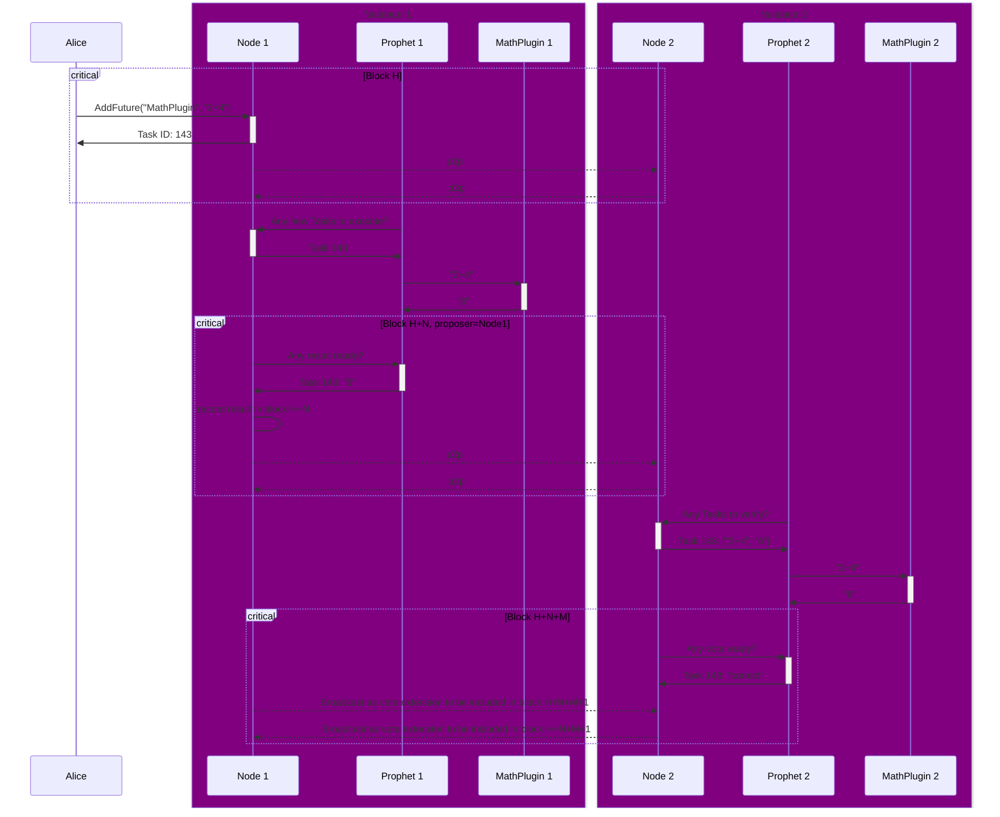

---
sidebar_position: 4
---

# x/async

## Overview

The `x/async` module is a [Cosmos SDK](https://docs.cosmos.network/) module for running offchain heavyweight computations asynchronously and storing the results onchain. It uses the [ABCI 2.0](https://docs.cometbft.com/v1.0/spec/abci/) framework
and its [vote extensions](https://docs.cosmos.network/main/build/abci/vote-extensions).

This module implements the following concepts:

- [Task](#task)
- [AVR Plugin](#avr-plugin)
- [Prophet](#prophet)

## Usage

You can call the `x/async` module from your EVM smart contract using the [`x/async` precompile](/build-an-app/precompiles/x-async). This module allows you to build any logic combining offchain computation with onchain verification.

At this moment, `x/async` supports two types of computations:

- AI-driven price predictions
- HTTP requests to external services, such as blockchain APIs

You can learn the basics and then dive deeper by following these guides:

- [Interact with `x/async`](/build-an-app/interact-with-warden-modules/interact-with-x-async)
- [Run offchain computations with `x/async` AVR Plugins](/build-an-app/run-offchain-computations/introduction)
- [Implement automated Orders with price prediction](/build-an-agent/build-an-onchain-ai-agent/implement-automated-orders-with-price-prediction/introduction)

## Concepts

### Task

A **Task** is an offchain user-defined unit of computation that is executed asynchronously. The result is stored onchain.

A user can request a Task, specifying an **input** and an [AVR Plugin](#avr-plugin), which determines what format of input to accept and how to handle it. There are different types of Tasks, depending on the Plugin type.

After that, a [validator](/learn/glossary#validator) running a [Prophet](#prophet) executes the Plugin and provides the Task result of a Task. Other validators vote on correctness of the result. It takes several blocks to get the output, but it doesn't slow the blockchain down thanks to asynchronous execution.

You can learn more in the [Task execution flow](#task-execution-flow) section of this article.

### AVR Plugin

An **AVR Plugin**, or **Asynchronous Verifiable Resource**, is code that determines what kind of [Task](#task) input to accept and how to handle it in order to retrieve the result (output). In other words, the type of the computation to be executed depends on the Plugin type.

When requesting a Task, a user references a Plugin by ID. Then the Plugin is executed by a [Prophet](#prophet).

Developers can create their own Plugins or use the existing ones. Currently, we support two Plugins, which allow executing **price predictions** and **HTTP requests**.

You can learn more in the [AVR Plugins](#avr-plugins) section of this article.

### Prophet

A **Prophet** is a subprocess running on [validator](/learn/glossary#validator) nodes, which has two responsibilities:

- Fetching [Task](#task) requests and executing [AVR Plugins](#avr-plugin) to provide Task results
- Fetching requests satisfied by other validators to vote on the results

Prophets run on validator nodes separately from the [`wardend` process](/learn/glossary#node), without blocking the consensus. Running a Prophet is optional for a validator.

You can learn more in the [Prohpets](#prophets) section of this article.

## State

The `x/async` module keeps track of [Tasks](#task).

Completed Tasks are pruned after some time, to avoid state bloat.

## Messages

### `MsgAddFuture`

Creates a new [Task](#task), providing the following:

- A `[]byte` input
- A `string` ID of the [AVR Plugin](#avr-plugin) to use
- The `address` of a callback contract (optional)

:::note Notes
- The [Task](#task) has the `pending` status until it has a result. Users can query Tasks by their IDs to check the progress.
- The callback contract must have a `cb()` function, allowing it to be invoked once the Task is ready.
:::

## AVR Plugins

### `pricepred`

The `pricepred` Plugin allows producing **AI-driven price predictions**.

You can find usage examples in the following guides:

- [Use the price prediction Plugin](/build-an-app/run-offchain-computations/use-the-price-prediction-plugin/introduction)
- [Implement automated Orders with price prediction](/build-an-agent/build-an-onchain-ai-agent/implement-automated-orders-with-price-prediction/introduction)

### `http`  

The `http` Plugin allows making **HTTP requests** to any external service. For example, developers can use `x/async` as an advanced [oracle service](../oracle-services) for fetching token prices from external APIs.

Note that Warden automatically converts HTTP responses to the CBOR format.

You can find a usage example in the following guide: [Use the HTTP Plugin](/build-an-app/run-offchain-computations/use-the-http-plugin/introduction).

## Prophets

### Executing Tasks

A Prophet continuously polls the chain to discover new pending [Tasks](#task), maintaining a local queue for them.

At the same time, a Prophet takes Tasks from the queue, and executes [AVR Plugins](#avr-plugin) referenced in these Tasks to generate Task results. This usually involves calling an external service.

The results are stored in the memory for the blockchain node to fetch it later.

### Voting on Task results

A Prophet continuously polls the chain to discover [Tasks](#task) that have a result submitted by another validator, maintaining a local queue for them.

Concurrently, Tasks are taken from the queue and validated (this usually involves calling an external service).

The votes are stored in memory for the blockchain node to fetch it later.

## ABCI lifecycle

The [ABCI](https://docs.cometbft.com/v1.0/spec/abci/) (Application Blockchain Interface) lifecycle includes these steps:

1. **Preparing a proposal**  
   Vote extensions from the previous block are processed and included in the proposal for the next block. The proposer validator also fetches new results from its [Prophet](#prophet) instance and includes them in a special transaction at the beginning of the block proposal.
2. **Broadcasting votes**  
   Then all validators, even non-proposers, fetch votes on existing [Tasks](#task) from their Prophets and broadcast these votes as [vote extensions](https://docs.cosmos.network/main/build/abci/vote-extensions).
3. **Finalizing the block**  
   When the proposal is processed (for example, the block is finalized), all new results and new votes are persisted in the blockchain storage, ready to be consumed.

## Task execution flow

Task execution includes the following steps, as shown in the diagram below:

1. A user (Alice) inserts a new [Task](#task) with an input (`2+4`) and a reference to an [AVR Plugin](#avr-plugin) (`MathPlugin`).
2. Node 1 asynchronously executes the Plugin (`MathPlugin`), providing a Task result.
3. When Node 1 is elected as the proposer for a block (H+N), it inserts the result (`6`) to be recorded.
4. Node 2 notices the new result for the Task and invokes its Plugin (`MathPlugin`) to verify the result.
5. The verification is broadcasted as vote extensions and eventually recorded at height H+N+M+1 since [vote extensions](https://docs.cosmos.network/main/build/abci/vote-extensions) are committed to the state only in the next block.

