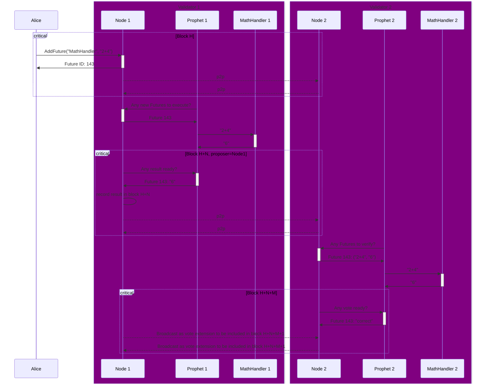

---
sidebar_position: 4
---

# x/async

## Overview

The `x/async` module is a [Cosmos SDK](https://docs.cosmos.network/) module for running offchain heavyweight computations asynchronously and storing the results onchain. It uses the [ABCI 2.0](https://docs.cometbft.com/v1.0/spec/abci/) framework
and its [vote extensions](https://docs.cosmos.network/main/build/abci/vote-extensions).

This module implements the following concepts:

- [Future](#future)
- [Prophet](#prophet)

## Usage

You can call the `x/async` module from your EVM smart contract using the [`x/async` precompile](/build-an-app/precompiles/x-async).

The `x/async` module allows you to build any logic combining offchain computation with onchain verification. For example, you can [implement automated Orders with price prediction](/build-an-agent/build-an-onchain-ai-agent/implement-automated-orders-with-price-prediction/introduction).

At this moment, `x/async` does two types of computations:

- AI-driven price predictions
- HTTP requests to external services, such as blockchain APIs

## Concepts

### Future

A **Future** is an offchain user-defined computational task that is executed asynchronously. The result is stored onchain.

A user can request a Future, specifying an **input** and a **handler** (referenced by ID), which determines how to interpret the input and what to do with it in order to retrieve the result.

After that, a [validator](/learn/glossary#validator) running a [Prophet](#prophet) executes the Future and provides the result. Other validators vote on correctness of the result. It takes several blocks to get the output, but it doesn't slow the blockchain down thanks to asynchronous execution.

There are two types of Futures, depending on the handler:

- **Price predictions**  
  Futures can produce AI-driven price predictions. For a usage example, see the following guide: [Implement automated Orders with price prediction](/build-an-agent/build-an-onchain-ai-agent/implement-automated-orders-with-price-prediction/introduction).
- **HTTP requests**  
  Warden Futures accept handlers for making HTTP requests to any external service. For example, a Future can call an external API to fetch a token price, so developers can use `x/async` as an advanced [oracle service](../oracle-services). Note that Warden automatically converts HTTP responses to the CBOR format.

### Prophet

A **Prophet** is a sidecar process running on [validator](/learn/glossary#validator) nodes, which has two responsibilities:

- Fetching [Future](#future) requests and executing handlers associated with Futures
- Fetching requests satisfied by other validators to vote on the results

Prophets run on validator nodes separately from the [`wardend` process](/learn/glossary#node), without blocking the consensus. Running a Prophet is optional for a validator.

This architecture is similar to [how Skip:Connect works](https://docs.skip.build/connect/learn/architecture).

## State

The `x/async` module keeps track of [Futures](#future).

Completed Futures are pruned after some time, to avoid state bloat.

## Messages

### MsgAddFuture

Creates a new [Future](#future), providing a `[]byte` input and a `string` ID for the handler to use.

**Note**: The [Future](#future) has the `pending` status until it has a result. Users can query Futures by their IDs to check the progress.

## Prophet (sidecar)

### Executing Futures

A Prophet continuously polls the chain to discover new pending [Futures](#future), maintaining a local queue for them.

At the same time, Futures are taken from the queue and the handler code associated with them is executed. This usually involves calling an external service.

The results are stored in the memory for the blockchain node to fetch it later.

### Voting on Future results

Prophet continuously polls the chain to discover Futures that have a result submitted by another validator, maintaining a local queue for them.

Concurrently, Futures are taken from the queue and validated (this usually involves calling an external service).

The votes are stored in memory for the blockchain node to fetch it later.

## ABCI lifecycle

The [ABCI](https://docs.cometbft.com/v1.0/spec/abci/) (Application Blockchain Interface) lifecycle includes these steps:

1. **Preparing a proposal**  
   Vote extensions from the previous block are processed and included in the proposal for the next block. The proposer validator also fetches new results from its [Prophet](#prophet) instance and includes them in a special transaction at the beginning of the block proposal.
2. **Broadcasting votes**  
   Then all validators, even non-proposers, fetch votes on existing [Futures](#future) from their Prophets and broadcast these votes as [vote extensions](https://docs.cosmos.network/main/build/abci/vote-extensions).
3. **Finalizing the block**  
   When the proposal is processed (for example, the block is finalized), all new results and new votes are persisted in the blockchain storage, ready to be consumed.

## Future execution flow

Future execution includes the following steps, as shown in the diagram below:

1. A user (Alice) inserts a new [Future](#future) with a handler (`MathHandler`) and an input (`2+4`).
2. Node 1 asynchronously executes the Future.
3. When Node 1 is elected as the proposer for a block (H+N), it inserts the result (`6`) to be recorded.
4. Node 2 notices the new result for the Future and invokes its handler (`MathHandler`) to verify the result.
5. The verification is broadcasted as vote extensions and eventually recorded at height H+N+M+1 since [vote extensions](https://docs.cosmos.network/main/build/abci/vote-extensions) are committed to the state only in the next block.

