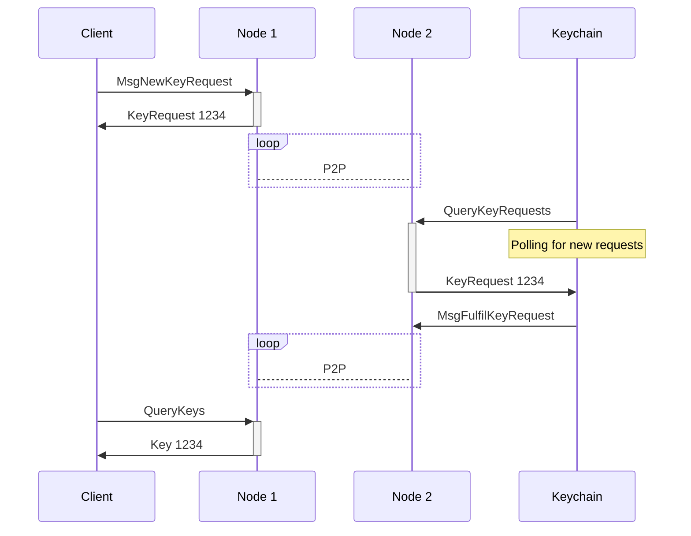
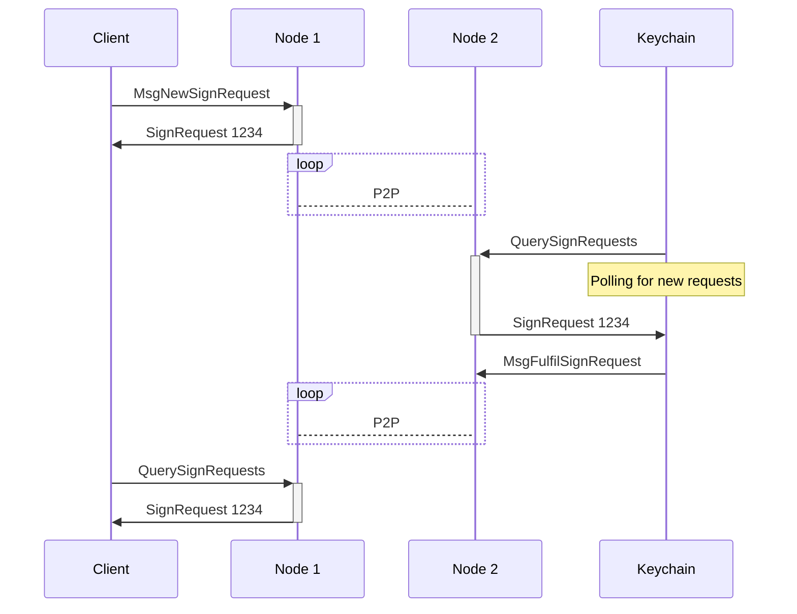

---
sidebar_position: 2
---

# x/warden

## Overview

The `x/warden` module is a [Cosmos SDK](https://docs.cosmos.network/) module allowing users to create and manage their Spaces and request Keychains to sign payloads.

This module implements Warden's core concepts:

- [Space](#space)
- [Key](#key)
- [Keychain](#keychain)
- [Analyzer](#analyzer)

## Usage

You can call the `x/warden` module from your EVM smart contract using the [`x/warden` precompile](/build-an-app/precompiles/x-warden), as shown in the [Interact with `x/warden`](/category/interact-with-xwarden) section.

The `x/warden` module is used for signing transactions in our [automated Orders example](/build-an-agent/build-an-onchain-ai-agent/implement-automated-orders/introduction).

## Concepts

### Space

A **Space** is a collection of users (owners) that manage [public keys](#key) and share a common set of [Approval Rules](x-act#rule), which are implemented in the `x/act` module:

- **Admin Rule**: This rule applies to all admin operations such as adding or removing Space owners.
- **Signing Rule**: This rule applies to all signature operations such as requesting a new key or signature from a [Keychain](#keychain).
- **Default Rule**: This rule applies if no Rule is specified, allowing any operation if at least 1 of the Space owners approves it.

### Key

Keys in blockchain are paired to identify users and secure the ownership of wallets:

- **Public key**: A public wallet address
- **Private key**: A private code for signing transactions on the wallet

On Warden, [Keychains](#keychain) generate key pairs and sign transactions with private keys. Keys have unique IDs used to refer to them when requesting a [Keychain](#keychain) to sign a payload.

Public keys are stored onchain, every key belonging to a certain [Space](#space).

### Keychain

A Keychain is a custodian that generates and stores [keys](#key) and signs transactions, fulfilling key and signature requests from users.

Keychain software runs on Keychain operators' servers, and operators can optionally set a fee for each key/signature request.

Keychains are registered onchain. Each of them has the following:

- A unique ID that identifies the Keychain in requests and collects fees
- A list of admins that can update the Keychain information
- A list of Keychain Writers—the only addresses authorized to publish signatures and keys

You can learn more in the [Key request flow](#key-request-flow) and [Signature request flow](#signature-request-flow) sections of this article.

### Analyzer

An **Analyzer** is a [CosmWasm](https://cosmwasm.com) contract that can intercept a payload before it's signed by a [Keychain](#keychain). Using Analyzers allows Keychains to receive the final payload without the need to have any knowledge of its content.

This is what Analyzers can do:

- Extract payload metadata, which then can be referenced in [Rule](x-act#rule) expressions
- Manipulate the payload before it's signed—for example, hash it following a specific algorithm

To illustrate this, it's possible to write an Ethereum Analyzer that will do the following:

- Extract information: the value being sent and the destination address
- Hash the payload using Ethereum's Keccak256 algorithm

You can learn more in the [Analyzers](#analyzers) section of this article.

## State

The `x/warden` module keeps the state of the following primary objects:

- Spaces
- Keys
- Keychains
- Key requests
- Signature requests

To manage this state, the module also keeps the following indexes:

- Keys by Space ID
- Spaces by owner address

## Rules

[Approval Rules](x-act#rule) are implemented the `x/act` module. The `x/warden` module provides the following variables to be used in Rules:

- `warden.space.owners`: The list of [Space](#space) owners
- `warden.analyzers.<addr>.<name>`: The [Analyzer](#analyzer) name and address

## Messages

### `MsgNewSpace`

Creates a new [Space](#space), optionally specifying the following:

- The Admin Rule
- The Signing Rule
- Additional owners

**Note**: If not specified, both the Admin and Signing Rules are set to the default Rule allowing any operation if at least 1 of the Space owners approves it.

This message is expected to fail in the following cases:

- An owner is specified twice.

### `MsgNewKeychain`

Creates a new [Keychain](#keychain), specifying the following:

- A human-readable description
- A key request fee (optionally)
- A signature request fee (optionally)

**Note**: The Keychain creator will be its first admin.

This message is expected to fail in the following cases:

- The description is empty.

### `MsgUpdateKeychain`

Updates a [Keychain](#keychain) by ID, specifying the following:

- A human-readable description
- A key request fee
- A signature request fee

This message is expected to fail in the following cases:

- The description is empty.
- The creator isn't an admin of the Keychain.

### `MsgAddKeychainWriter`

Adds a new Writer to a [Keychain](#keychain).

This message is expected to fail in the following cases:

- The Writer is already a Writer of the Keychain.
- The creator isn't an admin of the Keychain.

### `MsgFulfilKeyRequest`

Updates a key request (`KeyRequest`) by ID:

- On success, submits the [public key](#key) bytes.
- On failure, submits a human-readable reason.

This message is expected to fail in the following cases:

- The request isn't found.
- The creator isn't a Writer of the [Keychain](#keychain).
- The status field doesn't match the contents of the result field.

Learn more: [Key request flow](#key-request-flow)

### `MsgFulfilSignRequest`

Updates a signature request (`SignRequest`) by ID:

- On success, submits the signature bytes.
- On failure, submits a human-readable reason.

This message is expected to fail in the following cases:

- The request isn't found.
- The creator isn't a Writer of the [Keychain](#keychain).
- The status field doesn't match the content of the result field.

Learn more: [Signature request flow](#signature-request-flow)

## Actions

The following messages must be wrapped inside [Actions](x-act#action) from the `x/act` module (instead of being executed directly by users).

### `MsgAddSpaceOwner`

Adds an owner to a [Space](#space).

The Rule applied: `Space.AdminRule` if present, the default Rule otherwise.

This message is expected to fail in the following cases:

- The owner is already a member of the Space.

### `MsgRemoveSpaceOwner`

Removes an owner from a [Space](#space).

The Rule applied: `Space.AdminRule` if present, the default Rule otherwise.

This message is expected to fail in the following cases:

- The owner isn't a member of the Space.

### `MsgUpdateSpace`

Updates the Admin Rule and Signing Rule of a [Space](#space).

The Rule applied: `Space.AdminRule` if present, the default Rule otherwise.

This message is expected to fail in the following cases:

- The specified Admin Rule ID doesn't exist.
- The specified Signing Rule ID doesn't exist.

### `MsgNewKeyRequest`

Creates a new key request (`KeyRequest`) for a given [Keychain](#keychain). The resulting [key](#key) will belong to a given [Space](#space). Optionally, the following can be specified:

- A Rule that will be applied to the signing operations of the new Key

The Rule applied: `Space.SigningRule` if present, the default Rule otherwise.

This message is expected to fail in the following cases:

- The Space doesn't exist.
- The Keychain doesn't exist.
- The Rule doesn't exist.

Learn more: [Key request flow](#key-request-flow)

### `MsgUpdateKey`

Updates a [Key](#key) by ID, specifying the following:

- A new Rule for the Key

The Rule applied: `Key.Rule` if present, `Space.SigningRule` if present, the default Rule otherwise.

This message is expected to fail in the following cases:

- The Key doesn't exist.
- The Rule doesn't exist.

### `MsgNewSignRequest`

Creates a new signature request(`SignRequest`) for a given [key](#key) and the [Keychain](#keychain) that created it. The following can be specified:

- A list of [Analyzer](#analyzer) addresses. They will be invoked as part of this message to extract information from the payload.

The Rule applied: `Key.Rule` if present, `Space.SigningRule` if present, the default Rule otherwise.

This message is expected to fail in the following cases:

- The Key doesn't exist.
- One of the Analyzers doesn't exist.
- One of the invoked Analyzers fails.
- More than one Analyzer returns the `data_for_signing` field.

Learn more: [Signature request flow](#signature-request-flow)

## Events

See the [Protobuf definitions on GitHub](https://github.com/warden-protocol/wardenprotocol/blob/main/proto/warden/warden/v1beta3/events.proto).

## Analyzers

**Analyzers** are CosmWasm smart contracts that implement the interface described below.

See a [sample Analyzer on GitHub](https://github.com/warden-protocol/wardenprotocol/tree/main/contracts/contracts/basic-analyzer/src).

### Input

An `Analyze` message is expected to be handled by the `execute` function of the Analyzer contract.

The `input` field of the message is the binary payload submitted by a user in [`MsgNewSignRequest`](#msgnewsignrequest).

```rust
pub enum ExecuteMsg {
    Analyze { input: Binary },
}
```

### Output

As a result, the Analyzer contract should return a `Response` where the data field is populated with a JSON-encoded `AnalyzeResult`:

```rust
pub struct AnalyzeResult<T> {
    pub data_for_signing: Option<Binary>,
    pub result: T,
}
```

In this code, `T` is another struct specific to the Analyzer, containing numeric or string fields.

The `data_for_signing` field is the data that will be signed by the [Keychain](#keychain) when the [`MsgNewSignRequest` message](#msgnewsignrequest) is executed.

The fields of the `result` struct will be available for [Rules](x-act#rule) to reference.

## Key request flow

### Key requests

A key request is a request asking a [Keychain](#keychain) to generate a pair of private and public [keys](#key). Keychain operators can charge key request fees, indicated in aWARD (0.000000000000000001 [WARD](/tokens/ward-token/ward)).

In addition to Keychains, key requests involve the following actors:

  - **Node**: A server running the Warden Protocol software. See [Glossary: Node](../glossary#node).
  - **Client**: Software for interacting with the protocol, such as [SpaceWard](../glossary#spaceward). It runs on a user's machine.

### 1. Sending a request

1. The client sends a [`MsgNewKeyRequest` transaction](#msgnewkeyrequest) to its node, specifying these details:

- The key type—for example, ECDSA secp256k1
- The Keychain ID
- [The Approval Rule ID](x-act#rule)

2. A `KeyRequest` object is created and stored in the onchain database.

### 2. Checking the Rule

1. The node checks the Approval Rule: if the conditions specified in the Rule are satisfied, the [Intent Engine](../glossary#intent-engine) returns `true`.

2. The transaction gets included in a block and broadcast to the P2P network.

3. All nodes in the network reach consensus on the validity of the transaction and re-evaluate the Approval Rule check.

**Note**: 1/3 of the voting power has to agree on the outcome of evaluation. Otherwise, the request is never broadcast to the Keychain. If an attacker wants to abuse the system, they need to obtain more than 1/3 of the voting power.

### 3. Fulfilling the request

1. The Keychain queries its node for pending requests and picks up the `KeyRequest` object, identified by its unique ID.

2. The Keychain's MPC network generates a new private/public key pair and stores it. The new public key inherits its ID from the `KeyRequest` ID. 

3. A Keychain Writer sends a [`MsgFulfilKeyRequest` transaction](#msgfulfilkeyrequest) with the public key to the node.

**Note**: Currently all Keychains available in Warden are MPC-based: each Keychain operator runs a network of MPC nodes. Potentially, a Keychain can be operated without an MPC network—Warden isn't in charge of it.

### Diagram

This diagram represents the key request flow:



## Signature request flow

### Signature requests

A signature request is a request asking a [Keychain](#keychain) to sign a transaction with a [private key](#key). Keychain operators can charge signature request fees for doing it, indicated in aWARD (0.000000000000000001 [WARD](/tokens/ward-token/ward)).

In addition to Keychains, signature requests involve the following actors:

- **Node**: A server running the Warden Protocol software. See [Glossary: Node](../glossary#node).
- **Client**: Software for interacting with the protocol, such as [SpaceWard](../glossary#spaceward). It runs on a user's machine.

### 1. Sending a request

1. The client sends a [`MsgNewSignRequest` transaction](#msgnewsignrequest) to its node, specifying these details:

   - Raw data bytes
   - The key ID
   - [The Approval Rule ID](x-act#rule)

2. A `SignRequest` object is created and stored in the onchain database.

**Note**: While key requests directly indicate the Keychain in the request, signature requests contain the Keychain ID inside the `keys` object.

### 2. Checking the Rule

1. The node checks the Approval Rule: if the conditions specified in the Rule are satisfied, the [Intent Engine](../glossary#intent-engine) returns `true`.

2. The transaction is included in a block and broadcast to the P2P network.  

3. All nodes in the network reach consensus on the validity of the transaction and re-evaluate the Approval Rule check.

**Note**: 1/3 of the voting power has to agree on the outcome of evaluation. Otherwise, the request is never broadcast to the Keychain. If an attacker wants to abuse the system, they need to obtain more than 1/3 of the voting power.

### 3. Fulfilling the request

1. The Keychain queries its node for pending requests and picks up the `SignRequest` object, identified by its unique ID.  

2. The Keychain's MPC network generates a signature using the specified private key.  

3. A Keychain Writer sends a [`MsgFulfilSignRequest` transaction](#msgfulfilsignrequest) with the signature to the node.

**Note**: Currently all Keychains available in Warden are MPC-based: each Keychain operator runs a network of MPC nodes. Potentially, a Keychain can be operated without an MPC network—Warden isn't in charge of it.

### Diagram

This diagram represents the signature request flow:


