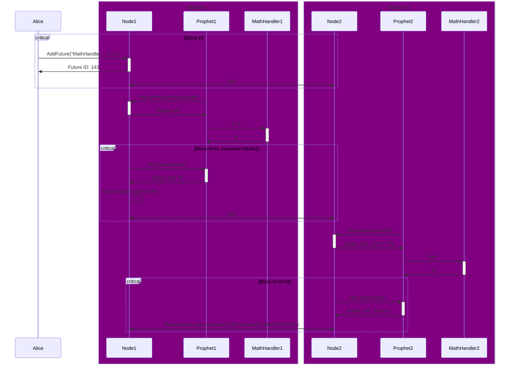

# x/async

## Overview

The `x/asyn` module is a [Cosmos SDK](https://docs.cosmos.network/) for running off-chain heavyweight computations asynchronously and storing the results on-chain.

Users are able to request new computation on-chain, specifying an input and a *handler*.

Validators are running a sidecar process called **prophet**. Prophet has two responsibilities: fetching new requests for executing them; and fetching requests satisfied by other validators to add its vote.

## Concepts

### Future

A Future is something that will be executed asynchronously. One validator will provide the result and other validators will vote on its correctness.

Futures contain an *handler* ID, that decides *how* to interpret the input and what to do with it in order to retrieve the result.

### Prophet

A separate process running the validators nodes, alongside `wardend`. Not all validators will be required to run prophet.

Prophet is responsible for executing future handlers’ code, without blocking consensus.

This architecture is similar to [how skip:connect works](https://docs.skip.build/connect/learn/architecture).

## State

x/async keeps track of Futures.

Completed Futures will be pruned after some time, to avoid state bloat.

## Messages

### MsgAddFuture

Creates a new Future, providing a `[]byte` input and a `string` ID for the handler to use.

The Future will be considered in a `pending` state until it has a result. The user can query the Future by its ID to check the progress.

## Prophet (sidecar)

### Executing Futures

Prophet will continuously poll the chain to discover new pending Futures, maintaining a local queue for them.

Concurrently, Futures are taken from the queue and the associated handler’s code it’s executed (this usually involves calling an external service).

The results will be stored in memory for the blockchain node to fetch it later.

### Voting Future results

Prophet will continuously poll the chain to discover Futures that have a result submitted by another validator, maintaining a local queue for them.

Concurrently, Futures are taken from the queue and validated (this usually involves calling an external service).

The votes will be stored in memory for the blockchain node to fetch it later.

## ABCI lifecycle

From the POV of a node: if the validator is the proposer for the next block, it’ll fetch results from Prophet and include them in a special transaction at the beginning of the block proposal. Every validator (even non-proposers) will broadcast their voting on existing Futures as vote extensions.

When the proposal is processed (i.e. the block is finalized) all the new results and new votes are persisted in the blockchain storage.

## Sequence diagram

Sequence diagram showing a user named Alice that inserts a new Future for a handler called “MathHandler”, with input “2+4”. Node1 asynchronously executes it, and when is elected proposer for a block (H+N) it inserts the result (”6”) to be recorded. Node2 notices the new result for a future and invokes its MathHandler to verify the result, the verification will be broadcasted as vote extensions and eventually recorded at height H+N+M+1 (the +1 is due to how vote extension works, as they’re only committed to the state only in the next block).
