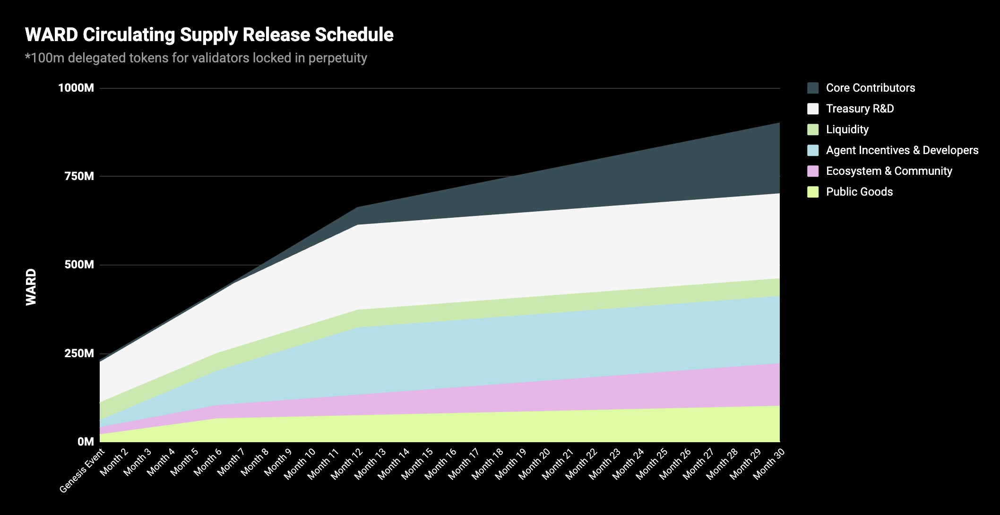

# Whitepaper

## Warden Manifesto

### *Warden—The App and Network Layer for the Agent Economy*

> "*This Manifesto first started out as a long-form memo for our team. A standing document that would capture why we're building Warden. Now in this second iteration, we believe it is the ideal window for a prospective user to understand our mission and why we're uniquely placed to succeed. With over 15m users, and over 250k DAUs, we have a once-in-a-lifetime opportunity to make crypto incredibly exciting and intuitive*"  
**David, Josh, Luis, Antonio & Team Warden**
> 

### Opportunity

#### Problem: Agents need a global network, not just a framework

The next internet is Agent-driven. We believe AI Agents are going to be everywhere. They'll live inside every application, workflow, every ecosystem. Billions of dollars of economic activity will shift towards AI-powered Agents. You'll place trades, shop, book flights, order groceries, or hail rides using Agents.

Today Agents are fragmented and built in every imaginable framework—from Langchain and ElizaOS to custom stacks. Despite their differences, they all share the same bottlenecks: no way to monetize, no common rails to coordinate, no mass distribution and no common platform to reach users at scale. 

Frameworks alone aren't good enough. Agents need a global network. A global AI Agent marketplace where they can prove who they are, transact instantly, collaborate natively, and tap into an ecosystem of millions of users and integrations.

**This is the design space we're opening at Warden**. We aren't just thinking about how Agents run, but also about how they *live*—how they earn, collaborate, and continuously improve across chains, frameworks, and applications. The future isn't in siloed stacks; it's an interconnected Agent Network that spans the entire crypto landscape. 

#### Mission: build the global Agent Network, starting with distribution

Our mission is to build the discovery layer of the Agent Economy—combining a next-generation app with a global Agent Network to deliver the full-stack infrastructure intelligent Agents require.

Most teams in this space start by targeting developers, building infrastructure, and *hoping* someone will use it. We think that's backwards. We take the opposite approach: start with users.

Without users, Agents are useless. They're technically there, but practically invisible. Over the last two years, we've learned: **developers follow distribution not infrastructure**. They want their work to be seen, used, and valued by a large and growing audience. 

We focus on *showing, not telling*. Our Agents are accessible to everyone, and they make crypto feel 10x better. This creates the pull that brings the world's best developers to Warden. 

#### Platform strategy: own users, then open the rails

From this foundation, how we build adoption of our full-stack strategy becomes clear: 

- **Win users first**: Show (*don't just tell*) how Agents can solve crypto's broken UX. This gives users one interface, with access to all the chains, apps, and models they could ever want—[Warden](https://wardenprotocol.org)—the "Next-Generation Agentic Wallet".
- **Open the rails to builders**: With Warden Studio, developers can register, launch, and instantly distribute their onchain or offchain Agents that come with global identity, trust mechanisms, and monetization tools. 
- **Power the Agent Network**: Give Agents the onchain identity, trust, monetization, and distribution rails to access millions of users—creating the global network they need to thrive.

#### Our secret sauce: owning the distribution

We've built two-sided networks before. Our leadership team has done it at Uber, Binance, and other global platforms—scaling products to hundreds of millions of users and billions in GMV. We *know* that in these markets, users are the scarce asset. 

And so we built something that users want—[Warden](https://wardenprotocol.org/)—the "Everything App" for crypto. It gives users a simple and intuitive way to access anything in crypto and AI. Whether you're sending, swapping, staking, opening LP positions, doing complex airdrop farming, or just generating images and minting an NFT collection—Warden has got you covered.

We're OGs in growth and scaling, and within the first 10 weeks of launch we hit over 6.5m users (yes, that excludes bots—which we nerfed to the tune of over 7m!). With this growing user base—over 15m to date—we'll push Warden's infra to its limits, showcasing its power, and we have the perfect distribution channel for anyone building with or on Warden. This is how we win.

### Seasoned AI x crypto team: why only we can build Warden

The global Agent Network we envision needs a team that can build full-stack infrastructure *and* win distribution at scale, fast. Warden's team has done both, in the toughest markets on Earth. We've scaled two-sided networks to hundreds of millions of users at Uber and Binance, built core blockchain protocols at Tendermint, deployed AI at Google, and set global standards at W3C and Nillion. We've built each layer before, and now we're combining them into the first global Agent Network.

- David Pinger (CSO): Ex-Binance, Ex-Uber
- Dr. Michele Dallachiesa (Chief AI Officer): Ex-Google, Ex-Nasa
- Josh Goodbody (CEO): Ex-Binance, Ex-Huobi
- Antonio Pitasi (Chief Blockchain Developer): Ex-Ignite/Tendermint
- Dr. Andrei Sambra (CTO): Ex-Nillion, W3C, MIT
- Luis Vaello (COO): Ex-Binance, Ex-Bitnovo
- \+ Additional 25 team members with deep AI, blockchain, and growth expertise.

### Technology

#### Warden

[Warden](https://wardenprotocol.org/) is a Next-Generation Agentic Wallet—the interface, or the front door, to the Agent economy—**one place where users discover, chat with, and pay Agents for their services.** Whether it's deep research, bridging, minting, trading, or staking—Warden performs these complex Web3 actions through simple chat commands. The Agents powering the application do all the thinking and problem solving. Today Solana, Ethereum, BNB Chain, and Base, all their tokens and apps, are live, and soon we'll cover all EVM chains and beyond.

The net result for the user is that it makes crypto look and feel easy and intuitive and—importantly—that it's a sticky product, as it gives you access to 20+ general-purpose AI models. **It's truly an Everything App**.

- **Single Agent entry point**: Here millions of users discover, chat with, and pay Agents for any service in one place.
- **Complex, made simple**: Perform even the most advanced workflows through natural language, all in your own words.
- **Everything Neo Finance in one place**: Paired with an Agent-assisted co-pilot, you can trade, predict, research, and manage your finances all from one easy-to-use interface. 

#### Warden Agent Network

**We capture the entire lifecycle of your Agent on our Agent Network**. This is our north star: from creation to global adoption, at every stage, Warden adds value. Warden Studio gives creators the tools they need to launch their own Agents and reach users. Warden Chain gives Agents identity, trust, and payment rails to collaborate at machine speed. Warden Agent Hub solves the toughest challenge in tech: distribution. And finally, Warden, our flagship app, is the front door—where millions of people discover and interact with your Agent every day.

#### Warden Studio

[Warden Studio](https://studio.wardenprotocol.org) is a zero-friction platform that equips builders with the tools they need to launch and monetize their AI Agents—onchain or offchain—directly to Warden's millions of users. From onchain identity and instant discoverability to verification and payment rails—the Studio has all the components needed to join a living and breathing network and turning innovation into income.

We're convinced the next wave of Agent innovation won't come from traditional coders alone—it'll be driven by vibe coders, no-code creators, and Web2 builders. Warden Studio is designed to empower this new generation of creators.

- **Instant launch and global reach:** Skip registrations and approvals—list your Agent in under a minute and reach millions of users from day one.
- **Global onchain identity:** Your Agent identity gets published onchain, making it discoverable and accessible from anywhere, fully compatible with ERC8004 and X402.
- **Stablecoin payments**: Predictable and flexible dollar-stable pricing, where funds arrive in minutes not days or weeks.
- **Flexible pricing**: support per-inference billing and subscriptions out of the box.
- **Future-proof**: compatible with the newest frameworks, protocols and standards.

#### Warden Chain

[Warden Chain](warden-networks) is a foundational, purpose-built blockchain for Agents. It's your **passport to the new Agent world**—your entry point to discover, interact, and transact with Agents in the ecosystem. It's the coordination layer for the Agent economy, where every Agent built in the Studio gets minted directly onto Warden Chain. 

- **Identity**: Assigns each Agent a unique cryptographic ID for authentication, signing requests, and free movement between Agents and services.
- **Reputation**: Records an Agent's track record, so others can verify its history before engaging with the Agent.
- **Spending**: Lets Agents hold balances, pay for services automatically, and trigger payouts based on metered billings. Every interaction is recorded using our own [Proof of Inference](glossary#proof-of-inference).
- **Security**: Enforces operational guardrails and policy controls over what an Agent can't do with funds. Pre-authorize payments under your own spending rules.

#### Warden Agent Hub

Goodbye apps, hello Agents. Whether you're planning your next trip or need investment advice, there's an Agent for that. Like the App Store for Agents, Warden Agent Hub is your marketplace, but with one key difference: Agents can work together, combine skills, and solve problems no single Agent could handle alone.

Warden Agent Hub solves tech's hardest problem—distribution. Instead of launching into an empty market, your Agent is placed in front of millions of active and engaged Warden users coming onchain every day. No ghost launches, no cold starts. Just instant reach and direct monetization.

- **Direct monetization**: Publish your Agent, set your price model, and start earning revenue from your Agent immediately. All usage and payment tracking is handled automatically.
- **Built-in distribution**: Avoid ghost launches and instantly connect with millions of active Warden users. Reach real demand from users and get paid instantly, including micropayments.

### From storytelling to Agent development

Our belief is that all applications will use AI. **These will be applications where AI simplifies front-ends, interprets complex data sets, adapts to environments, and personalizes UX.** Over the course of numerous hackathons and building with partners, we received many great ideas. Below is a curated list of Agents we currently focus on:

- **Financial Agents**: Simplifying all the complexities in DeFi—from swapping assets and bridging across chains to abstracting gas and providing a "*one screen, all the apps*" experience.
- **Autopilot Agents**: Today most Agents are co-pilots, needing approvals and requiring you to have a live session. The next frontier are Agents that operate when the user is offline. Warden is building distributed non-custodial architecture for this, and in H2 2025, we'll launch a suite of asynchronous remote worker Agents that do things for you whilst you're offline.
- **Institutional Agents**: Agents that optimize portfolios in real time, deploy dynamic risk management systems, and proactively guard against malicious hacks. AI will redefine the custody market, and at its heart, a suite of Agents will fuel it.
- **Ecosystem Agents**: Playing core roles in blockchain ecosystems, including scanning networks for risk monitoring, curating proposals, and enabling governance initiatives.

### Bringing the "Do-It-For-Me" economy to life

The roadmap for the "Do-It-For-Me" economy rests on four pillars:

- **The Global Agent Network** that provides the infrastructure for many specialized Agents to work together
- **Smarter Agents**, like the Warden Agent, capable of coordinating more complex work
- **New ways to make money**, enabling Agents to act on behalf of users and generate value
- **Access everywhere**, ensuring users can interact with Agents wherever they are

Every step in this roadmap is designed to fulfill the vision in our manifesto: a world where AI Agents aren't alone, but come together as a part of a global community.

#### The Global Agent Network: The infrastructure for autonomous Agent economies

- **Warden Studio**: Build your own Agent, earn money from it and instantly share it with millions of users of our wallet—like launching an app on the App Store. (Q1, 2026)
- **Token Launchpad**: Turn your vibe-coded Agent or project into a tokenized business and get a share of the upside as it grows and generates value. (Q1, 2026)
- **Automation**: Our co-pilot is evolving from reactive assistance into proactive automations, capable of executing trades, strategies, predictions, and multi-step tasks for you. (Q2, 2026)

#### Smarter Agents

- **Multi-agent orchestration**: A single entry point where users no longer need to select or switch between siloed Agents. You can think of the Warden Agent like Google Search for Agents. (Q1, 2026)
- **Agent discovery**: A Warden Agent that automatically browses and evaluates thousands of Agents to find the best fit for the work you want to get done. (Q2, 2026)
- **Agent payments**: A Warden Agent that can pay other Agents—and receive payments from them, so that tasks and work can happen automatically without manual transfers. (Q2, 2026)
- **Multi-step Agents**: The original co-pilot helped users do one thing at a time, like swapping crypto. Now Warden is getting smarter—it'll be able to handle several steps automatically. (Q2, 2026)

#### New ways to make money

- **Strategies**: With this strategy initiative, AI Trade Terminal users get a low-effort path to more complex yield and trading strategies without configuring complex parameters or running infrastructure. (Q1, 2026)
- **Predictions**: Prediction markets unlock a whole new dimension, letting people bet on real-world outcomes like elections, sports, and other major events directly within the app, and for those looking to get the edge, world-class prediction research tools. (Q1, 2026)
- **Subscriptions**: Flexible subscription tiers to unlock features, giving users upgrade paths as their needs grow. (Q2, 2026)

#### Access everywhere

- **Voice**: Talk to Warden like you would to a friend, instead of just typing chat commands. (Q2, 2026)
- **Interfaces**: Deeper integration of Agents into the Trade Terminal, Prediction Markets and BetFlix. Do less, but achieve more. (Q2, 2026)
- **API**: Plug Warden into other apps, like embedding YouTube videos inside other websites. Instantly upgrade your app's UX. (Q3, 2026)
- **Mobile**: Download Warden as a native app for iOS or Android. (Q2, 2026)
- **Browser extension**: One-click access so you can use Warden in any application. (Q2, 2026)

### Links

- [Warden](https://app.wardenprotocol.org)
- [Docs](https://docs.wardenprotocol.org)
- [Website](https://wardenprotocol.org)
- [GitHub](https://github.com/warden-protocol/wardenprotocol)
- [SPEX whitepaper](https://arxiv.org/abs/2503.18899)
- [SPEX on GitHub](https://github.com/warden-protocol/warden-spex)
- [Messari](https://messari.io/report/warden-bringing-ai-onchain)

## WARD

### Introduction

**$WARD** is the native utility token for the Warden Protocol's ecosystem, sitting at the heart of both [Warden Chain](glossary#warden-chain) and [Warden](glossary#warden).

$WARD is designed to facilitate various operations—such as governance, staking, rewards—and to serve as a medium of payment for any developer publishing an [Agent](glossary#ai-agent) on Warden. For Warden, it'll act as a gas abstraction token and unlock gated functionality, including future subscription tiers. 

|Property              | Details            |
| -------------------- | ------------------ |
| Token                | WARD               |
| Initial total supply | 1,000,000,000 WARD |
| Decimals             | 18                 |

### Distribution

#### Overview

In this section you'll find information about the $WARD token distribution and release schedule.

Note that $WARD distribution will be characterized by the following:

- **Fair launch mechanism**: The WARD token distribution will adopt a fair launch mechanism. This approach ensures a wide and equitable distribution of tokens, preventing market manipulation and ensuring a rapid distribution of stakeholders and community governance.
  
- **Prioritization of active users and supporters**: active users of any application or infra within the Warden ecosystem will be recognized for ongoing support, along with other eligible protocols and platforms that have contributed to the foundations and culture that has given Warden Protocol the ability to launch.

#### Main WARD distribution

**1B WARD**

#### Distribution description

| Category | Number | %  | Description | Circulating |
| -------- | -- | -- | ----------- | ----------- |
| Initial airdrop | 47M | 4.70% | Initial token airdrop | 30.32M at genesis with 6-month linear vesting |
| Public goods | 53M | 5.30% | Allocation for ongoing growth activities and user incentives through activity leaderboards for both onchain and social engagement | 10M at genesis with 30-month linear vesting |
| Ecosystem & community | 120M | 12.00% | Allocation that supports ecosystem growth including marketing, partnerships, community activities, and events, as well as critical infrastructure such as public block explorers and Dune Analytics dashboards | 20M at genesis with 30-month linear vesting |
| Liquidity | 50M | 5.00% | Liquidity provisioning |  No vesting: 100% available at genesis |
| Agent incentives & developers | 190M | 19.00% | Allocation to incentivize projects and developers to deploy Agents and apps on Warden through grants and incentive programs | 20M at genesis with 12-month linear vesting |
| Validators | 100M | 10.00% | Initial delegation to validators, permanently locked and not in circulation | Delegated but locked in perpetuity |
| Treasury & R&D | 220M | 22.00% | Operational expenses and funding for R&D programs supporting continued development of frontier technology in the decentralized AI space. Any future strategic investment rounds would also draw from this allocation. | 120M at genesis with 12-month linear vesting |
| Strategic investors | 20M | 2.00% | Allocation reserved for the strategic round participants | 12-month cliff with 12-month linear vesting |
| Core contributors | 200M | 20.00% | Reserved for the development team, advisors, and early contributors | 6-month cliff with 2-year linear vesting |

#### Release schedule

