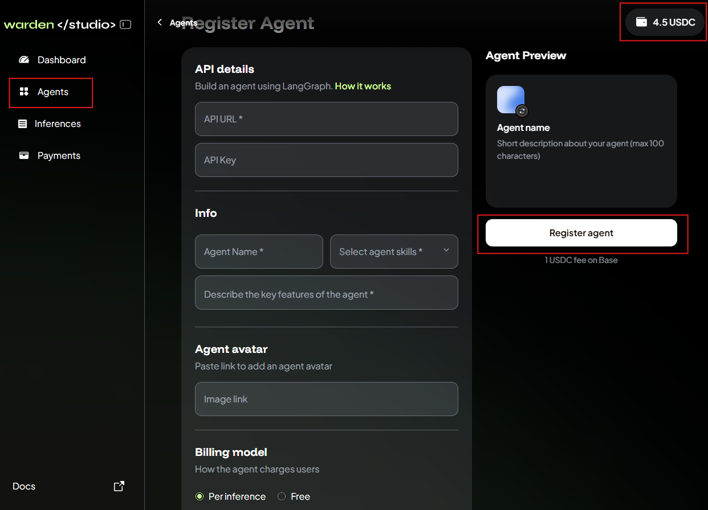
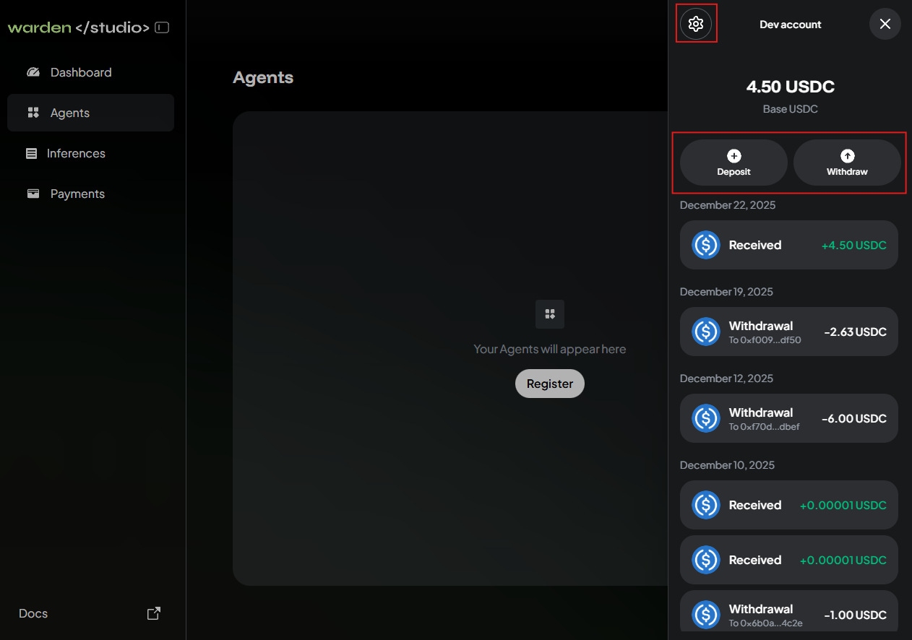

---
sidebar_position: 4
---

# Publish

## Overview

This guide explains how to build your **Community Agent** and publish it on Warden through **Warden Studio**, our platform for developers.

:::important
To quickly get started with publishing an Agent on Warden, explore the examples and documentation in our GitHub repository: [`community-agents`](https://github.com/warden-protocol/community-agents).
:::

:::tip
If you get stuck or have any questions, join the developer channel in our Discord: [`#developers`](https://discord.com/channels/1199357852666560654/1222892775876333629).
:::

## Technical requirements

You can implement any Web3 or Web2 workflow and any custom functionality: your Agent can connect to APIs, use databases, tools, and so on.

Please keep in mind the following requirements and technical limitations:

- Currently, you must use [LangGraph](https://www.langchain.com/langgraph). Support for more frameworks is coming soon.
- You can host your Agent on LangGraph Cloud or on your own infrastructure.
- Make sure that your Agent is accessible through an API. **No UI is required**.
- Make sure that you only have one Agent per LangGraph instance to keep your Agents separated.
- For security reasons, Agents will not have access to users' wallets, nor will they be able to store any data on Warden infrastructure. These limitations will be removed in the next phase of the Warden Agent Hub.

## Step 1. Build an Agent

To quickly get started with publishing an Agent on Warden, explore the examples and documentation in our GitHub repository:

1. Clone/fork the repository: [`community-agents`](https://github.com/warden-protocol/community-agents).
2. Extend and adapt any example to build your own LangGraph Agent.
3. Deploy your Agent on LangGraph Cloud or on your infrastructure.
4. Make sure your Agent is accessible through the LangGraph API.

To learn more, explore the [official LangGraph documentation](https://docs.langchain.com/oss/javascript/langgraph/overview) and check [LangGraph beginner guides](https://github.com/warden-protocol/community-agents/tree/main/docs) in our repository.

:::important
To publish your Agent, you **do not need to build a UI**. The only thing required is an **API URL**, which is **automatically available** once you deploy your Agent.
:::

:::tip Tips
- Each example we provide in the `community-agents` repository has its own README explaining how we built the Agent—you can start with the [Weather Agent](https://github.com/warden-protocol/community-agents/tree/main/agents/weather-agent).
- With LangGraph, you can use either **TypeScript** or **Python**. 
:::

## Step 2. Publish your Agent

Now you can publish and monetize your Agent on [Warden](https://app.wardenprotocol.org) through **Warden Studio**—our platform for Agent developers.

Make sure your [Warden account](https://help.wardenprotocol.org/warden-app/manage-your-wallets#the-main-account) holds the following assets:

- At least **1 USDC on Base** to pay the registration fee
- **ETH on Base** to pay the gas fee

Then take the following steps in Warden Studio:

1. Log in using your Warden account credentials: 👉 [Warden Studio](https://studio.wardenprotocol.org)  
2. Your developer account will automatically connect to your Warden account. Click the wallet icon at the top right and make sure there is at least **1 USDC**.
3. Open the **Agents** tab and click **Register**.
4. Provide the required details:
   - Your agent's API URL and API key
   - The name, description, skills, and avatar
   - The preferred billing model (per inference or free)
5. Click **Register agent** and wait.

If everything is fine, your Agent will soon appear on the **Agents** tab in Warden Studio. You'll also see the Agent on Warden: just open the [Agent Hub](https://help.wardenprotocol.org/warden-app/explore-ai-agents#access-agents) and check the **Community** tab.

## Step 3. Manage your Agent

In [Warden Studio](https://studio.wardenprotocol.org), you can monitor inferences and payments to your Agent. Just check the following tabs:

- **Inferences**
- **Payments**

You can also manage your **developer account**—a wallet for paying the Agent registration fee and receiving payments from users:

1. Log in: 👉 [Warden Studio](https://studio.wardenprotocol.org)
2. Click the wallet icon at the top right to access your dev account.
3. Manage the wallet:
   - To deposit funds, click **Deposit**.
   - To withdraw funds, click **Withdraw**.
   - To configure, click the gear icon at the top. You can manage the appearance, security, and login settings.

:::note
Once you log in, the developer account automatically connects with your Warden account using the same credentials but displays only **USDC on Base**.
:::

## Earn rewards

We encourage Agent developers to participate in the [Agent Builder Incentive Programme](https://wardenprotocol.org/blog/agent-builder-incentive-programme). You can build an Agent, publish it on Warden, and earn rewards for early onboarding, quality, and other achievements. To learn more, see the [FAQ](https://wardenprotocol.notion.site/agent-builder-incentive-faq).

To qualify for rewards, you need to do the following:

- Publish an Agent meeting the [technical requirements](#technical-requirements)
- [Register for the programme](https://docs.google.com/forms/d/e/1FAIpQLSdwTR0BL8-T3LLbJt6aIyjuEYjMAmJPMdwffwHcyW6gskDQsg/viewform)
- Submit a pull request to the `community-agents` repository, listing your Agent in [`README.md`](https://github.com/warden-protocol/community-agents/blob/main/README.md#-community-agents-and-tools)

:::tip
To earn extra rewards, ship clean code and great docs. Innovative or under-served categories will get additional recognition and funding.
:::
