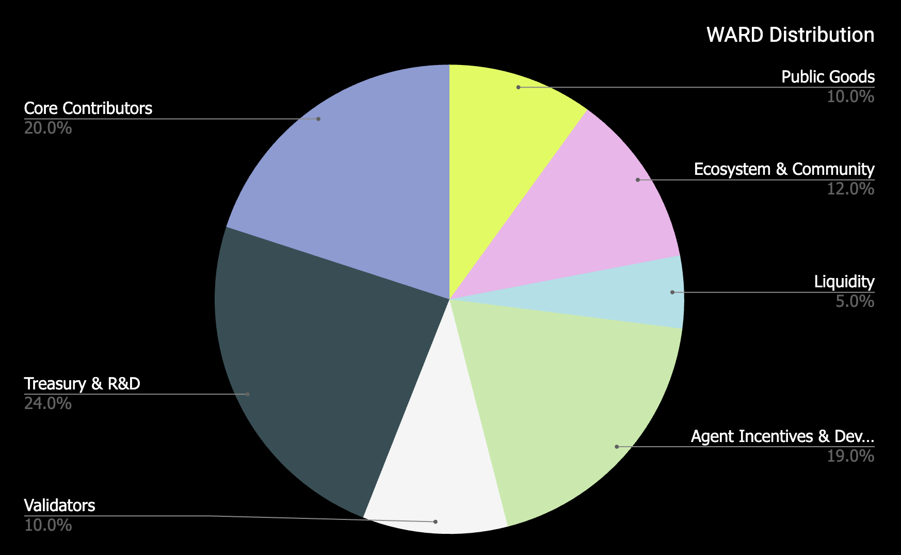

# Distribution

## Overview

In this section you'll find information about the $WARD token distribution and release schedule.

Note that $WARD distribution will be characterized by the following:

- **Fair launch mechanism**: The WARD token distribution will adopt a fair launch mechanism. This approach ensures a wide and equitable distribution of tokens, preventing market manipulation and ensuring a rapid distribution of stakeholders and community governance.
  
- **Prioritization of active users and supporters**: active users of any application or infra within the Warden ecosystem will be recognized ongoing support, along with other eligible protocols and platforms that have contributed to the foundations and culture that has given Warden Protocol the ability to launch.

## Main WARD distribution

**1B WARD**

## Distribution description

| Category | Number | %  | Description | Circulating |
| -------- | -- | -- | ----------- | ----------- |
| Initial airdrop | 47M | 4,70% | Initial token airdrop | 30.32M at genesis with 6-month linear vesting |
| Public goods | 53M | 5.30% | Allocation for ongoing growth activities and user incentives through activity leaderboards for both onchain and social engagement | 10M at genesis with 30-month linear vesting |
| Ecosystem & community | 120M | 12.00% | Allocation that supports ecosystem growth including marketing, partnerships, community activities, and events, as well as critical infrastructure such as public block explorers and Dune Analytics dashboards | 20M at genesis with 30-month linear vesting |
| Liquidity | 50M | 5.00% | Liquidity provisioning |  No vesting: 100% available at genesis |
| Agent incentives & developers | 190M | 19.00% | Allocation to incentivize projects and developers to deploy Agents and apps on Warden through grants and incentive programs | 20M at genesis with 12-month linear vesting |
| Validators | 100M | 10.00% | Initial delegation to validators, permanently locked and not in circulation | Delegated but locked in perpetuity |
| Treasury & R&D | 220M | 22.00% | Operational expenses and funding for R&D programs supporting continued development of frontier technology in the decentralized AI space. Any future strategic investment rounds would also draw from this allocation. | 120M at genesis with 12-month linear vesting |
| Strategic investors | 20M | 2.00% | Allocation reserved for the strategic round participants | 12-month cliff with 12-month linear vesting |
| Core contributors | 200M | 20.00% | Reserved for the development team, advisors, and early contributors | 6-month cliff with 2-year linear vesting |

## Release schedule

