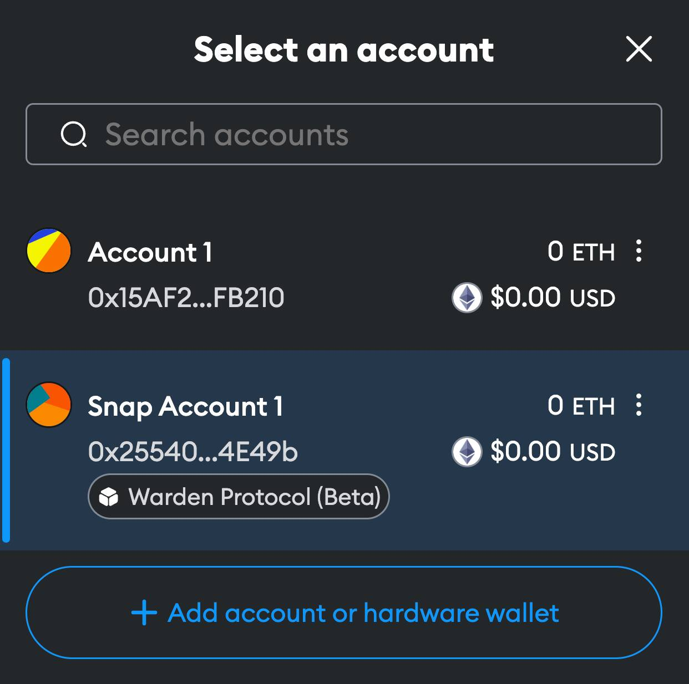

# MetaMask Snap

Warden Protocol maintains a [MetaMask Snap](https://metamask.io/snaps/) to
bring your Warden Protocol Ethereum addresses to any dApp that already supports
MetaMask.




## Build

Clone the Warden Protocol repo:

```sh
git clone https://github.com/warden-protocol/wardenprotocol

cd wardenprotocol/snap
```

Install the required dependencies:

```sh
npm install
```

Run the server (it will monitor changes and rebuild automatically):

```sh
npm start
```

Now SpaceWard can load the MetaMask Snap using the origin
`local:http://localhost:8123`.


## Publish

MetaMask Snaps are published as npm packages. At this time, the Warden Protocol
MetaMask Snap is not published to npm, but you can build and test it
locally.
