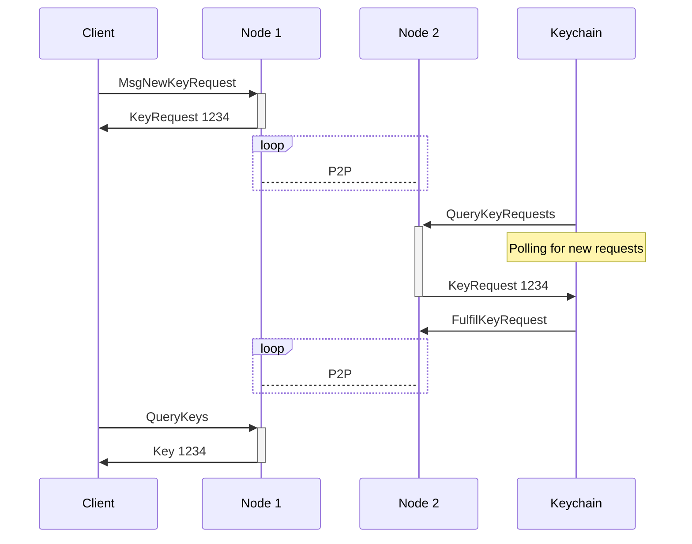
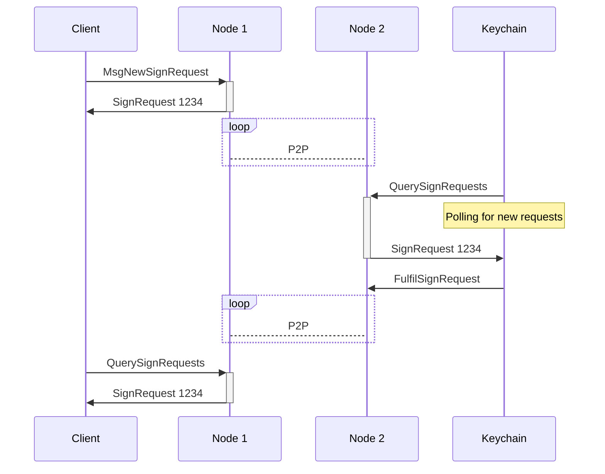

# Protocol

This document is an early draft that outlines a 30,000 foot view of the flow of
data through the system.

## Overview

The Warden Protocol is a system for managing keys for blockchain nodes. It
consists of three types of actors: the Warden Protocol nodes (part of the
blockchain network), the Keychains, and the Clients.

A Keychain is a custodian of private keys. It's responsible for generating and
storing keys, and for signing data using those keys. It's a software running on
the custodian's server. 

The Warden Protocol acts as the access control layer for the Keychains. It
allows users to request keys from the Keychains, and later to request
signatures for data using those keys.

## Services

- Node, any blockchain node in the Warden Protocol network
- Keychain, an KMS software running on the custodian's server
- Client, a software that interacts with the Warden Protocol running on the
  users' machines (e.g. SpaceWard)

## Requesting a new Key

The client sends a `MsgNewKeyRequest` transaction to a Node.

In the request, the client specified the type of key it wants (e.g. ECDSA
secp256k1) and the Keychain it wants to use.

The Keychain will see a pending request and will pick it up. The Keychain
generates a new key pair and stores it. The Keychain sends a `FulfilKeyRequest`
to the Node containing the public key.

The KeyRequest is uniquely identified by an ID. The resulting Key will be
uniquely identified by the same ID.

## Requesting a Signature

The flow for requesting a signature is similar to the flow for requesting a new
key.

The client sends a `MsgNewSignRequest` transaction to a Node containing the
raw data bytes to be signed and the Key to use.

The Keychain responsible for that Key will see a pending signature request and
will pick it up. The Keychain signs the data using the private key and sends a
`FulfilSignRequest` to the Node containing the signature.

The `SignRequest` is uniquely identified by an ID. The request will be
updated with the signature once it's available.

## Interacting with the Node

The Node is a central point of contact for the Warden Protocol. It's
responsible for routing requests to the appropriate Keychain, and for routing
responses back to the client.

Interacting with the node is possible through a HTTP API, or through a gRPC
API.

The full list of available endpoints is documented in the [API
Reference](./api).
