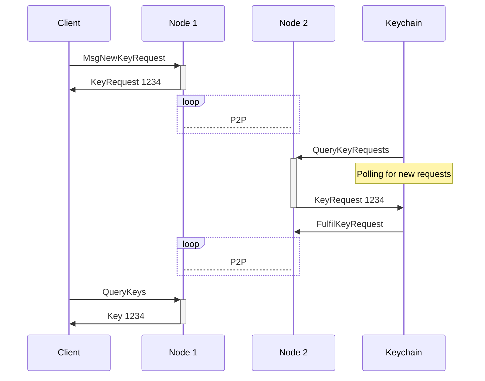
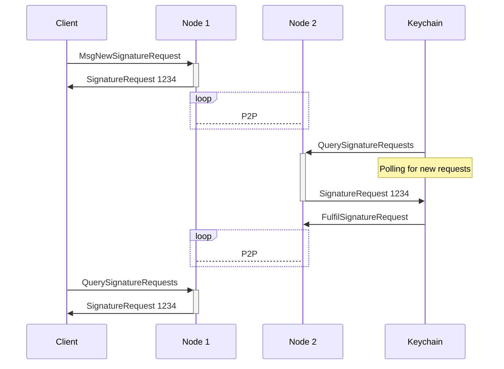

---
sidebar_position: 4
---

# Transaction flow

---REVIEW---

## Overview

This section explains how the Warden Protocol processes two types of transactions: [key requests](/learn/glossary#key-request) and [signature requests](/learn/glossary#signature-request).

The Warden Protocol is a system that manages keys for [blockchain nodes](/learn/glossary#warden-protocol-node). Warden users can request [Keychains](/learn/glossary#keychain) to generate pairs of private and public [keys](/learn/glossary#key) and sign transactions with private keys. Requests reach [Keychains](/learn/glossary#keychain) only after Warden's [Intent Engine](/learn/glossary#intent-engine) verifies that user [Intents](/learn/glossary#intent) are satisfied.

## Actors

The Warden Protocol includes three types of actors participating in sending and processing transactions:

- **Node**: A server running the Warden Protocol software
- **Keychain**: Software for generating keys and signing transactions, running on a Keychain operator's server
- **Client**: Software for interacting with the protocol, running on a user's machine (such as [SpaceWard](/learn/glossary#spaceward))

## Key request flow

The flow for generating a private/public key pair includes the following steps:

1. A Client creates a `KeyRequest`, specifying these details:

    - The key type – for example, ECDSA secp256k1
    - The Keychain ID
    - The Intent ID

2. The Client sends a `MsgNewKeyRequest` transaction to a Node.

3. The Node checks user Intents with the Intent Engine. The transaction gets included in a block and broadcasted to the P2P-network. All nodes in the network reach consensus on the validity of the transaction and re-evaluate the Intent check.

4. The Keychain queries a Node for pending requests. It picks up the `KeyRequest`, identified by its unique ID.

5. The Keychain generates a new private/public key pair and stores it. The new key inherits its ID from the `KeyRequest` ID. 

6. The Keychain sends a `FulfilKeyRequest` request with the public key to the Node.

## Signature request flow

The flow for requesting a signature includes the following steps:

1. A Client creates a `SignatureRequest`, specifying these details:

    - Raw data bytes
    - The private key ID
    - The Intent ID

2. The Client sends a `MsgNewSignatureRequest` transaction to a Node.

3. The Node checks user Intents with the Intent Engine. The transaction gets included in a block and broadcasted to the P2P-network. All nodes in the network reach consensus on the validity of the transaction and re-evaluate the Intent check.

4. The Keychain queries a Node for pending requests. It picks up the `SignatureRequest`, identified by its unique ID.

5. The Keychain fulfils the request. The MPC network generates a signature using the specified private key. Different Keychain operators use different methods to do it.

6. The Keychain sends a `FulfilSignatureRequest` with the signature to the Node.

