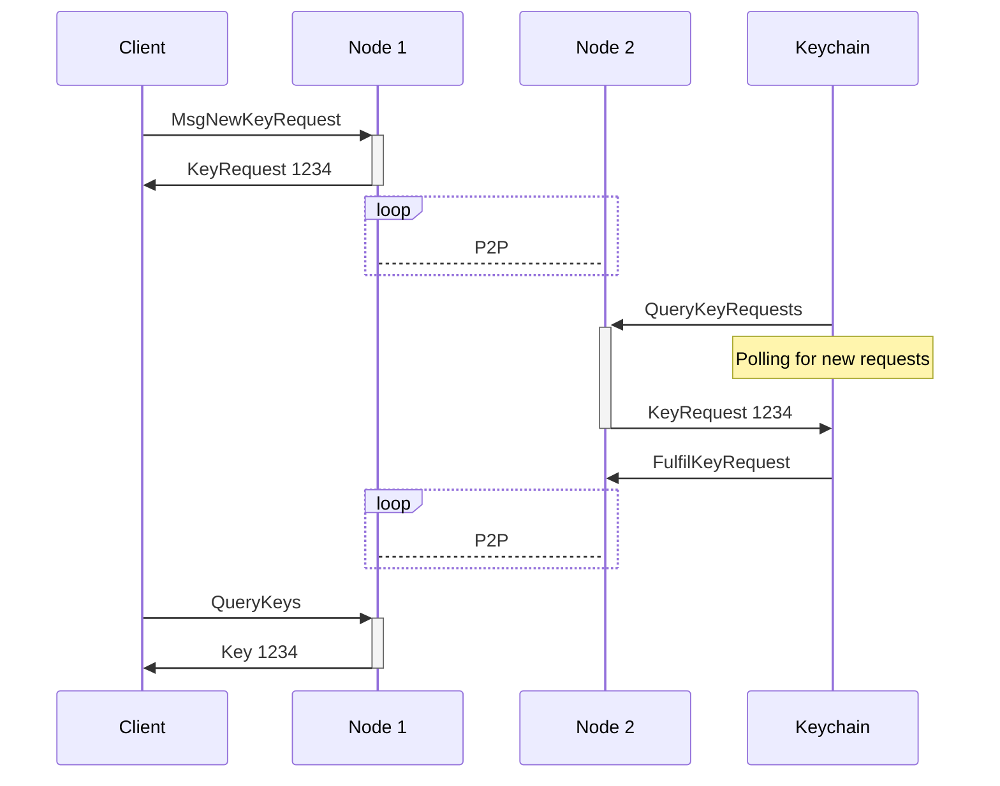
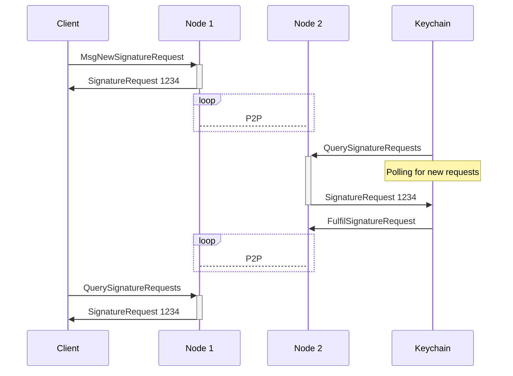

---
sidebar_position: 4
---

# Transaction flow

---REVIEW---

## Overview

The Warden Protocol is a system that manages keys for [blockchain nodes](/learn/glossary#warden-protocol-node). Warden users can request [Keychains](/learn/glossary#keychain) to generate pairs of private and public [keys](/learn/glossary#key) and sign transactions with private keys. After Warden's [Intent Engine](/learn/glossary#intent-engine) verifies user [Intents](/learn/glossary#intent), [Keychains](/learn/glossary#keychain) fulfil the requests.

This section explains how the Warden Protocol processes these two types of transactions: [key requests](/learn/glossary#key-request) and [signature requests](/learn/glossary#signature-request).

## Actors

The Warden Protocol includes three types of actors participating in sending and processing transactions:

- **Node**: A server running the Warden Protocol software
- **Keychain**: Software for generating keys and signing transactions, running on a Keychain operator's server
- **Client**: Software for interacting with the protocol, running on a user's machine (such as [SpaceWard](/learn/glossary#spaceward))

## Key request flow

The flow for generating a private/public key pair includes the following steps:

### 1. Sending a request

The Client sends a `MsgNewKeyRequest` transaction to a Node, specifying these details:

- The key type – for example, ECDSA secp256k1
- The Keychain ID
- The Intent ID

### 2. Checking Intents

2.1. The Node checks user Intents with the Intent Engine.

2.2. The transaction gets included in a block and broadcasted to the P2P-network.

2.3. All nodes in the network reach consensus on the validity of the transaction and re-evaluate the Intent check.

### 3. Fulfilling the request

3.1. The Keychain queries a Node for pending requests and picks up the key request, identified by its unique ID.

3.2. The Keychain generates a new private/public key pair and stores it. The new key inherits its ID from the key request ID. 

3.3. The Keychain sends a `FulfilKeyRequest` transaction with the public key to the Node.

### Diagram

This diagram represents the key request flow:

## Signature request flow

The flow for requesting a signature includes the following steps:

### 1. Sending a request

The Client sends a `MsgNewSignatureRequest` transaction to a Node, specifying these details:

- Raw data bytes
- The private key ID
- The Intent ID

### 2. Checking Intents

2.1. The Node checks Intents with the Intent Engine.  

2.2. The transaction is included in a block and broadcasted to the P2P-network.  

2.3. All nodes in the network reach consensus on the validity of the transaction and re-evaluate the Intent check.

### 3. Fulfilling the request

3.1. The Keychain queries a Node for pending requests and picks up the signature request, identified by its unique ID.  

3.2. The Keychain fulfils the request, and the MPC network generates a signature using the specified private key.  

3.3. The Keychain sends a `FulfilSignatureRequest` transaction with the signature to the Node.

### Diagram

This diagram represents the signature request flow:

