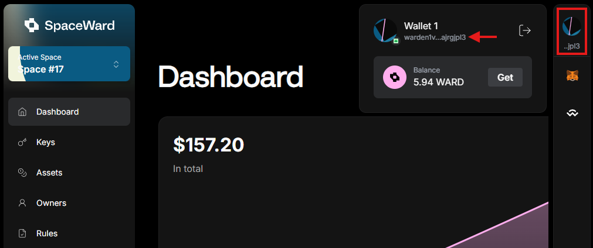

---
sidebar_position: 3
---

# Connect your wallet

To start using SpaceWard, connect your **Cosmos wallet** to your Warden account.

## Create a Cosmos wallet

If you don't have a wallet, create one. Currently, the following wallets are available:

- 👉 [Leap](https://leapwallet.io/download) 
- 👉 [Keplr](https://www.keplr.app/download)
- 👉 [Cosmostation](https://www.cosmostation.io/products/cosmostation_extension) 

## Connect

Now you can connect to SpaceWard:

1. Open [SpaceWard homepage](https://spaceward.buenavista.wardenprotocol.org) and click **Connect**.    
2. Select a wallet to connect.    
3. Your wallet will prompt you to add the Warden Protocol chain.
4. Approve the transaction, and you'll be ready to enter SpaceWard!

## Get your Warden address

After connecting, you'll receive a **Warden address**.

To get it, click your connected wallet icon in the top-right corner of the screen. A pop-up will open where you can see the wallet details and copy the address.

