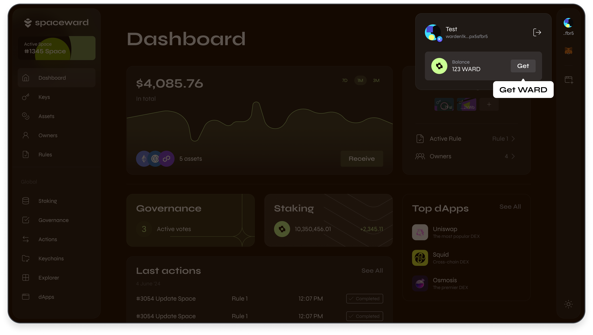

---
sidebar_position: 4
---

# Get test WARD

To conduct transactions on Warden using SpaceWard or any other wallet, get **test WARD tokens** from our faucet.

After you connect a wallet for the first time, SpaceWard will prompt you to get some WARD, as shown in the [Quick start guide](quick-start).

If you wish to get more WARD after that, take these steps:

1. Connect to SpaceWard: 👉 [SpaceWard on Chiado](https://spaceward.chiado.wardenprotocol.org/)
2. In the top-right corner of the screen, click your [connected wallet](connect-your-wallet) and then click **Get**.
3. You'll be redirected to a faucet. Click **Get WARD** and wait for WARD to be sent to your wallet.

