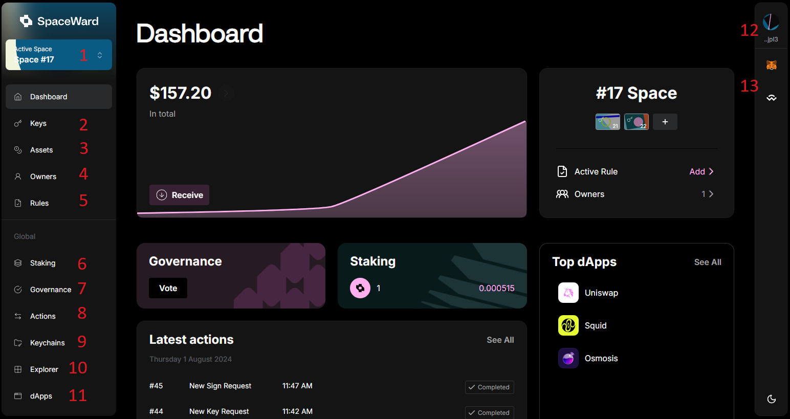

---
sidebar_position: 1
id: home-doc
slug: /
---

# Introduction

## Overview

👉 [Try SpaceWard on Buenavista testnet](https://spaceward.buenavista.wardenprotocol.org)

**SpaceWard** is the front-end interface for the Warden Protocol, enabling account aggregation and modularly secure omnichain operations.

**For users**: Use the most secure multichain multisig wallet. Create Spaces, protect your wallets and program transactions with Intents, and interact with the Web3 space.

**For builders**: Build OApps on Warden or any compatible blockchain, protected by Modular Security.

To engage with SpaceWard, you need to [connect your wallet](/spaceward/connect-your-wallet) with the Warden Protocol.

## Main features

Within SpaceWard, you have the ability to carry out a wide range of protocol-related activities:

1. [Manage Spaces](/spaceward/manage-spaces)
2. [Manage keys](/spaceward/manage-keys)
3. [Manage assets](/spaceward/manage-assets)
4. [Manage Space owners](/spaceward/manage-owners)
5. [Manage Rules](/spaceward/manage-rules)
6. [Stake WARD](/spaceward/stake-ward)
7. [Participate in governance](/spaceward/participate-in-governance)
8. View Actions in your Space
9. [View Keychains](/spaceward/manage-keys#view-keychains)
10. Monitor transactions
11. [Use dApps](/spaceward/use-dapps#use-spaceward-collection) from the SpaceWard-curated collection
12. [Get your Warden address](/spaceward/connect-your-wallet#get-your-warden-address), [get test WARD](/spaceward/get-test-ward), or close the session
13. [Access dApps](/spaceward/use-dapps#use-spaceward-collection) through WalletConnect and MetaMask Snap

## Transaction flow

SpaceWard allows you to securely carry out operations across multiple blockchains.

You need to create a **key** (wallet) associated with a certain **Keychain** – a custodian that generates and stores keys and signs transactions. The Keychain will sign your transaction only it meets the **Approval Rule** you created. Learn more: [Glossary: Keychain](https://docs.wardenprotocol.org/learn/glossary#keychain).

This is how it works:

1. You can initiate a transaction from your preferred decentralized application (dApp).
2. Upon initiation, the transaction passes through Approval Rules.
3. If approval is granted, the system requests a signature from the Keychain.
4. Once signed, the transaction is then broadcast to its network.
