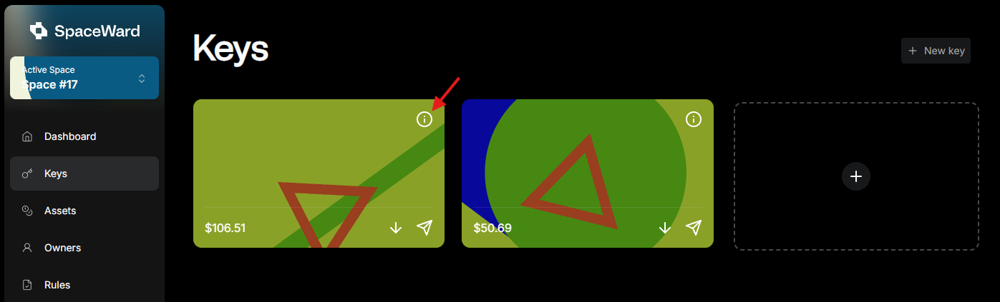

# Manage keys

## Overview

This guide explains how to create and manage your **keys** (wallets).

:::note
In the Warden Protocol keys are associated with **Keychains** – custodians that generate and store keys and sign transactions. Learn more: [Glossary: Keychain](https://docs.wardenprotocol.org/learn/glossary#keychain).
:::

## Request a key

To obtain a new key, do this:

1. Connect to SpaceWard: 👉 [SpaceWard on Chiado](https://spaceward.chiado.wardenprotocol.org/)  
  If it's your first time, see the [Quick start guide](./quick-start.md).
2. In the left menu, navigate to **Keys**.
3. Click **Create key**.
4. Select the Keychain you wish to operate from and click **Create**.
5. Approve the transaction in your connected wallet.

## View details of a key

In the **Keys** section of [SpaceWard](https://spaceward.chiado.wardenprotocol.org), you can click your key and view its addresses, Keychain, and type. You can also edit the key name.

## Get your key address

To get your key (wallet) address in a certain network, do the following:

- Click the **↓** icon on your new key.
- Select the asset and network pair.
- Copy the address.

## View Keychains

You can access a list of all available Keychains – custodians that generate and store keys and sign transactions:

1. Connect to SpaceWard: 👉 [SpaceWard on Chiado](https://spaceward.chiado.wardenprotocol.org/)
2. In the left menu, navigate to **Keychains**.

Here you can also request a key for any Keychain – just click **Create Key**.

