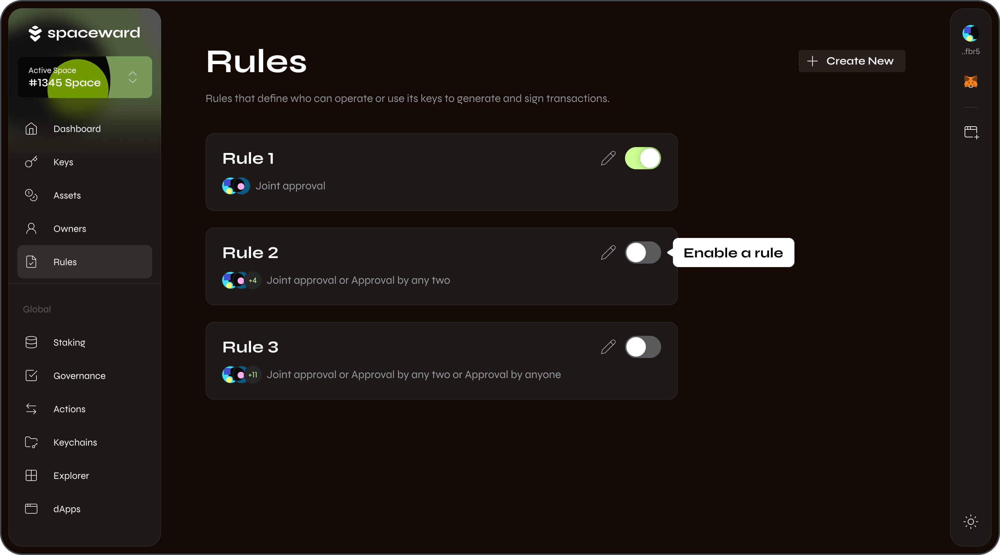
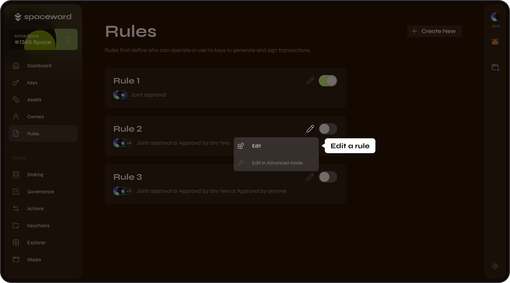
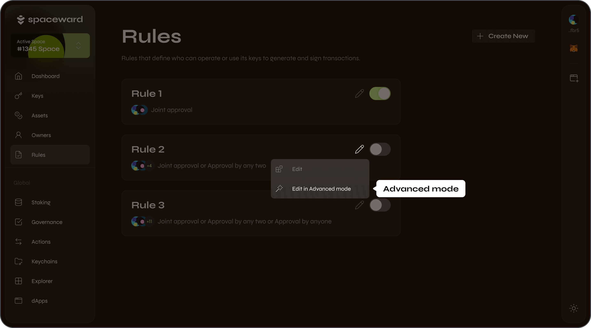

---
sidebar_position: 9
---

# Manage Rules

## Overview

**Rules** are a set of user-defined conditions under which a Keychain signs a transaction with a certain [key](manage-keys).

SpaceWard users can set up their own Rules as conditions to get transactions approved. For example, an Intent can allow executing a transaction only if 2 of 3 approvers sign it.

:::tip
Each approver is identified by Warden address – an address that is assigned to a SpaceWard user after [connecting a wallet](connect-your-wallet). To check your address, click its icon in the top-right corner of the screen.
:::

## Create and enable a Rule

To create a Rule, do this:

1. Connect to SpaceWard: 👉 [SpaceWard on Chiado](https://spaceward.chiado.wardenprotocol.org/)
2. In the left menu, navigate to **Rules**.
3. Click **Create a new Rule**.
4. Select the preferred Rule type:
    - **Joint approval**: All approvers must approve the transaction.
    - **Approval by certain amount**: A minimum threshold number of approvals is required.
    - **Approval by anyone**: One approval is required.
    - **Advance mode**: Create a custom Rule. See [Advanced Rules](#advanced-rules).
5. If needed, add approvers and specify other details by [editing your Rule](#edit-a-rule).
6. To start applying a new Rule, toggle its slider. Only one Rule can be active at a time.



## Edit a Rule

You can edit your Rule at any moment:

1. Connect to SpaceWard: 👉 [SpaceWard on Chiado](https://spaceward.chiado.wardenprotocol.org/)
2. Navigate to **Rules**.
3. Click the pencil symbol on your Rule, then click **Edit**.
4. You can make the following adjustments:
    - To add an approver, click **Add approver** and enter a Warden address. Approvers are accounts participating in your Rule, which includes you as the default approver. Other SpaceWard users can also add you to their Rules. The number of approvers isn't limited.
    - To add a condition, click the plus button and select **Add Approval Condition**. This will result in a Rule operating under multiple conditions: the one you selected when initially setting the Rule type and the additional conditions you added after.
    - To add a whitelist address, click the plus button and select **Add whitelist address**. Only transactions to these addresses will be approved.
5. Click **Save**.




## Advanced Rules

### Configure

To configure an advanced Rule, take these steps:

1. Connect to SpaceWard: 👉 [SpaceWard on Chiado](https://spaceward.chiado.wardenprotocol.org/)
2. Navigate to **Rules**.
3. Click the pencil symbol on your Rule. Click **Edit in Advanced mode**.
4. Enter a custom expression for your Rule.



### Operators

In your Rule expressions, you can use numbers and approver addresses in combination with the following operators:

- `AND`
- `OR`
- `ALL`
- `ANY` + `FROM`

### Examples

Here are some simple examples of custom Rule expressions, which you can modify to create more complex Rules:

- Joint approval by 2 addresses:

    ```
    address1 AND address2
    ```

- Approval by 2 of three addresses:
    
    ```
    ANY 2 FROM (address1, address2, address3)
    ```
- A combination of conditions:

    ```
    address1 AND (address2 OR address3) AND (ANY 1 FROM (address5 , address6, address7))
    ```
