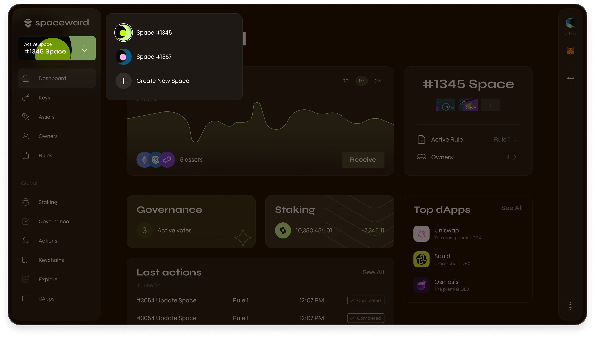

---
sidebar_position: 5
---

# Manage Spaces

## Overview

A **Space** functions as a management hub for a collection of keys, akin to an organization. You can maintain separate Spaces for distinct purposes, such as distinguishing between personal and professional uses.

Note that a Space can have multiple [owners](manage-owners).

## Create your first Space

After you connect a wallet for the first time, SpaceWard will prompt you to create your first Space, as shown in the [Quick start guide](quick-start).

To check an overview of your Space, click **Dashboard** in the left menu. To unlock more features, [request a key](manage-keys#request-a-key).

## Create more Spaces

If you wish to create additional Spaces, take these steps:

1. Connect to SpaceWard: 👉 [SpaceWard on Chiado](https://spaceward.chiado.wardenprotocol.org/)
2. Navigate to the top-left corner of the screen and click **Active Space**.
3. Click **Create New Space**.
4. Approve the transaction for creating a new Space in your connected wallet.

To switch between Spaces, just use the **Active Space** menu.

## View details & activity

Within your Space, you can view its details and monitor activity. Use the following sections in the left menu:

- **Dashboard**: Access an overview of your assets, stakes, Rules, latest Actions, and other information related to the Space.
- **Actions**: Monitor activity in your Space: key requests, removing space owners, etc.
- **Explorer**: Access Warden block explorer to monitor the state of Warden Protocol, including the activity in your Space.
