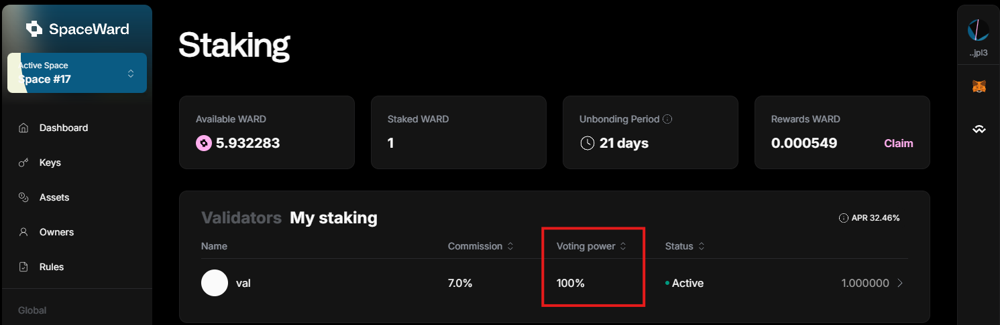

---
sidebar_position: 11
---

# Participate in governance

## Overview

After [staking](stake-ward) your [WARD tokens](https://docs.wardenprotocol.org/tokens/ward-token/ward), you can **participate in governance**, which means voting on new proposals for the Warden protocol. It's possible only while your tokens are bonded (staked).

Your [voting power](#voting-power) depends on the total amount of staked WARD. The more you stake, the stronger is your voice!

## Vote

To cast a vote, take these steps:

1. Connect to [SpaceWard](https://spaceward.buenavista.wardenprotocol.org).
2. In the left menu, navigate to **Governance**. You'll see a list of proposals.
4. Click an active proposal you wish to vote on to open its details.
5. Click **Vote** and then select the option you wish to vote for.
6. Approve the transaction in your connected wallet.

## Voting power

Your **voting power** depends on the total amount of staked WARD. To view it, do this:

1. Connect to [SpaceWard](https://spaceward.buenavista.wardenprotocol.org) and navigate to **Staking**
2. Navigate to the **My staking** tab with the list of your stakes.
3. Check the **Voting power** column in the table.

## Suggest a proposal

To join the conversation around a potential governance proposal, visit our Discord:  

- 👉 [Join Warden Discord](https://discord.com/invite/wardenprotocol)