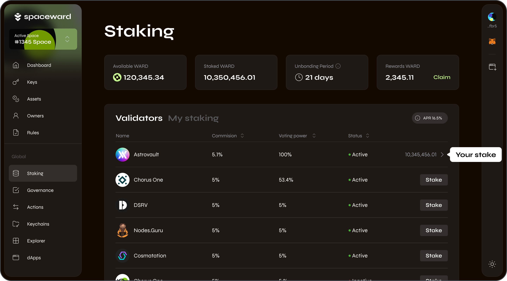
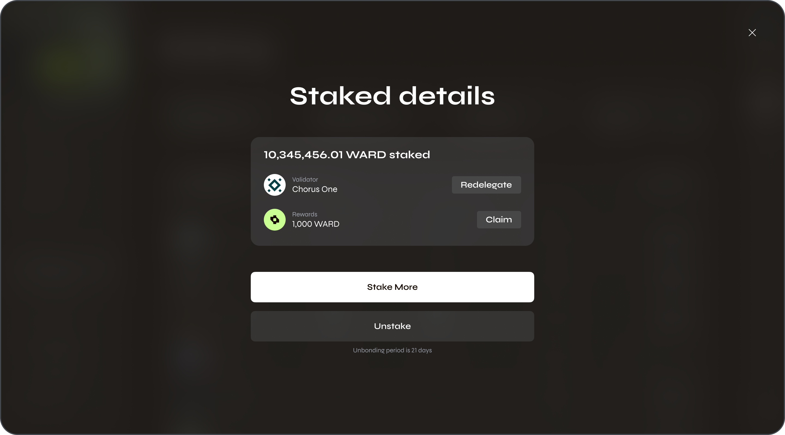

---
sidebar_position: 10
---

# Stake WARD

## Overview

You can **stake** your [WARD tokens](https://docs.wardenprotocol.org/tokens/ward-token/ward) in SpaceWard. Staking allows you to earn **daily rewards** and directly [participate in governance](participate-in-governance). The more you stake, the more rewards and voting power you receive!

This section explains how to stake WARD and then to redelegate your stake, claim rewards, stake more, or unstake.

:::note
When you [stake](https://docs.wardenprotocol.org/learn/glossary#staking) tokens, you [delegate](https://docs.wardenprotocol.org/learn/glossary#delegator) them to a preferred [validator](https://docs.wardenprotocol.org/learn/glossary#validator) acting on your behalf. Learn more: [How to choose a validator?](https://docs.wardenprotocol.org/operate-a-node/delegation-plan#how-to-choose-a-validator)
:::

## Stake

To stake WARD, do the following:

1. Connect to SpaceWard: 👉 [SpaceWard on Chiado](https://spaceward.chiado.wardenprotocol.org/)
2. In the left menu, navigate to **Staking**.
3. Navigate to the **Validators** tab, where you'll find a list of available validators.
4. Select your preferred validator and click **Stake** next to it.
5. Enter the amount to stake.
6. Click **Stake** and approve the transaction in your connected wallet.

You can check the list of your stakes in the **My staking** tab.

## Manage your stake

After staking, you can claim your rewards or stake more at any time, including restaking your rewards.

If you initiate a redelegation to another validator or unstaking, you'll have to wait for the **unbonding period of 21 days**. During this period, your tokens don't earn rewards.

To manage your stake, do the following:

1. Connect to SpaceWard: 👉 [SpaceWard on Chiado](https://spaceward.chiado.wardenprotocol.org/)
2. Navigate to **Staking** and open the **My staking** tab with the list of your stakes.
3. Click your staked amount in the table to open details of the stake.
4. Select one of the available options:
    - **Redelegate**
    - **Claim rewards**
    - **Stake More**
    - **Unstake**
5. If required, specify details such as the amount of WARD or a new validator.
6. Confirm the transaction in your connected wallet.

