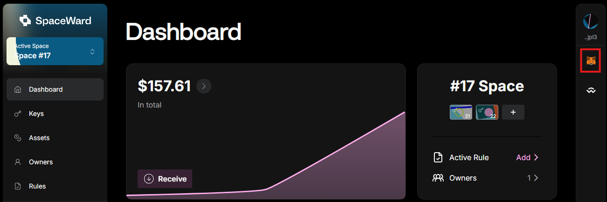

---
sidebar_position: 13
---

# Use external wallets

## Overview

SpaceWard allows you to integrate with external wallets such as **WalletConnect** and **MetaMask Snap**.

## Use WalletConnect

### Connect

You can connect to any EVM-based decentralized application through WalletConnect:

1. In the external app you're using, find a section for connecting wallets. Select **WalletConnect**.
2. Copy the pairing code or save the QR code as an image.
3. Connect to [SpaceWard](https://spaceward.buenavista.wardenprotocol.org).
4. Click the WalletConnect logo in the right sidebar.
5. Paste the pairing code or the QR code and click **Connect**.
6. Select the Space or address you wish to use and click **Approve connection**.

### Approve

After you initiate a transaction in a dApp, you'll see an approval request. Then you need to do the following:

1. Click **Approve**.
2. The Warden Protocol will apply a [Rule](manage-rules) to your transaction. This may lead to a signature request in your Cosmos wallet or a different process based on the applied Rule.
3. Your preferred Keychain will sign the transaction and broadcast it to the destination blockchain.

## Enable MetaMask Snap

The groundbreaking **MetaMask Snap** feature allows you to seamlessly integrate your test Ethereum addresses generated by the Warden Protocol directly into **MetaMask Flask**. You can connect with your MetaMask Flask wallet on any of your favorite EVM dApps.

:::note
The Warden Protocol is in the testnet phase, so you have to use MetaMask Flask. Once the final version is released, you'll be able to use the standard orange MetaMask extension. We'll need to be whitelisted to have it in the original MetaMask, pending security audit.
:::

### Prerequisites

👉 [Install MetaMask Flask](https://docs.metamask.io/snaps/get-started/install-flask/) – the developer version of MetaMask.
   
:::warning
- Deactivate the standard orange MetaMask extension to prevent conflicts with MetaMask Flask.
- Don't store real assets or your current seed phrase in MetaMask Flask. Remember, this is a developer version.
:::

### Integrate

1. Connect to [SpaceWard](https://spaceward.buenavista.wardenprotocol.org). If it's your first time, see the [Quick start guide](buenavista-quick-start).
2. On the right panel, click the MetaMask logo and then **Install Snap**.
3. When your MetaMask Flask wallet opens, accept the installation prompt.
4. In the left menu, navigate to **Keys**.
5. Select the preferred key and click **Add to MetaMask**.
6. Confirm in MetaMask Flask.

### Result

Congratulations! You've successfully integrated SpaceWard with MetaMask Flask. You'll be able to see your address in your MetaMask Flask wallet, tagged as **Warden Protocol**.

:::warning
Exercise caution and refrain from using real assets at this stage. Safety first!
:::