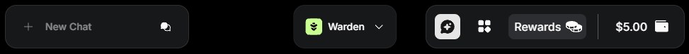
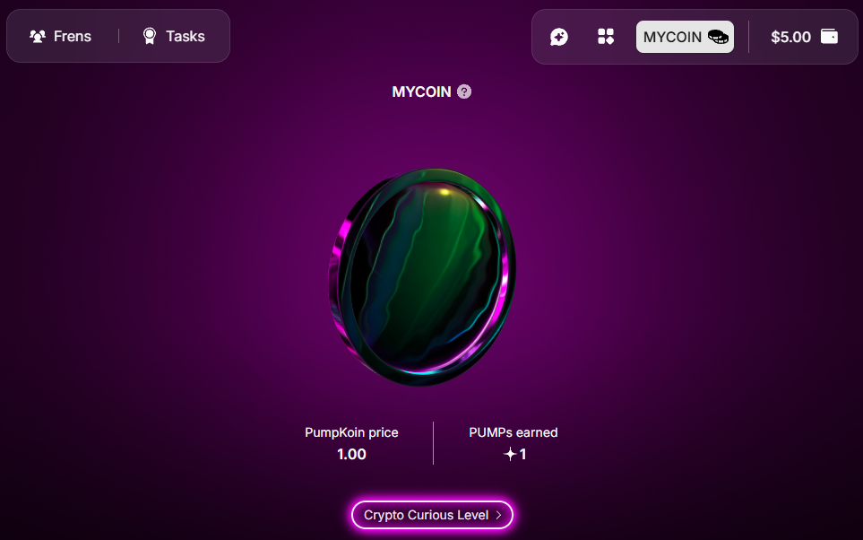

---
sidebar_position: 7
---

# Create your coin

## Overview

In Warden, you can create and grow **your own coin** to compete in the **PUMP Leaderboard** and **earn rewards**.

## Name your coin

To get started, click the **Rewards** icon in the top right:

Then simply name your coin. Congratulations! Now you can start earning rewards.

## Pump your coin

There are multiple things you can do to increase the value of your coin:

- Complete daily and weekly tasks
- Play Flappy Yapy and other games
- Invite your friends

## Earn rewards

Warden is part of an ongoing **rewards campaign**, with up to **2.5%** of the [WARD token](https://docs.wardenprotocol.org/tokens/ward-token/ward) supply (**$1M+** in current value) allocated to participants.

Learn more about the rewards campaign: 👉 [The Great Pump Off](https://wardenprotocol.org/blog/great-pump-off)
