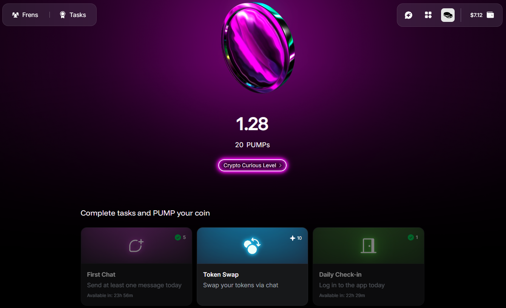

---
sidebar_position: 7
---

# Create your coin

In the Warden App, you can create and grow **your own coin** to compete in the **PUMP Leaderboard** and **earn rewards**. The app is part of an [ongoing rewards campaign](https://wardenprotocol.org/blog/great-pump-off), with up to **2.5%** of the **WARD token** supply (**$1M+** in current value) allocated to participants.

To get started, click the coin icon in the top right, then create and name your coin. There are multiple things you can do to increase its value:

- Complete daily and weekly tasks
- Play Flappy Yapy and other games
- Invite your friends

