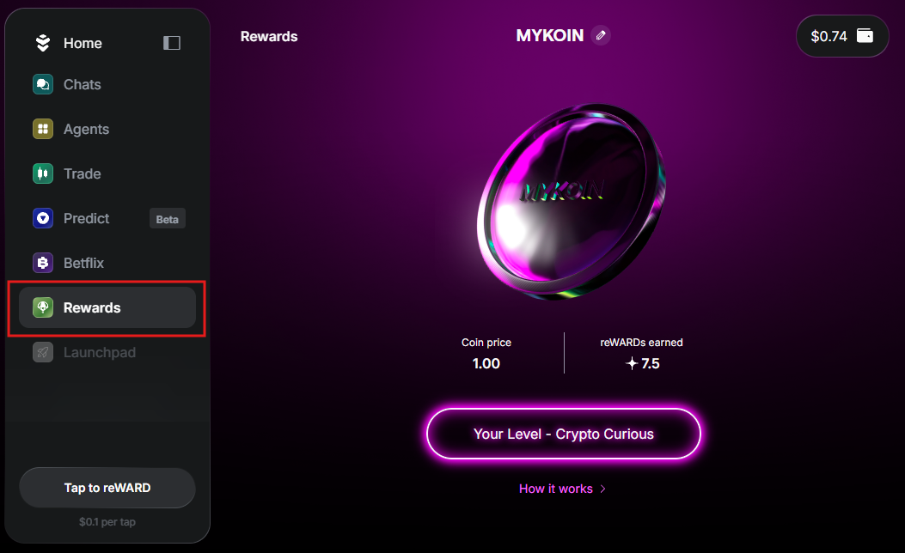
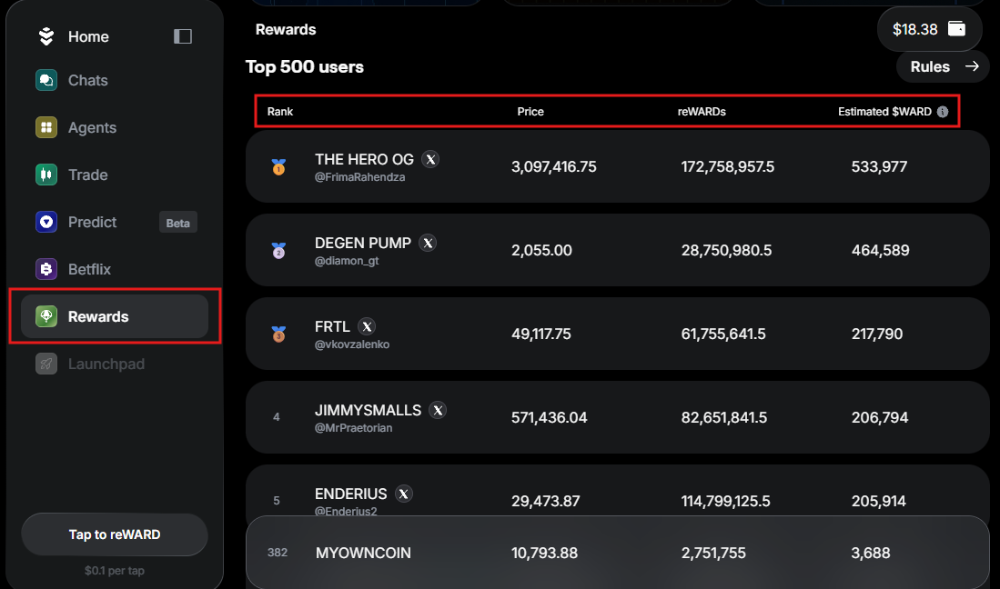
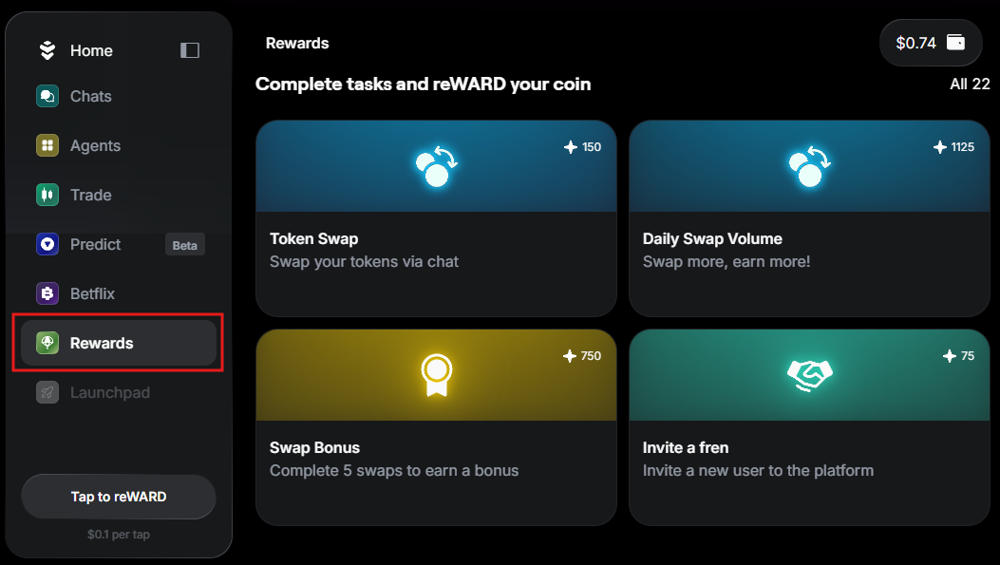
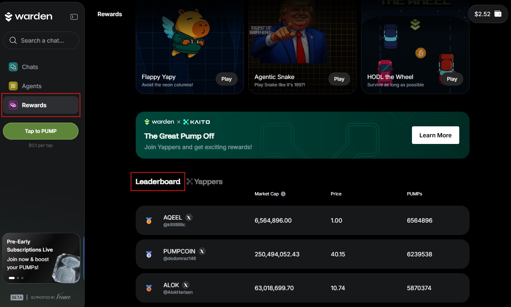

---
sidebar_position: 5
---

# Earn rewards

## Overview

In this section, you'll discover how to start **earning rewards** in Warden:

1. [Create a coin](#create-your-coin): Create your PumpKoin.
2. [Earn PUMP points](#earn-pumps): Stay active in Warden to boost your coin's rank.
3. [Earn WARD](#earn-ward): The top PUMP holders will earn rewards in the WARD token.

:::tip
The most active users will also gain priority access to upcoming features.
:::

## Create your coin

To create your **PumpKoin**, take these steps:

1. Log in: 👉 [Warden](https://app.wardenprotocol.org)
2. In the left menu, navigate to the **Rewards** tab.
3. Then simply name your coin.

Congratulations! Now you can start earning PUMP points.

## Earn PUMPs

### What are PUMPs?

**PUMP points** are your reward for activity in Warden. The more PUMPs you earn, the higher your coin climbs on the [leaderboard](#check-your-rank).

The top PUMP holders will enjoy the following benefits:

- [Earn WARD](#earn-ward)
- Gain priority access to upcoming features

### Complete tasks

To get PUMPs, **complete tasks** in Warden:

- Swap
- Use AI Agents
- Play in-app games
- And more

We're continuously expanding the task list with new ways to earn.

To access all available tasks and see the PUMP points you can earn, simply go to the **Rewards** tab and scroll down:

### Tap to pump

A fun way to collect more PUMPs is by playing the **Tap to Pump** game:

- Each tap costs **$0.10**.
- Every tap grants you **10 PUMPs**.
- Every 10 taps, you unlock a chance to hit a reward boost: **x10**, **x15**, or **x20**.

You can access the game from any tab—simply click **Tap to PUMP** in the left menu:

### Check your rank

To check your coin's rank, navigate to the **Rewards** tab and scroll down to the **PUMP Leaderboard**:

## Earn WARD

Active Warden users can earn rewards in the [WARD token](https://docs.wardenprotocol.org/ward/introduction): simply [create your coin](#create-your-coin), [start earning PUMP points](#earn-pumps), and climb the ranks. The top PUMP holders will be eligible for rewards.

This is part of **The Great Pump Off**—an ongoing **rewards campaign**, with up to **2.5%** of WARD supply (**$1M+** in current value) allocated to participants. Designed by Warden, in collaboration with [Kaito](https://www.kaito.ai), this campaign is engineered to reward those who actively use Warden and drive community engagement:

- Learn more about the rewards campaign 👉 [The Great Pump Off](https://wardenprotocol.org/blog/great-pump-off)
- Join the campaign 👉 [Warden Protocol on Kaito](https://yaps.kaito.ai/warden)
