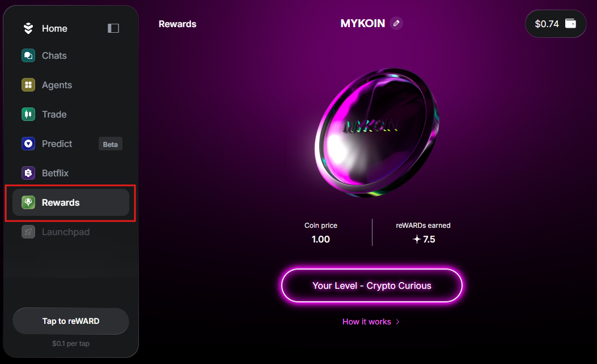
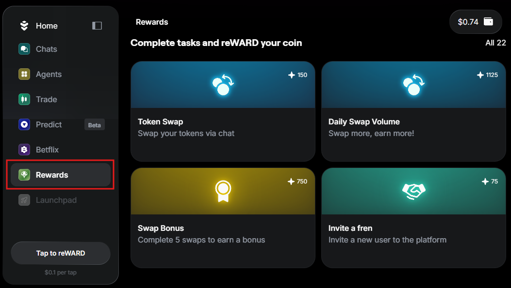
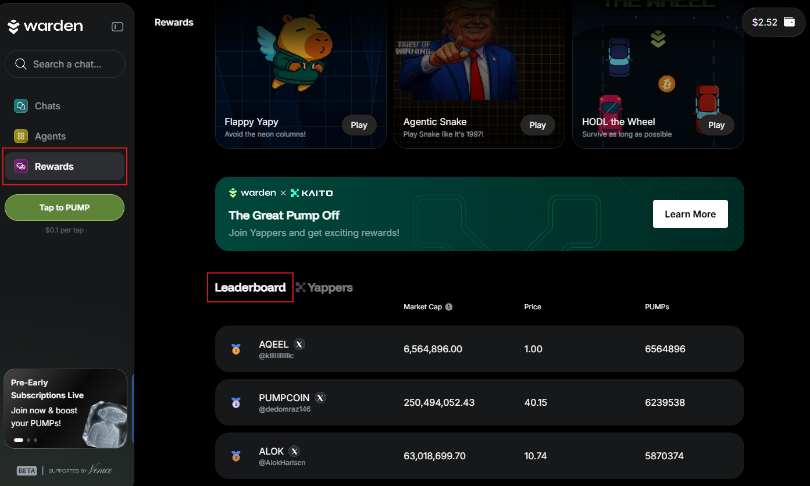
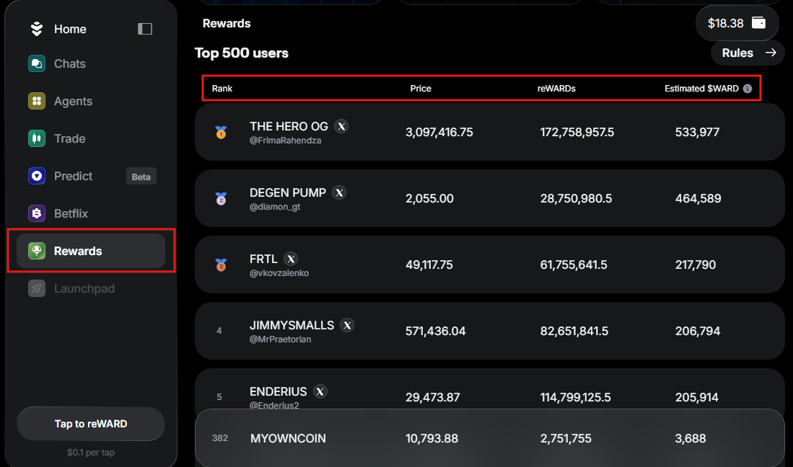
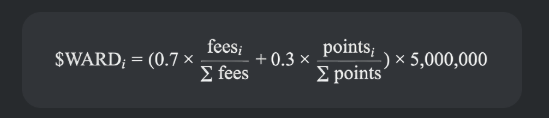

---
sidebar_position: 9
---

# Earn rewards

## Overview

In this section, you'll discover how to start **earning rewards** in Warden:

1. [Create a coin](#create-your-coin): Create your own coin.
2. [Earn reWARD points](#earn-reward-points): Stay active in Warden to boost your coin's rank.
3. [Check your rank](#check-your-rank): Check your rank on the leaderboard.
4. [Get $WARD](#get-ward): The most active users will be rewarded with $WARD.

## Create your coin

To create **your own coin**, take these steps:

1. Log in: 👉 [Warden](https://app.wardenprotocol.org)
2. In the left menu, select **Rewards**.
3. Then simply name your coin.

Congratulations! Now you can start earning reWARD points.

## Earn reWARD points

### reWARDs

In Warden, you can earn **reWARD points**—your reward for activity in the application.

There are multiple ways to earn reWARDs:

- [Complete tasks](#complete-tasks)
- [Tap to reWARD](#tap-to-reward)
- [Trade](#trade)

The more reWARDs you earn, the higher [your coin](#create-your-coin) climbs on the [leaderboard](#check-your-rank).

:::note
Your position also depends on [fees](fees) you pay in Warden. To learn how exactly the rank and $WARD rewards are calculated, see [Get $WARD](#get-ward).
:::

### Complete tasks

To get reWARDs, **complete tasks** in Warden:

- Swap
- Use AI Agents
- Play in-app games
- And more

We're continuously expanding the task list with new ways to earn.

To access all available tasks and see the reWARD points you can earn, simply go to the **Rewards** tab and scroll down:

### Tap to reWARD

A fun way to collect more reWARDs is by playing the **Tap to reWARD** game:

- Each tap costs **$0.10**. To learn more, see [Tap to reWARD fee](fees#tap-to-reward-fee).
- Every tap grants you **10 reWARDs**.
- Every 10 taps, you unlock a chance to hit a reward boost: **x10**, **x15**, or **x20**.

You can access the game from any tab—simply click **Tap to reWARD** in the left menu:

### Trade

To earn additional reWARDs, join the **League of Traders** and climb its leaderboards.

You can either participate in perpetual trading or play our trading game:

- [Trade](trade#earn-rewards)
- [Play Betflix](play-betflix#earn-rewards)

## Check your rank

All [coins](#create-your-coin) compete on the **leaderboard**. The top users will be rewarded with [$WARD](https://docs.wardenprotocol.org/ward/introduction).

You position depends on the amount of [reWARDs](#rewards) you earned and [fees](fees) you paid in Warden. To learn how exactly the rank and $WARD rewards are calculated, see [Get $WARD](#get-ward).

The leaderboard displays the following information:

- Your coin's rank
- The number of reWARDs you earned
- The estimated $WARD reward

To access this data, open the **Rewards** section and scroll down to the leaderboard:

## Get $WARD

The most active Warden users will be rewarded with [$WARD](https://docs.wardenprotocol.org/ward/introduction). In the current season, we'll distribute **5,000,000 $WARD** to the **top 500** users on [leaderboard](#check-your-rank).

In the [current reward campaign](https://wardenprotocol.org/blog/season-04-leaderboard-update-full-transparency-real-rewards), $WARD distribution is based on your [reWARD points](#rewards) and [fees](fees). Note that you're competing on your share of total system activity and fees, not on absolute numbers. For example, if everyone trades more, your share can drop.

:::tip
To learn more about fees in Warden, see [Fees](fees).
:::

Your estimated **$WARD reward** is displayed on the leaderboard. This number is calculated from two values:

- **70% of your fees** divided by total fees
- **30% of your reWARDs** divided by total reWARDs

The $WARD amount you'll get is a sum of these values multiplied by 5,000,000.

:::note
If you have **8% of total fees** and **10% of total reWARDs**, then your total share = 8% × 70% + 10% × 30% = 5.6% + 3% = **8.6% of the pool**.

:::
