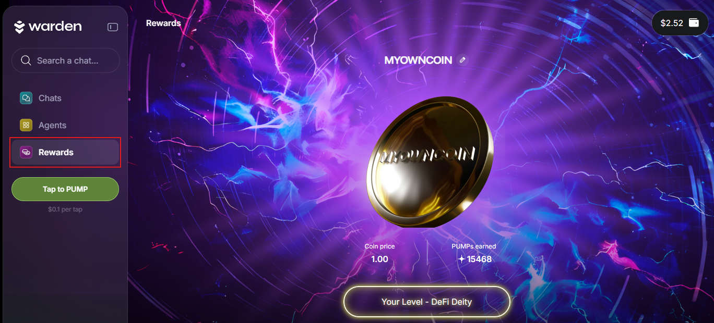

# Earn rewards

## Overview

In this section, you'll learn how to start **earning rewards** in Warden:

- Create a **PumpKoin**—your own virtual currency.
- Stay active in Warden to earn **PUMP points** and boost your coin's rank.
- Top PUMP holders will gain priority access to new features and earn [WARD](https://docs.wardenprotocol.org/ward/introduction).

## Create your coin

To create your **PumpKoin**, take these steps:

1. Log in: 👉 [Warden](https://app.wardenprotocol.org)
2. In the left menu, navigate to the **Rewards** tab.
3. Then simply name your coin.

Congratulations! Now you can start earning PUMP points.

## Earn PUMPs

### Complete tasks

Your activity in Warden generates **PUMP points**, boosting your coin. Top PUMP holders will [earn WARD](#earn-ward) and gain priority access to upcoming features.

You can get PUMPs by performing various tasks such as swapping, using Agents, playing games, and much more. The actual reward per each task may vary dynamically depending on the task type and other conditions.

To access tasks and view the current rewards, simply navigate to the **Rewards** tab and scroll down.

The following tasks are available (we're constantly working on adding more): 

| Task                         | Description                                                 | Frequency       |
| ---------------------------- | ----------------------------------------------------------- | --------------- |
| **Daily Check-in**           | Log in to the app today                                     | Daily           |
| **First Chat**               | Send at least one message                                   | Daily           |
| **Play Games**               | Play a game to get 15 PUMPs                                 | Daily           |
| **Token Swap**               | Swap your tokens via chat                                   | Daily           |
| **Daily Swap Volume**        | Swap more, earn more!                                       | Daily           |
| **Swap Bouns**               | Complete 5 swaps to earn a bonus                            | Daily           |
| **Follow us on X**           | Become a follower @wardenprotocol                           | One-time        |
| **Warden Your Own Research** | WYOR with the Messari Agent and get rewarded!               | Unlimited       |
| **Messari Milestone**        | Earn milestone bonuses at 4, 8, and 10 tasks                | Milestone-based |
| **Kaibot Daily Yap**         | Review your Kaito performance                               | Daily           |
| **Kaibot Milestone**         | Earn milestone bonuses at 4, 8, and 10 Kaibot interactions  | Milestone-based |
| **WachAI**                   | Verify tokens using WachAI                                  | Daily           |
| **WachAI Milestone**         | Earn milestone bonuses at 4, 8, and 10 WachAI chats         | Milestone-based |
| **Invite a fren**            | Invite a friend and get 75 PUMPs per referral               | One-time        |               

### Tap to pump

- **Tap Cost**: Each tap costs **$0.10** (deducted from user balance).
- **Base Reward**: Each tap grants **10 PUMPs**.
- **Random Boosts**:
    - In every set of 10 taps, the user has a chance to trigger a boost (x10, x15, x20).
    - Boost replaces the base reward for that tap (e.g., instead of 5 PUMPs, user receives 50, 75, or 100 PUMPs).
    - After the first 10 taps, the chance for boosts continues at the same interval logic (every 10 taps).

Charging logic: we are using a strict payment hierarchy with USDC on Sol, Base, Ethereum, and then the native tokens on Solana, Base, Ethereum. If one fails, we try the next one.

Every 10 taps, you have a chance to trigger a boost: x10, x15, or x20.
The boost multiplies your base PUMP rewards per tap.

### Check your rank

To check your coin's rank, navigate to the **Rewards** tab and scroll down to the **PUMP Leaderboard**:

XXX

## Earn WARD

Warden is part of an ongoing **rewards campaign**, with up to **2.5%** of the [WARD token](https://docs.wardenprotocol.org/ward/introduction) supply (**$1M+** in current value) allocated to participants.

Learn more about the rewards campaign: 👉 [The Great Pump Off](https://wardenprotocol.org/blog/great-pump-off)
