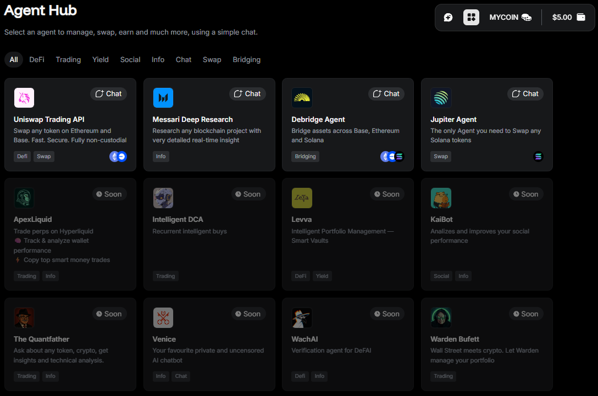
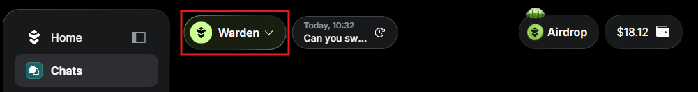

---
sidebar_position: 4
---

# Explore AI Agents

## Overview

Explore the **Agent Hub** to unlock the full potential of Warden with **AI Agents**! They allow you to swap, bridge, research, and much more through a simple chat interface.

We support the following Agents:

- [Warden AMA Agent](#warden-ama-agent): The default Agent for managing your assets.
- [Verified Warden Agents](#verified-warden-agents): Agents created and verified by Warden.
- [Community Agents](#community-agents): Agents built by our developer community. [You can participate too!](https://wardenprotocol.org/blog/agent-builder-incentive-programme)

In the sections below, you'll find the full list of available Agents—and more are [coming soon](#coming-soon)!

## Access Agents

You can explore and select Agents in the **Agent Hub**:

1. Log in: 👉 [Warden](https://app.wardenprotocol.org)
2. In the left menu, open the **Agents** tab.
3. Select an Agent. Use the **Verified**/**Community** tabs to switch between Agent types.
4. After selecting an Agent, you'll be taken to the **Chats** tab.

 
Alternatively, you can access Agents directly from the **Chats** tab. Use the drop-down menu at the top to switch quickly between the Agents:

:::tip
Interacting with some of the Agents is subject to fees. Before starting, you may need to [fund your main account](manage-your-wallets#deposit) or the [Agents Credits wallet](manage-your-wallets#agents-credits). See the requirements for each Agent below.
:::

## Warden AMA Agent

The **Warden AMA** Agent is the default Agent you see when logging in to Warden. It's not displayed in the Agent Hub, but you can always switch to it in the **Chats** tab.

This Agent performs all your Web3 transactions and handles other tasks:

- [Sends or swaps](manage-your-wallets#send-or-swap) tokens on all the supported chains
- Checks your balances
- Generates an image based on a text description
- Answers any questions about Warden and the [Warden Protocol](https://docs.wardenprotocol.org)

Networks:

- **Ethereum**
- **Solana**
- **Base**
- **BNB Smart Chain (BSC)**
- **Arbitrum**

Fees: [swap](fees#swap-fees) and [transfer fees](fees#transfer-fee).

## Verified Warden Agents

**Verified Warden Agents** are AI Agents created and verified by Warden.

### Base Farmer

The **Base Farmer** Agent assists you with managing your tokens on the Base chain:

- Checks balances
- Swaps tokens using [Uniswap](https://app.uniswap.org)
- Transfers tokens

Networks:

- **Base**
- **Arbitrum**

Tokens:

- **USDC**
- **VIRTUAL**

Fees: [swap](fees#swap-fees) and [transfer fees](fees#transfer-fee).

### CoinGecko

**CoinGecko** is an Agent that integrates with [CoinGecko](https://www.coingecko.com) to deliver insights and analytics on cryptocurrencies. You can analyze up to **2 coins**.

The Agent supports two key functions:

- Data retrieval: current price, market cap, volume, and other metrics
- Coin analysis: performance and risk assessment, general takeaways, and comparative insights

Fees: none.

:::tip
To compare **3 or more tokens**, use [Messari](#messari-deep-research).
:::

### deBridge

The **deBridge** Agent integrates with [deBridge](https://debridge.finance), facilitating secure and precise cross-chain token transfers. You can bridge tokens (native or USDC) between any of the supported networks. All transactions require confirmation.

Networks:

- **Ethereum**
- **Base**
- **Solana**
- **BNB Smart Chain (BSC)**
- **Arbitrum**

Tokens:

- **ETH**
- **SOL**
- **BNB**
- **USDC**

Fees: [deBridge fees](fees#debridge-fees).

### Intelligent DCA

The **Intelligent DCA** Agent automates recurring token swaps on [Uniswap](https://app.uniswap.org), helping you accumulate crypto over time through Dollar Cost Averaging (DCA). You can either spend or receive a fixed amount of a token at the following intervals: 5m, 1h, 1d, 1w, 30d.

:::note
**Dollar Cost Averaging (DCA)** is a long-term investment strategy where you invest a fixed amount of money into a particular asset at regular intervals. As a result, you buy more units of the asset when prices are low and fewer units when prices are high, averaging out the cost of your investments over time.
:::

The DCA Agent can perform the following intelligent tasks:

- Automatically select the chain with the highest balance (if none is specified).
- Determine the optimal swap type for your strategy.
- List, monitor, and deactivate your existing DCA tasks on demand. 
- Search for tokens and retrieve detailed information about them.

Networks:

- **Ethereum**
- **Base**
- **BNB Smart Chain (BSC)**
- **Arbitrum**

Fees: [swap fees](fees#swap-fees).

### Jupiter

The **Jupiter** Agent integrates with the [Jupiter Exchange](https://jup.ag)—a decentralized exchange (DEX) aggregator built on the Solana blockchain. This is the only Agent you need to send and swap any Solana tokens.

Just specify the amount and other details in the chat, and the Agent will do the rest:

- Swap SOL for any Solana token
- Swap tokens for each other
- Send SOL or any token to a destination address

Networks: **Solana**

Fees: [swap](fees#swap-fees) and [transfer fees](fees#transfer-fee).

### Kaibot

**Kaibot** is a conversational AI Agent that analyzes a user's Twitter/X handle and recent activity to provide personalized feedback on their social media performance:

- Summaries of recent tweets for the last 7–30 days
- Engagement metrics (likes, replies, retweets)
- Relative position on the [Kaito leaderboard](https://docs.kaito.ai/kaito-connect-infofi-network/yapper-leaderboard) (without exposing internal score)
- Tailored recommendations to increase impact

To start using Kaibot, provide your X handle. If your handle is already linked to the Warden account, Kaibot will fetch it automatically.

Fees: [Kaibot fee](fees#kaibot-fee).

### Levva

The **Levva** Agent is an AI-powered portfolio manager tailoring investment strategies to your goals and automating yield optimization. This Agent can assist with analyzing your wallet, swapping tokens, managing positions, checking market news, and more.

Networks:

- **Base**
- **Ethereum**

Fees: [swap fees](fees#swap-fees).

:::note
The default network is Base. To manage your portfolio on Ethereum, you need specify it explicitly.
:::

### Messari Deep Research

The **Messari Deep Research** Agent integrates with [Messari](https://messari.io)—the leading provider of crypto market intelligence products that help professionals navigate the Web3 space.

Use this Agent to research any blockchain project with detailed, real-time insight: discover trending tokens on a specific chain, generate meme coin reports, analyze NFT market dynamics, and much more.

Fees: [Messari fee](fees#messari-fee).

### Uniswap Trading API

The **Uniswap Trading API** allows sending and swapping tokens on the supported chains through [Uniswap](https://app.uniswap.org)—a decentralized crypto exchange built on Ethereum. Swaps are fully non-custodial: they're handled directly from your wallet without any third party holding your assets.

Just specify the network, currency pair, and amount in the chat, and the Agent will do the rest:

- Swap ETH for any token
- Exchange tokens for each other
- Send ETH or any token to a destination address

Networks:

- **Ethereum**
- **Base**
- **BNB Smart Chain (BSC)**
- **Arbitrum**

Fees: [swap](fees#swap-fees) and [transfer fees](fees#transfer-fee).

:::note
To start using this Agent, you need to read and agree to the Uniswap Labs terms of service and privacy policy.
:::

### WachAI

**WachAI** is an Agent that performs token verification. It uses the following methods:

- Address- and chain-based verification: You provide WachAI with the token's address and the blockchain it resides on. This method is highly accurate, as token addresses are unique.
- Ticker-based verification: You provide WachAI with a token's ticker, and the Agent fetches verification data. This method is less reliable due to possible duplicates in token tickers.

Fees: [WachAI fee](fees#wachai-fee).

## Community Agents

**Community Agents** are AI Agents built by our developer community. [You can participate too!](https://wardenprotocol.org/blog/agent-builder-incentive-programme)

### Crypto Research by Caesar

**Crypto Research by Caesar** integrates with the [Caesar API](https://docs.caesar.xyz/get-started/introduction) to deliver in-depth analysis of projects, trends, and blockchain data for smarter decisions.

This Agent can do the following:

- Discover markets and platforms based on user criteria—for example, low-risk and low-fee
- Compare prediction or crypto platforms by usability, fees, and features
- Summarize effective strategies and insights from real-world examples
- Provide step-by-step guidance for using tools and interpreting market data
- Create personalized plans for tracking market trends
- And more

To use this Agent, you need to fund your [Agents Credits wallet](manage-your-wallets#agents-credits).

Fees: [Caesar fees](fees#caesar-fees).

### Deep Research by Caesar

**Deep Research by Caesar** integrates with the [Caesar API](https://docs.caesar.xyz/get-started/introduction) to deliver advanced analysis, evidence-based reasoning, and data interpretation.

Supported capabilities include the following:

- Summarize recent findings from peer-reviewed scientific literature 
- Compare studies and experimental results across related research areas
- Identify and describe analytical techniques for specific scientific tasks
- Explain complex scientific workflows step-by-step
- And more

To use this Agent, you need to fund your [Agents Credits wallet](manage-your-wallets#agents-credits).

Fees: [Caesar fees](fees#caesar-fees).

### Portfolio Analysis Agent

The **Portfolio Analysis Agent** analyzes cryptocurrency portfolios based on provided EVM and Solana wallet addresses. If you don't provide an address, the Agent will use your Warden wallet and analyze tokens on all chains.

This Agent can do the following:

- Portfolio performance analysis over a specified time period
- Token breakdown: current values, price changes, and performance metrics
- Token analysis showing top gaining and losing tokens in the overall market
- Quantitative insights: total portfolio value changes and percentage changes

Networks:

- **Solana**
- All EVM-compatible networks

Fees: none.

:::tip
For active portfolio management that integrates analytics with automated investment, try the [Levva Agent](#levva).
:::

## Coming soon

The Agent lineup keeps growing. Here's what to expect next:

- **Anime Agent**
- **Google Assistant**
- **Travel**
- **ApexLiquid**
- **The Quantfather**
- **Venice**
- **Warden Bufett**
- **The Butler**
