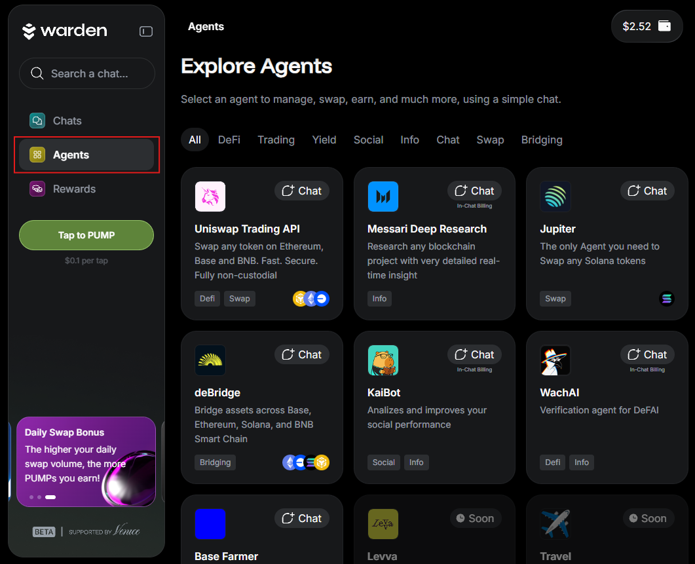

# Explore AI Agents

## Overview

Unlock the full potential of Warden with **AI Agents**! They allow you to swap, bridge, research, and much more through a simple chat interface.

In the sections below, you'll find the list of available Agents—and more are coming soon!

## Access Agents

You can explore and select Agents in the **Agent Hub**:

1. Log in: 👉 [Warden](https://app.wardenprotocol.org)
2. Click the **Agent Hub** icon in the top-right corner of the screen.
3. [Fund your wallet](manage-assets#deposit-assets) on any of the chains supported by the preferred Agent.
3. Select an Agent. If required, review and accept the legal terms.
4. After selecting an Agent, you'll be forwarded to the [chat screen](use-the-chat).

Alternatively, you can access Agents directly from the chat screen. Use the drop-down menu at the top to switch quickly between the Agents:

## Available Agents

### Warden AMA Agent

The **Warden AMA Agent** is the default Agent you see when logging in to Warden. It's not displayed in the Agent Hub, but you can always switch to it in the [chat](use-the-chat).

This Agent performs all your Web3 transactions and handles other tasks:

- [Sends or swaps](manage-assets#send-or-swap-assets) tokens on all the supported chains
- Checks your balances
- Generates an image based on a text description
- Answers any questions about Warden and the [Warden Protocol](https://docs.wardenprotocol.org)

Supported networks:

- **Ethereum**
- **Solana**
- **Base**

Fees: [swap](fees#swap-fees) and [transfer fees](fees#transfer-fees).

### Uniswap Trading API

The **Uniswap Trading API** allows sending and swapping tokens on the supported chains through [Uniswap](https://app.uniswap.org)—a decentralized crypto exchange built on Ethereum. Swaps are fully non-custodial: they're handled directly from your wallet without any third party holding your assets.

Just specify the network, currency pair, and amount in the chat, and the Agent will do the rest:

- Swap ETH for any token
- Exchange tokens for each other
- Send ETH or any token to a destination address

Supported networks:

- **Ethereum**
- **Base**

Fees: [swap](fees#swap-fees) and [transfer fees](fees#transfer-fees).

:::note
To start using this Agent, you need to read and agree to the Uniswap Labs terms of service and privacy policy.
:::

### Messari Deep Research

The **Messari Deep Research** Agent integrates with [Messari](https://messari.io)—the leading provider of crypto market intelligence products that help professionals navigate the Web3 space.

Use this Agent to research any blockchain project with detailed, real-time insight: discover trending tokens on a specific chain, generate meme coin reports, analyze NFT market dynamics, and much more.

Fees: [Messari fees](fees#messari-fees).

### Jupiter Agent

The **Jupiter Agent** integrates with the [Jupiter Exchange](https://jup.ag)—a decentralized exchange (DEX) aggregator built on the Solana blockchain. This is the only Agent you need to send and swap any Solana tokens.

Just specify the amount and other details in the chat, and the Agent will do the rest:

- Swap SOL for any Solana token
- Swap tokens for each other
- Send SOL or any token to a destination address

Supported networks: **Solana**.

Fees: [swap](fees#swap-fees) and [transfer fees](fees#transfer-fees).

### Coming soon

The Agent lineup keeps growing. Here's what to expect next:

- **DeBridge**
- **ApexLiquid**
- **Intelligent DCA**
- **Levva**
- **KaiBot**
- **The Quantfather**
- **Venice**
- **WachAI**
- **Warden Bufett**
- **The Butler**
