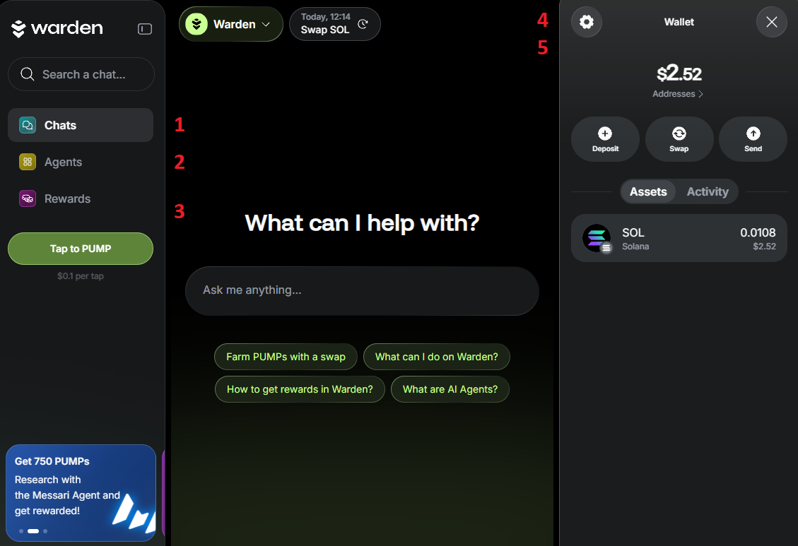

# Introduction

## Overview

Try the app: 👉 [Warden](https://app.wardenprotocol.org)

**Warden** is your **Agentic Wallet**, built on [Warden Protocol](https://docs.wardenprotocol.org). It lets you interact with **AI Agents** to perform tasks across both Web2 and Web3 ecosystems.

With seamless Web3 integration and a focus on privacy, decentralization, and accessibility, the app offers a smooth, user-friendly experience.

Whether you're a seasoned pro, a meme coin trader, or just getting started—Warden will simplify your crypto journey.

## Key components

Here are the main components of Warden:

- **Chat commands**: You can perform complex Web3 actions, such as swapping and transferring assets, using simple chat commands.
- **Agent execution**: Under the hood, Warden utilizes [AI Agents](https://docs.wardenprotocol.org/learn/glossary#ai-agent) to execute the complexities of transactions and interactions.
- **Accessibility**: The app is free, private, and uncensored.
- **Gamification**: You can create and grow your own coin to earn crypto.

These components work together to create a powerful tool for you to navigate the complexities of the crypto world with ease and efficiency.

## Main features

Within Warden, you can do the following:

1. [Use the AI chat](warden-app/use-the-chat)
2. [Explore AI Agents](warden-app/explore-ai-agents)
3. [Manage your wallets](warden-app/manage-your-wallets)
4. [Trade](warden-app/trade)
5. [Predict](warden-app/predict)
6. [Play Betflix](warden-app/play-betflix)
7. [Earn rewards](warden-app/earn-rewards)
8. [Stake $WARD](warden-app/stake-ward)

## Supported networks

Currently, Warden supports the following networks:

- **[Warden Protocol](https://docs.wardenprotocol.org/learn/introduction-to-warden)**
- **Ethereum**
- **Solana**
- **Base**
- **BNB Smart Chain (BSC)**
- **Arbitrum**

More chains are coming soon—stay tuned!

:::tip
To start transacting on a chain, [fund your wallet](warden-app/manage-your-wallets#deposit) with its native coin—for example, **SOL on Solana**. Then you can receive other tokens available on the network.
:::
