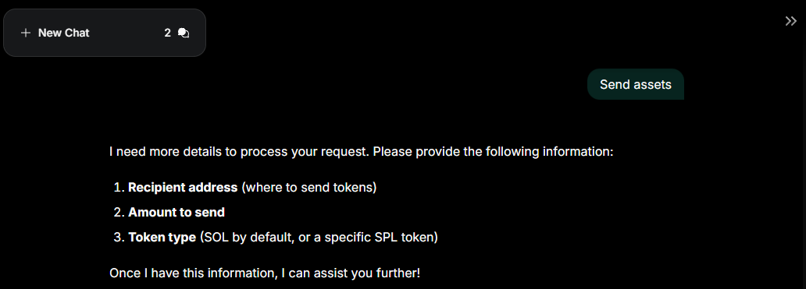

---
sidebar_position: 5
---

# Manage assets

## Overview

This guide explains how to view, deposit, send, or swap your **assets** in Warden.

## View the balance & activity

You can access your balances and activity in the [wallet](manage-your-wallet):

1. Log in: 👉 [Warden](https://app.wardenprotocol.org)
2. Click the wallet icon in the top-right corner.
3. You'll see the **Assets** tab with a detailed breakdown of your balances.
4. To explore your activity history and transaction details, open the **Activity** tab.

Alternatively, you can ask the default [Warden Agent](explore-ai-agents#warden-agent) about your balances.

:::tip
Funds for **trading** and for **Betflix** are kept separately from your main balance. Learn more: [trading wallet](trade#manage-the-trading-wallet), [Betflix wallet](play-betflix#manage-betflix-wallet).
:::

## Deposit assets

To start transacting on a chain, fund your wallet with its native coin—for example, **SOL** on **Solana**. Then you can receive other tokens available on the network.

To deposit an asset to your wallet, take the following steps:

1. Log in: 👉 [Warden](https://app.wardenprotocol.org)
2. Click the wallet icon in the top-right corner.
3. Select **Deposit**.
4. Select one of the [supported networks](/#supported-networks).
5. Select one of these options:
   - **Pay with card**: Pay through MoonPay.
   - **Transfer from wallet**: Link a Web3 wallet and deposit funds from it. 
   - **Receive funds**: Copy your wallet address or scan the QR code.

:::tip
To view and unlink your linked wallets, see the [account settings](manage-your-wallet#configure-the-wallet).
:::

## Send or swap assets

In Warden, you can send or swap assets using simple **chat commands**:

1. Log in: 👉 [Warden](https://app.wardenprotocol.org)
2. Make sure your [wallet is funded](#deposit-assets).
3. In the [Chats tab](use-the-chat#start-chatting), ask the [Warden Agent](explore-ai-agents#warden-agent) to **send** or **swap** an asset.
4. Provide the required details and confirm the transaction in the chat.
5. The Agent will share the transaction details with you. You can also check your [activity history](#view-the-balance--activity).

Before you start, keep in mind this:

- When specifying the recipient, you can refer to your [favorite addresses](manage-your-wallet#configure-the-wallet) by name.
- All swaps and transfers are subject to fees: see the [Fees](fees) section for details.
- You can use any other [asset management Agent](explore-ai-agents#asset-management-agents).
