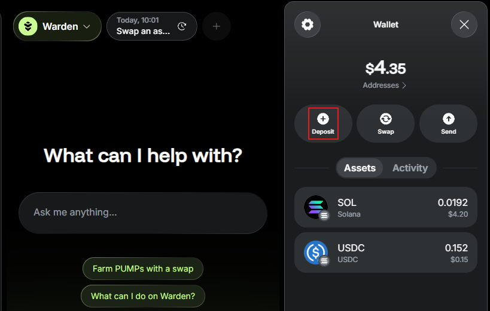

# Manage assets

## Overview

This guide explains how to view, deposit, send, or swap your **assets** in the Warden App.

## View the balance

You can access your balance and a detailed breakdown of assets in the [wallet](manage-your-wallet).

Just log in to the [Warden App](https://app.wardenprotocol.org) and click the wallet icon in the top right.

## Deposit assets

To deposit an asset, take the following steps:

1. Log in: 👉 [Warden App](https://app.wardenprotocol.org)
2. Click the wallet icon in the top-right corner.
3. Select **Deposit**.
4. Select one of these options:
   - **Pay with card**: Pay through MoonPay.
   - **Transfer from wallet**: Link a Web3 wallet and deposit funds from it. 
   - **Receive funds**: Copy your wallet address or scan the QR code.

:::tip
To view and unlink your linked wallets, see the [account settings](manage-your-wallet#configure-the-wallet).
:::

## Send or swap assets

In the Warden App, you can send or swap assets using simple **chat commands**.

Make sure your [wallet is funded](#deposit-assets) and follow these steps:

1. Log in: 👉 [Warden App](https://app.wardenprotocol.org)
2. In the chat box, ask the [AI assistant](use-the-ai-assistant) to **send** or **swap** an asset. Alternatively, you can initiate a transfer by clicking **Send** in your wallet.
4. Provide the required details and confirm the transaction in the chat.
5. The assistant will share the transaction details with you. You can also find them anytime in your [activity history](manage-your-wallet#view-the-balance--activity).

:::tip
When specifying the recipient, you can refer to your [favorite addresses](manage-your-wallet#configure-the-wallet) by name.
:::

