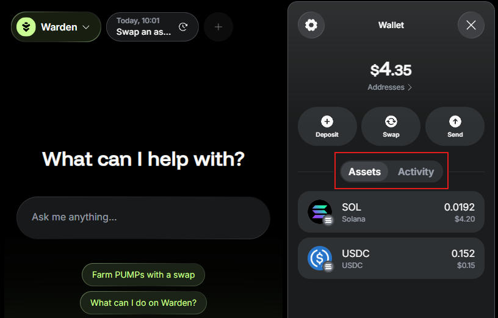
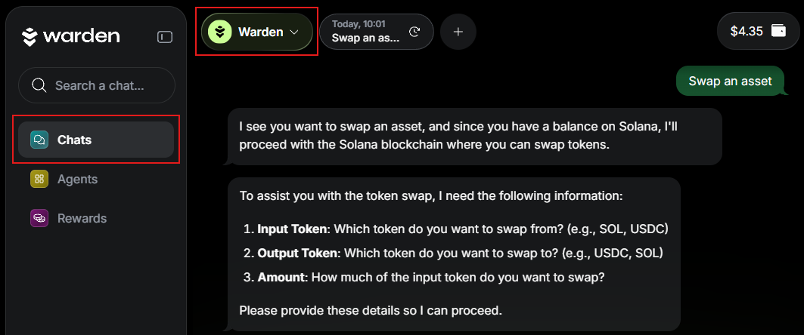

# Manage assets

## Overview

This guide explains how to view, deposit, send, or swap your **assets** in Warden.

## View the balance

You can access your balance and a detailed breakdown of assets in the [wallet](manage-your-wallet). Simply log in to [Warden](https://app.wardenprotocol.org) and click the wallet icon in the top right:

You'll see your assets and activity:

## Deposit assets

To start transacting on a chain, fund your wallet with its native coin—for example, **SOL** on **Solana**. Then you can receive other tokens available on the network.

To deposit an asset to your wallet, take the following steps:

1. Log in: 👉 [Warden](https://app.wardenprotocol.org)
2. Click the wallet icon in the top-right corner.
3. Select **Deposit**.
4. Select one of the [supported networks](#supported-networks).
5. Select one of these options:
   - **Pay with card**: Pay through MoonPay.
   - **Transfer from wallet**: Link a Web3 wallet and deposit funds from it. 
   - **Receive funds**: Copy your wallet address or scan the QR code.

:::tip
To view and unlink your linked wallets, see the [account settings](manage-your-wallet#configure-the-wallet).
:::

## Send or swap assets

In Warden, you can send or swap assets using simple **chat commands**.

Make sure your [wallet is funded](#deposit-assets) and follow these steps:

1. Log in: 👉 [Warden](https://app.wardenprotocol.org)
2. In the chat box, ask the [AI assistant](use-the-chat) to **send** or **swap** an asset. Alternatively, you can initiate a transfer by clicking **Send** in your wallet.
4. Provide the required details and confirm the transaction in the chat.
5. The assistant will share the transaction details with you. You can also find them anytime in your [activity history](manage-your-wallet#view-the-balance--activity).

:::tip
When specifying the recipient, you can refer to your [favorite addresses](manage-your-wallet#configure-the-wallet) by name.
:::

