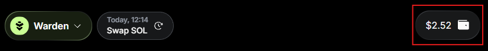
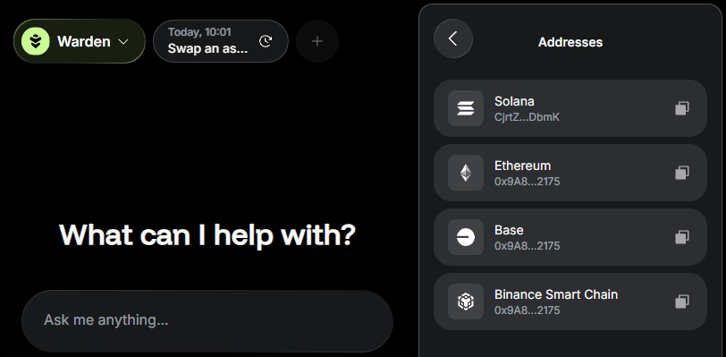

# Manage your wallet

## Overview

The **wallet** represents your account on Warden. Here you can [manage your assets](manage-assets): view your balance and activity and initiate transactions.

This guide explains how to access and configure your wallet: whitelist addresses, manage authentication methods, and more.

## Access your wallet

To access your wallet, simply do this:

1. Log in: 👉 [Warden](https://app.wardenprotocol.org)
2. Click the wallet icon in the top-right corner.

## Get your address

To copy your wallet address, [open the wallet](#access-your-wallet) and take these steps:

2. Click **Addresses**.
3. Select an address associated with the desired network.

## Configure the wallet

To access your Warden account settings, [open your wallet](#access-your-wallet) and click the gear icon on the top:

The following settings are available:

- **Favorite Addresses**: Whitelist addresses to reference them by name in the [AI chat](use-the-chat).
- **Security**: Manage your private keys and passkeys.
- **Login**:
  - Link and unlink Web3 wallets (for [depositing assets](manage-assets#deposit-assets)).
  - Add an authentication method.

## Export your wallet

You can [export your wallet](https://privy-io.notion.site/Transferring-your-account-9dab9e16c6034a7ab1ff7fa479b02828) by copying its private key. [Open the wallet](#access-your-wallet) and take these steps:

1. Click the gear icon on the top to access account settings.
2. In the **Security** section, click your private key on the desired network.
3. Click **Copy key**.

:::warning
Never share your private key with anyone. It grants full access to your assets.
:::

