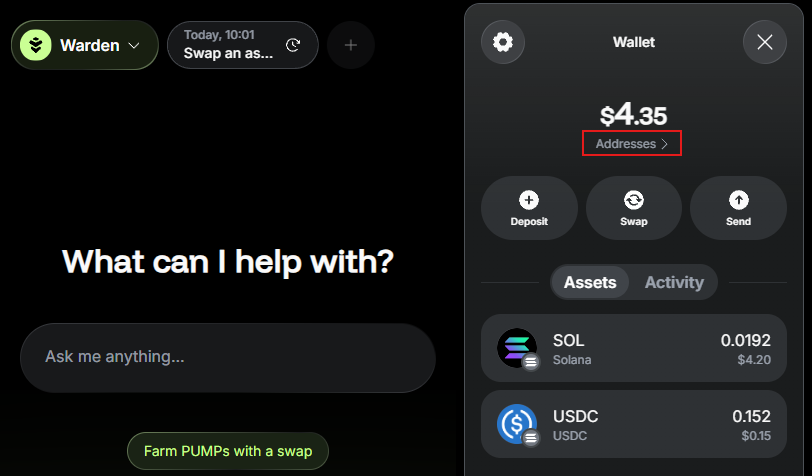

# Manage your wallet

## Overview

The **wallet** represents your account on Warden. Here you can [manage your assets](manage-assets): view your balance and activity and initiate transactions.

This guide explains how to access and configure your wallet: whitelist addresses, manage authentication methods, and more.

## Access your wallet

To access your wallet, simply do this:

1. Log in: 👉 [Warden](https://app.wardenprotocol.org)
2. Click the wallet icon in the top-right corner.

## Configure the wallet

To configure your account, take the following steps:

1. Click the wallet icon in the top-right corner.
2. Click the gear icon and configure the following options:
   - **Linked Wallets**: View and unlink Web3 wallets you've [deposited assets](manage-assets#deposit-assets) from.
   - **Favorite Addresses**: Whitelist addresses to reference them by name in the [AI chat](use-the-chat).
   - **Security** Manage your private keys and passkeys.
   - **Login**: Add an authentication method: **Email**, **Google**, **Twitter**, or **Telegram**.

## Get your address & key

To copy your wallet address, take these steps:

1. Click the wallet icon in the top-right corner.
2. Click **Addresses**.
3. Select an address associated with the desired network.

To get your private key, do this:

1. Click the gear icon to open Settings.
2. In the **Security** section, click your private key on the desired network.
3. Click **Copy key**.

:::warning
Never share your private key with anyone. It grants full access to your assets.
:::
