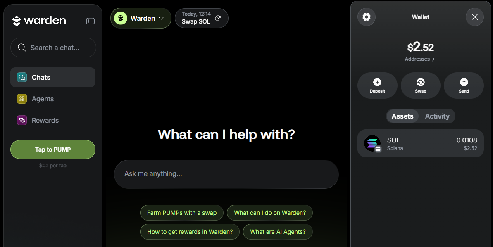

# Manage your wallet

## Overview

This guide explains how to manage your **wallet (account)** in Warden.

In the wallet, you can view your balance and activity, whitelist addresses, manage authentication methods, and more.

## View the balance & activity

To view your balance and activity, take these steps:

1. Log in: 👉 [Warden](https://app.wardenprotocol.org)
2. Click the wallet icon in the top-right corner of the screen.

Here you can do the following:

- View your balance and [manage your assets](manage-assets)
- See a breakdown of your assets in the **Assets** tab
- Review your activity and transaction details in the the **Activity** tab

## Configure the wallet

To configure your account, take the following steps:

1. Click the wallet icon in the top-right corner.
2. Click the gear icon and configure the following options:
   - **Linked Wallets**: View and unlink Web3 wallets you've [deposited assets](manage-assets#deposit-assets) from.
   - **Favorite Addresses**: Whitelist addresses to reference them by name in the [AI chat](use-the-chat).
   - **Security** Manage your private keys and passkeys.
   - **Login**: Add an authentication method: **Email**, **Google**, **Twitter**, or **Telegram**.

## Get your address & key

To copy your wallet address, take these steps:

1. Click the wallet icon in the top-right corner.
2. Click **Addresses**.
3. Select an address associated with the desired network.

To get your private key, do this:

1. Click the gear icon to open Settings.
2. In the **Security** section, click your private key on the desired network.
3. Click **Copy key**.

:::warning
Never share your private key with anyone. It grants full access to your assets.
:::
