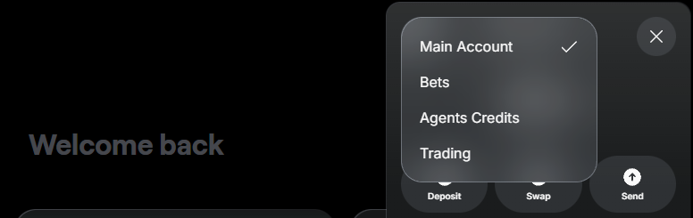

---
sidebar_position: 5
---

# Manage your wallets

## Overview

This guide explains how to manage your Warden wallets:

- [Main account](#main-account): The main wallet holding your assets on the supported chains.
- [Dedicated wallets](#dedicated-wallets): Special wallets used for Agent and trading fees.

## Access your wallets

You can access your wallets from any Warden tab:

1. Log in: 👉 [Warden](https://app.wardenprotocol.org)
2. Click the wallet icon at the top-right to open the wallet panel.
3. Use the menu at the top to switch between your accounts:
   - **Main account**: [Your main account](#main-account)
   - **Agents Credits**: [The Agents Credits wallet](#agents-credits)
   - **Trading**: [The trading wallet](#trading)
   - **Bets**: [The Betflix wallet](#betflix)

## Main account

The **main account** is the main Warden wallet holding your funds on all the supported chains. Here you can view your balances and activity and initiate transactions.

You can also configure and manage your account: whitelist addresses, get your private key, and link external accounts, such as Web3 wallets, emails, and social accounts.

### Deposit

To start transacting on a chain, you need to fund your main account with its native coin—for example, **SOL on Solana**. Then you'll be able to receive other tokens available on the network.

To deposit an asset, take the following steps:

1. Log in: 👉 [Warden](https://app.wardenprotocol.org)
2. Click the wallet icon in the top-right corner.
3. Make sure that **Main Account** is selected.
4. Click **Deposit**.
5. Select one of the [supported networks](/#supported-networks).
6. Select one of these options:
   - **Pay with card**: Pay through MoonPay.
   - **Transfer from wallet**: Link a Web3 wallet and deposit funds from it. 
   - **Receive funds**: Copy your wallet address or scan the QR code.
7. Follow the instructions.

:::tip
To view and unlink your linked wallets, see the [account settings](#configure).
:::

### Send or swap

You can send or swap assets in your main account using simple **chat commands**:

1. Log in: 👉 [Warden](https://app.wardenprotocol.org)
2. Make sure your [main account is funded](#deposit).
3. Initiate a transaction. There are two ways to do it:
   - In the main account, click **Swap**/**Send**. This will start a chat.
   - In the **Chats** section, ask the [Warden Agent](explore-ai-agents#warden-agent) to send or swap an asset.
4. Provide the required details and confirm the transaction in the chat.
5. The Agent will share the transaction details with you.

Alternatively, you can use any other [AI Agent](explore-ai-agents) that supports sending or swapping assets. For bridging, use the [deBridge Agent](explore-ai-agents#debridge).

:::note
Transactions are subject to [transfer](fees#transfer-fee) and [swap fees](fees#swap-fees).
:::

:::tip Tips
- When specifying the recipient, you can refer to your [favorite addresses](#configure) by name.
- You can check your history in the wallet's **Activity** tab.
:::

### View your assets

To view your balances and activity, do this:

1. [Open the main account](#access-your-wallets).
2. See the **Assets** and **Activity** tabs.

Alternatively, you can go to the **Chats** section and ask the default [Warden Agent](explore-ai-agents#warden-agent) about your balances.

### Get the address

To copy your wallet address (the public key), take these steps:

1. [Open the main wallet](#access-your-wallets).
2. Click **Addresses**.
3. Select an address associated with the desired network.

### Configure

To access your Warden account settings, [open any wallet](#access-your-wallets) and click the gear icon at the top:

The following options are available:

1. **Favorite Addresses**: Whitelist an address. You can reference your favorite addresses by name in the [AI chat](use-the-chat).
2. **Security**:
   - To manage your passkeys, click **Passkeys**.
   - To export your wallet, click your private key on the desired network and then click **Copy key**. Never share your private key with anyone—it grants full access to your assets. To learn more, see [Privy docs](https://privy-io.notion.site/Transferring-your-account-9dab9e16c6034a7ab1ff7fa479b02828). 
3. **Login**: Here you can link and unlink external accounts:
   - **Linked Wallets**: Link Web3 wallets (for [depositing assets](#deposit)).
   - **Email** & **Google**: Add an authentication method.
   - **Twitter**, **Telegram**, **Discord**: Link your social accounts.
4. **Integrations**: Connect or disconnect third-party services required by certain Agents, such as [Google Assistant](explore-ai-agents#google-assistant).

## Dedicated wallets

**Dedicated wallets** are special wallets where Warden stores funds for some of the AI Agents and trading.

:::tip
You can fund your dedicated wallets only from the [main account](#main-account).
:::

### Agents Credits

The **Agents Credits wallet** is a dedicated place where Warden stores your **Agents Credits**, which are used to pay certain [AI Agents](explore-ai-agents). The balance is held as **USDC on Base**.

This is how you can fund this wallet from the [main account](#main-account):

1. Log in: 👉 [Warden](https://app.wardenprotocol.org)
2. Click the wallet icon in the top-right corner.
3. Select **Agents Credits**.
4. Click **Deposit**.
5. Enter the amount and confirm.

Once you interact with an Agent using Agent Credits, you'll see your activity right in the wallet.

:::tip
To deposit and pay for gas, make sure your main account has **USDC and ETH** on **Base**.
:::

:::warning
Currently, withdrawals aren't allowed.
:::

### Trading

The **trading wallet** is a dedicated place where Warden stores your perpetual trading balance to protect assets in the [main account](#main-account).

Learn more: [Perpetual trading](trade#trading-wallet).

### Betflix

The **Betflix wallet** is a dedicated place where Warden stores your Betflix balance to protect assets in the [main account](#main-account).

Learn more: [Play Betflix](play-betflix#betflix-wallet).
