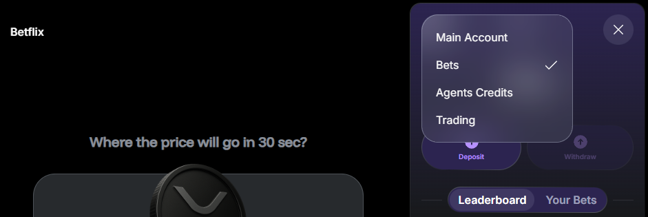

---
sidebar_position: 7
---

# Play Betflix

## Overview

You can trade with **Betflix**, Warden's Tinder-style prediction game.

Note that Betflix balance is kept [in a separate wallet](#manage-the-betflix-wallet).

:::tip
Warden also supports advanced trading tools. Learn more in the [Trade](trade) section.
:::

## Rules

The rules of Betflix are very simple:

- Swipe right or left to instantly go short or long on crypto assets.
- Each round lasts 5, 15, or 30 seconds depending on the coin.
- Positions are auto-closed or liquidated.
- Outcomes are instantly displayed.

Gameplay details:

- To play, you need **USDC on Solana**.
- The bet is fixed: **$2**/**5**/**10** per round with fixed **100x leverage**.
- Supported coins: **DOGE**, **PEPE**, **BONK**, **WIF**, **SHIB**, **TRUMP**, and more.
- All bets are subject to fees. Learn more: [Betflix fees](fees#betflix-fees).
- Top traders [earn PUMPs](#earn-pumps).

## Start playing

To start playing, you need **USDC on Solana** (**$6** or more):

1. Log in: 👉 [Warden](https://app.wardenprotocol.org)
2. If you don't have USDC on Solana, [deposit it to your main account](manage-your-wallets#deposit).
3. In the left menu, open the **Betflix** tab.
4. In the right panel, you'll see the [Betflix wallet](#manage-the-betflix-wallet). Click **Deposit** and add USDC from your main account.
5. Start playing:
   - Choose your bet: **$2**/**5**/**10**
   - Swipe right → Go long
   - Swipe left → Go short
   - Swipe up → Don't trade

## Earn PUMPs

By playing Betflix, you join the **League of Traders**: each swipe contributes to your **hourly**, **daily**, and **weekly** rankings, based on profit and streaks.

Top traders earn [PUMPs](earn-rewards#earn-pumps)—points that reward your activity in Warden:

- Hourly league: 1st–3rd ranks
- Daily league: 1st–5th ranks
- Weekly league: 1st–5th ranks

[Check your stats](#check-your-stats) in the Betflix wallet to view all leaderboards and the exact rewards.

## Manage the Betflix wallet

### Access

Warden stores your Betflix balance in a separate **Betflix wallet**, held as **USDC on Solana**. This protects assets in your [main account](manage-your-wallets#the-main-account).

To switch between the main and Betflix wallets at any time, click the wallet icon at the top right and select **Main Account** or **Bets** at the top of the wallet:

### Deposit & withdraw

This is how to move funds between your Betflix wallet and the main account:

1. Open the Betflix wallet.
2. Click **Deposit** or **Withdraw**.
3. Enter the amount and confirm. Deposits start from **$6**, and withdrawals from **$1**.
4. Warden will transfer USDC on Solana from or to your main account.

:::tip
To deposit, make sure your main account has **USDC on Solana**.
:::

### Check your stats

In the Betflix wallet, you can also view the game statistics:

- The **Leaderboard** tab displays your [League of Traders](#earn-pumps) ranking:
  - You can select the **Hourly**, **Daily**, or **Weekly** leagues.
  - To see rewards for each rank, click the information icon next to the winners list.
- The **Bets** tab displays your recent plays and results.

