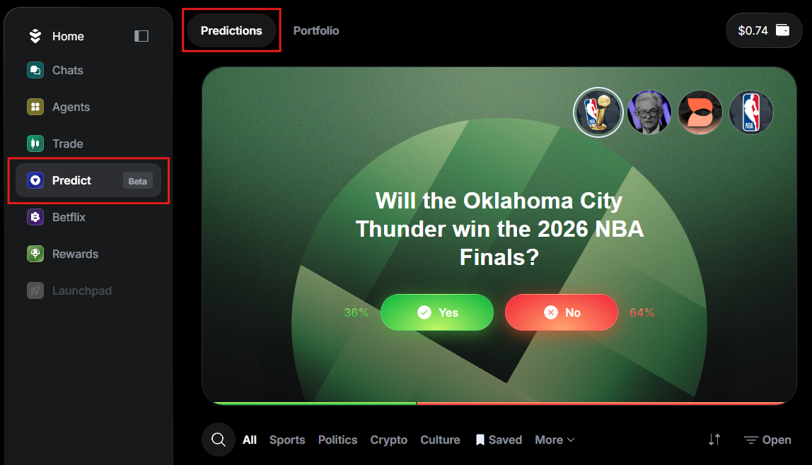
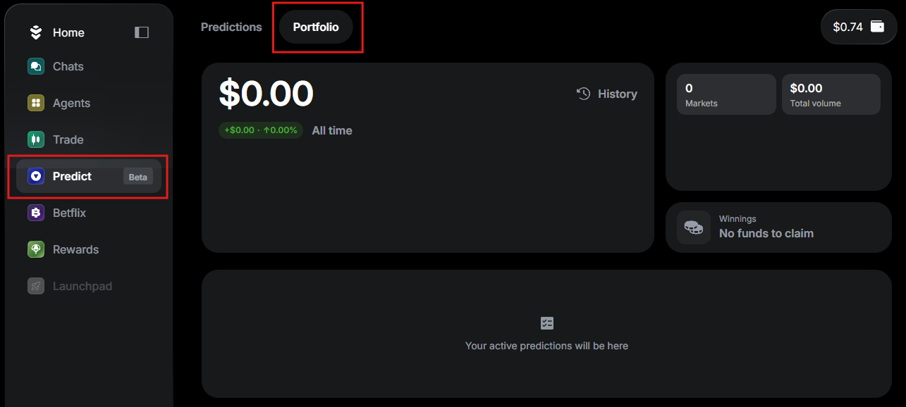
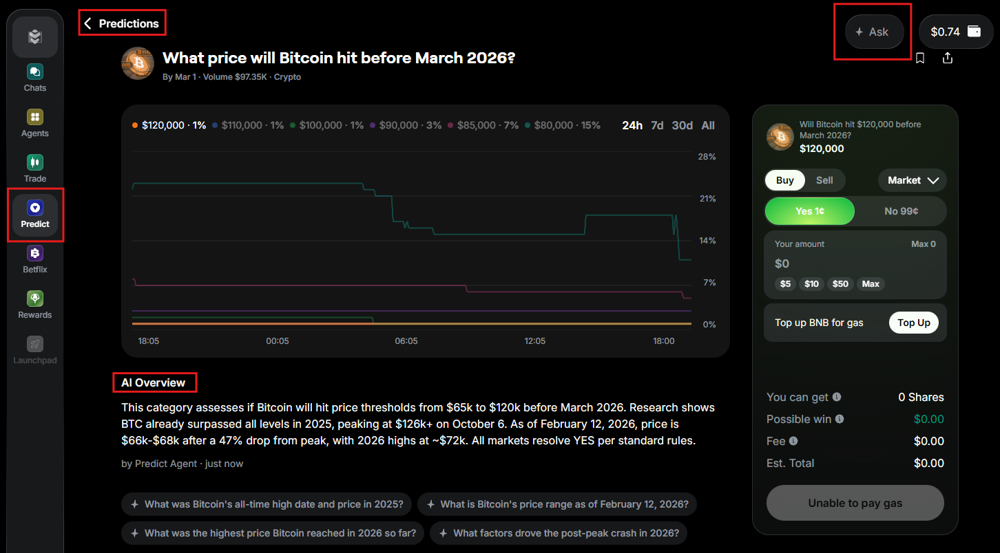
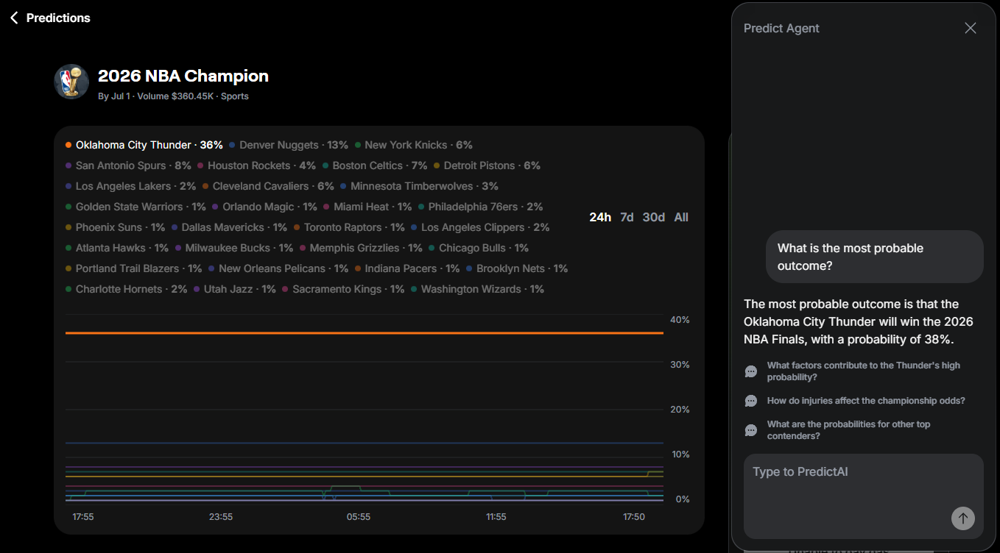

---
sidebar_position: 7
---

# Predict

:::important
This feature is currently in Beta.
:::

## Overview

Warden's **Predictions**, powered by [Predict.fun](https://predict.fun) and paired with the **Predict Agent**, allow you to trade real-world events with the help of the AI.

Warden supports various markets: sports, politics, crypto, and culture. You can explore them using our AI Agent and live data, place orders, and manage your portfolio.

To learn more, read this article.

## Create an order

To start predicting, you need **USDT on BNB Smart Chain**. Take these steps:

1. Log in: 👉 [Warden](https://app.wardenprotocol.org)
2. In the left menu, select **Predict**.
3. In the **Predictions** tab, select and explore any of the available markets.
4. If you don't have USDT on BNB, click **Top Up** and follow the instructions.
5. Select **Yes** or **No**.
6. Select the order type: **Market** or **Limit**.
7. Set other parameters (depending on the order type).
8. Confirm.

:::tip
Before placing an order, you can [analyze the market](#analyze-the-market).
:::

## Manage your portfolio

To view and manage your portfolio, open the **Predict** section and switch to the **Portfolio** tab:

## Analyze the market

After selecting an event in the **Predictions** tab, you access the following market analysis tools:

- **The live chart** displaying predictions
- **The AI overview** of the market
- **The Predict Agent** providing insights on the market and probable outcomes

I can analyze prediction markets for the Brentford vs Arsenal game, providing insights on probabilities for outcomes such as wins for either team or a draw, along with relevant statistics and reasoning behind those estimates.

