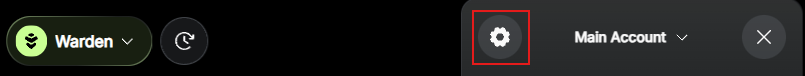

# Register for the airdrop

## Overview

Registration for the [WARD](https://docs.wardenprotocol.org/ward/introduction) airdrop is going live.

You can sign up through the **Airdrop Registration Portal** in Warden. Before registering, you may need to prepare your account—follow this guide to learn more.

:::warning
Make sure that you only access the Airdrop Registration Portal through [Warden](https://app.wardenprotocol.org). Do not click any external or social links. 
:::

## Important information

- All registration happens in [Warden](https://app.wardenprotocol.org). We'll **never** ask you to connect your wallet to any third-party website.
- You must have an active [Warden account](manage-your-wallets#the-main-account) to register and claim rewards.
- Linking any external wallet or account must happen **before** the registration.
- Registration does not guarantee rewards. Allocations will be provided at the claiming stage.
- Users who do not register will not be able to participate in the claiming phase.

## 1. Prepare your account

Before registering, make sure your [Warden account](manage-your-wallets#the-main-account) is ready. The steps below depend on your user type.

### Warden users

Your Warden account already contains all the necessary information, and no additional action is required. Just [register](#2-register) on the Airdrop Registration Portal.

### Kaito yappers

Before registering on the Airdrop Registration Portal, link your X account to your Warden account.

1. Log in: 👉 [Warden](https://app.wardenprotocol.org)
2. Click the wallet icon at the top right. This will open your account.
3. Go to **Settings** by clicking the gear icon.
4. In the **Login** section, link your X (Twitter) account to your Warden account.

After this, you can [register for the airdrop](#2-register).

:::note
Once your X is linked, we'll track the mindshare you generated during the Kaito Pre-TGE campaign. Remember: the Kaito campaign required use of Warden.
:::

### WARP holders & stakers

Before registering on the Airdrop Registration Portal, link your wallets containing **WARP** or **staked WARP** to your Warden account:

1. Identify your wallets containing WARP or staked WARP on [YieldWard](https://yieldward.com).
2. Log in: 👉 [Warden](https://app.wardenprotocol.org)
3. Click the wallet icon at the top right. This will open your account.
4. Go to **Settings** by clicking the gear icon.
5. In the **Login** section, click **Linked Wallets** and follow the instructions.

After this, you can [register for the airdrop](#2-register).

### OPEN OG

To qualify for the airdrop, you must meet **both** of the following requirements:

- The minimum required amount of **LVVA** or **staked LVVA**
- The unique NFT on **Base**, owned by the same wallet address that holds LVVA

:::important
If you meet only one of the requirements, you will not be able to participate in the claiming stage. 
:::

Before registering on the Airdrop Registration Portal, link your wallets containing these assets to your Warden account:

1. If you hold or stake your LVVA tokens on Levva, make sure that the unique NFT is owned by the same wallet address, even though the NFT is on Base.
2. Log in: 👉 [Warden](https://app.wardenprotocol.org)
3. Click the wallet icon at the top right. This will open your account.
4. Go to **Settings** by clicking the gear icon.
5. In the **Login** section, click **Linked Wallets** and follow the instructions.

After this, you can [register for the airdrop](#2-register).

### Ambassadors

Every **ambassador** needs to link their X and Discord accounts:

1. Log in: 👉 [Warden](https://app.wardenprotocol.org)
2. Click the wallet icon at the top right. This will open your account.
3. Go to **Settings** by clicking the gear icon.
4. In the **Login** section, link your X (Twitter) and Discord.

After this, you can [register for the airdrop](#2-register).

### Wallchain Quacks holders

The distribution for **Wallchain Quacks** will happen through [Wallchain](https://www.wallchain.xyz). Registration is not required at this stage unless you qualify under another category.

## 2. Register

After [preparing your Warden account](#1-prepare-your-account), you can sign up in the **Airdrop Registration Portal**:

