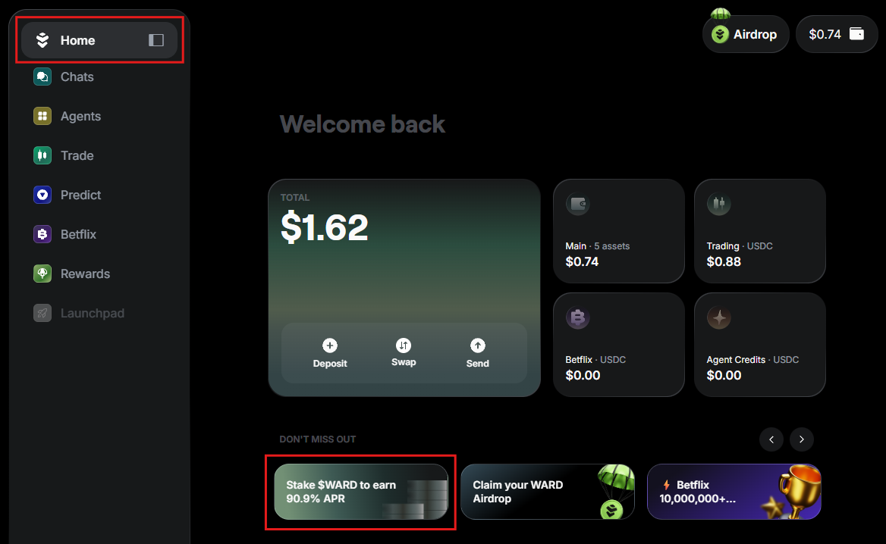
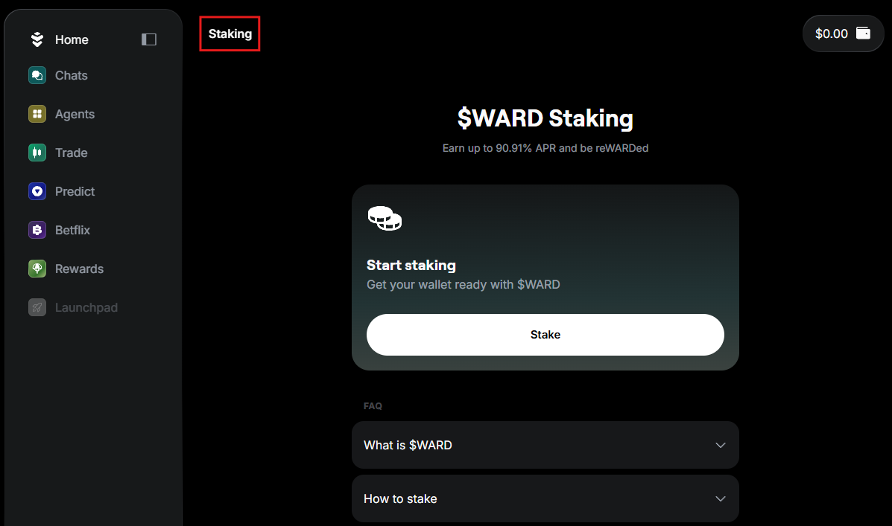
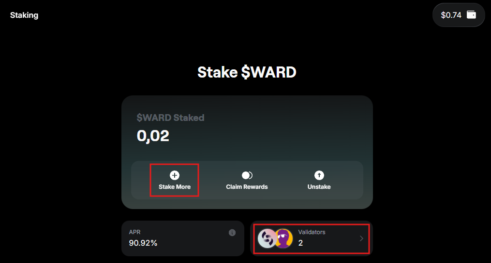
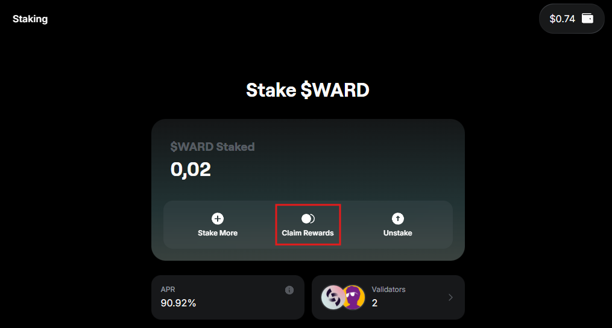

# Stake $WARD

## Overview

[$WARD](https://docs.wardenprotocol.org/ward/introduction) is the native token of Warden Protocol.

If you hold $WARD, you can **stake** it to participate in the network's security and earn **rewards**. The more you stake, the more rewards you receive!

This section explains how to stake $WARD, claim rewards, stake more, or unstake.

:::note
When staking, you **delegate** your tokens to a preferred **validator** acting on your behalf. To learn more, see [Warden validators](#warden-validators).
:::

## Access staking

To access staking, open [Warden](https://app.wardenprotocol.org) and click **Stake $WARD** on the home screen:

## Stake

To start staking on Warden, take these steps:

1. Log in: 👉 [Warden](https://app.wardenprotocol.org).
2. Make sure your [Warden wallet](manage-your-wallets#main-account) holds enough $WARD.
3. On the home screen, click **Stake $WARD**.
4. On the staking screen, click **Stake**.
5. Select a validator. You can sort and filter the list.
6. Enter the amount to stake.
7. Confirm the transaction.

Your $WARD will be delegated to the selected validator, and you'll start [earning rewards](#earn--claim). Warden will display your portfolio on the staking screen.

:::important
Please note that validators charge **commissions**. The amount varies.
:::

:::note
To learn more about validators, see [Warden validators](#warden-validators).
:::

## Stake more

You can always **stake more**.

On the [staking screen](#access-staking), click **Stake More** or the list of validators from your portfolio:

## Earn & claim

**Staking rewards** are distributed automatically by the network. They accrue **over time** based on the following:

- The amount you've staked
- How your [validator](#warden-validators) performs

You can **claim** any portion of your accumulated rewards at any time:

1. On the [staking screen](#access-staking), click **Claim**.
2. Enter the amount.
3. Confirm the transaction.

You'll immediately receive $WARD to your main account.

## Unstake

You can **unstake** any portion of your staked $WARD at any time:

1. On the [staking screen](#access-staking), click **Unstake**.
2. Select the validator you want to unstake from.
3. Enter the amount to unstake.
4. Confirm.

There is an **unbonding period of 14 days** during which your tokens will be locked before they become available in your wallet again.

## Warden validators

**Validators** are nodes that participate in the consensus process to secure the Warden Protocol network. They validate transactions an produce new blocks. By staking, you **delegate** your $WARD to a validator and earn a share of the rewards.

:::tip
When selecting validators on Warden, you can sort them by the following parameters: **total staked**, **voting power**, and **commission**. Learn more: [How to choose a validator?](https://docs.wardenprotocol.org/operate-a-node/delegation-plan#how-to-choose-a-validator)
:::

Here are all available Warden validators:

- [Crosnest](https://www.cros-nest.com)
- [POSITIVA](https://positiva.pro)
- WardenLabs
- [Unity Nodes](https://unitynodes.com)
- [Citadel.one](https://citadel.one)
- [Coinage x DAIC](https://daic.capital)
- [AlxVoy⚡ANODE.TEAM](https://anode.team)
- [AKNodes](https://aknodes.com)
- [UTSA](https://utsa.gitbook.io/services/)
- [polkachu.com](https://polkachu.com)
- [LithiumDigital](https://www.lithiumdigital.com/staking)
- CoreNode
- [Cumulo](https://cumulo.pro)
- [TrustedPoint](https://trusted-point.com)
- [POSTHUMAN 🧬 StakeDrop](https://www.posthuman.digital)
- [CroutonDigital](https://crouton.digital)
- [LiveRaveN](https://services.liveraven.net)
- [Allnodes](https://www.allnodes.com)
- [Lavender.Five Nodes](https://www.lavenderfive.com)
- [Nodes.Guru](https://nodes.guru)
- [DTEAM](https://dteam.tech)
- stakeFi
- [CryptoSJnet](https://cryptosj.net)
- [MictoNode](https://mictonode.com)
- [ITRocket](https://itrocket.net)
- AM Solutions
- [StakeUp](https://stakeup.tech)
- [EQLab](https://eqlab.io)
- [Inter Blockchain Services](https://ibs.team)
- [breskulpeak.com](https://www.breskulpeak.com)
- The Warden Guards
- [Brightlystake](https://brightlystake.com)
- MZONDER
- [WardenIndonesia](https://t.me/wardenprotocol_id)
- [VALIDARIOS](https://validarios.com)
