---
sidebar_position: 6
---

# Trade

## Overview

In Warden, you can use **perpetual contracts** (**trade perps**) to trade on future price movements of underlying token without actually owning them. Currently, Warden supports [Hyperliquid](https://hyperfoundation.org) perps.

Warden's **AI Trading Terminal** brings real-time market analysis tools directly into your trading screen so you make informed decisions before placing a trade. This includes AI signals, an order book, and a chart with technical indicators and drawing tools. You can either trade manually or use automated Strategies.

This guide explains how to open and manage your positions, manage the trading wallet, and use market analysis tools. To learn more about perps and the related concepts, see [Glossary](#glossary).

:::warning
Perpetual Trading involves significant risk, including potential loss of all funds due to leverage and volatility, and may not suit all users.
:::

:::tip
Want to trade just for fun? Try [Betflix](play-betflix).
:::

## Get started

### Access the Trading Terminal

**AI Trading Terminal** is a place in Warden where you can open perpetual trading positions and analyze market data. To access the Terminal, do this:

1. Log in: 👉 [Warden](https://app.wardenprotocol.org)
2. Open the **Trade** tab.

You'll see the Terminal interface, where you can do the following:

1. Switch between [manual trading](#manual-trading) and [strategies](#trading-with-strategies).
2. Select a perp to trade
3. [Create an order](#create-an-order)
4. [Manage your trade](#manage-your-trade)
5. [Manage the trading wallet](#trading-wallet)
6. [Analyze the market](#analyze-the-market)
7. [Earn reWARDs](#earn-rewards)

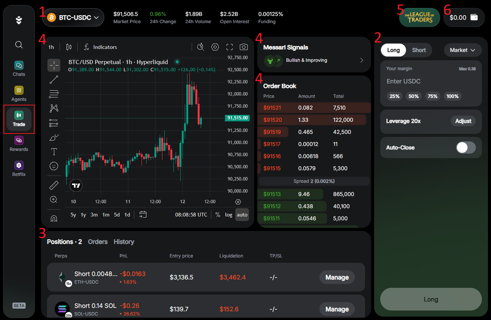

### Prepare funds

To start trading, you need **USDC** on **Arbitrum**, **Ethereum**, **Base**, or **BSC** (**$6** or more):

1. Log in: 👉 [Warden](https://app.wardenprotocol.org)
2. If you don't have USDC, [deposit it to your main account](manage-your-wallets#deposit).
3. In the left menu, open the **Trade** tab to access the AI Trading Terminal.
4. Click the wallet icon at the top right to open the [trading wallet](#trading-wallet).
5. In the trading wallet, click **Deposit** and add USDC from your main account.

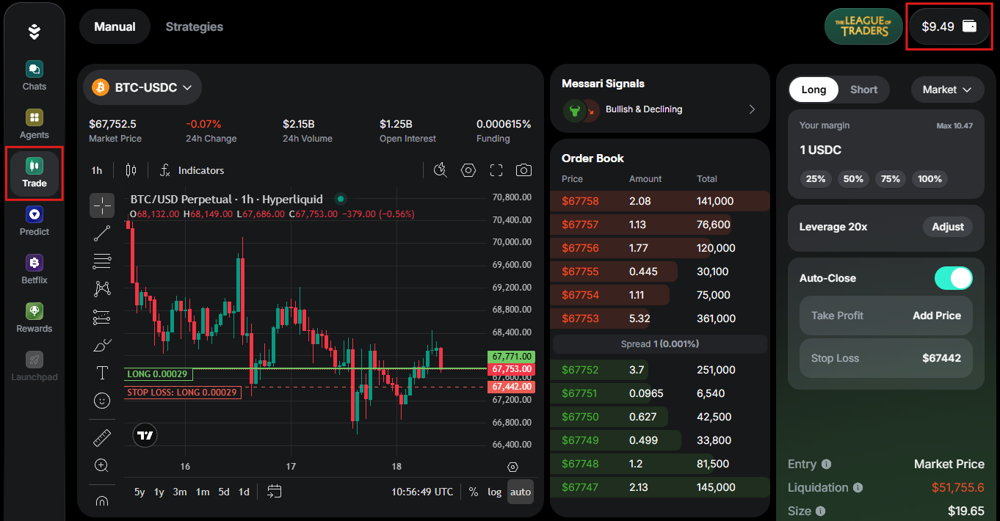

## Manual trading

### Create an order

An **order** is an instruction to buy or sell a perpetual contract. Warden supports **market** and **limit orders** ([learn more](#order)). Once you [prepare funds](#prepare-funds) in your trading wallet, you can create an order.

[Open the AI Trading Terminal](#access-the-trading-terminal) and do this:

1. If it's your first trade, click **Start Trading** and confirm your consent.
2. Select a token pair from the drop-down menu at the top left.
3. In the configuration panel at the right, set your [order parameters](#order-parameters).
4. Click **Long**/**Short** at the bottom of the configuration panel.
5. Review your order details and confirm opening a position.

:::note
Selecting a pair determines the perp you'll trade. Tokens (base currencies) are usually paired with **USDC** or **USDH**: BTC-USDC, ETH-USDC, OPENAI-USDC, and so on.
:::

:::tip Tips
- Before selecting a perp, you can [analyze the market](#analyze-the-market).
- To see only [builder-deployed perps](https://hyperliquid.gitbook.io/hyperliquid-docs/hyperliquid-improvement-proposals-hips/hip-3-builder-deployed-perpetuals), filter the pair list by **HIP-3**.
:::

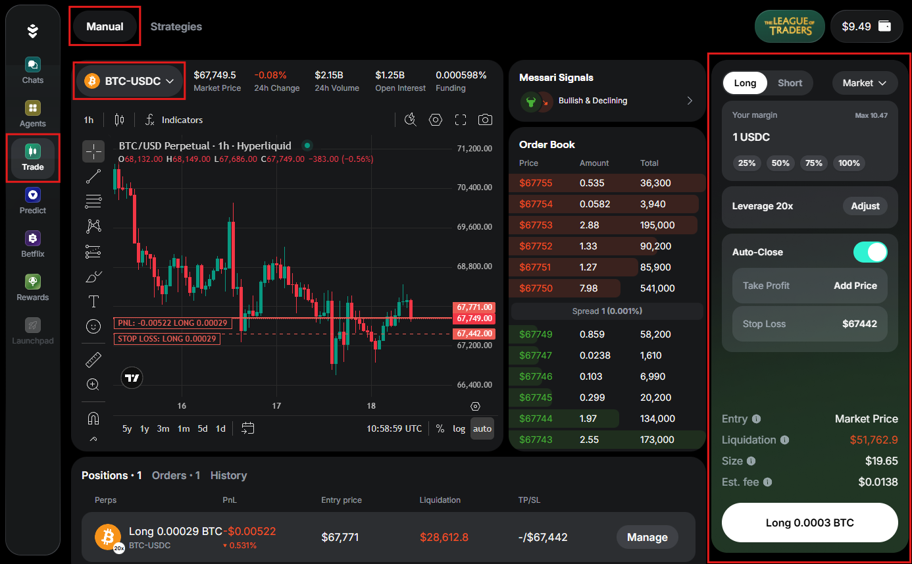
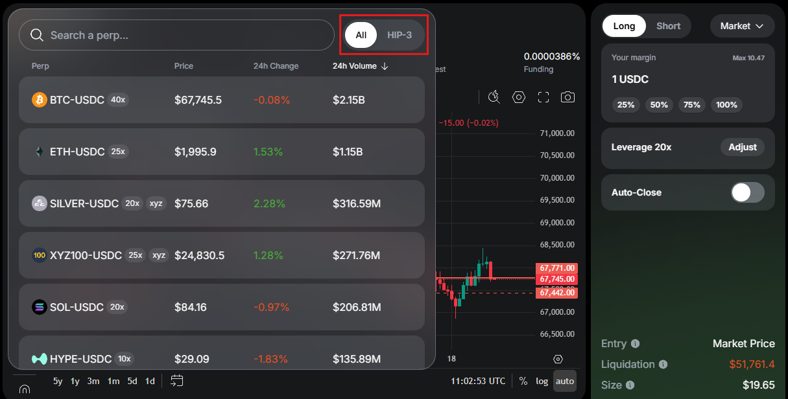

### Manage your trade

After you [create an order](#create-an-order), it **executes (fills)**. Execution may open new [positions](#position), modify existing ones, or partially close them. Opening positions is subject to [trading fees](fees#trading-fees).

:::note Notes
- Market orders fill immediately at the best available price, and limit orders fill when the price reaches your target price ([learn more](#order)).
- Perps use a single combined position per token. For example, if you already have a position in BTC and place another BTC order in the same direction, the fill will update the size of the position and your effective leverage.
:::

In the [AI Trading Terminal](#access-the-trading-terminal), you can track and manage your positions and orders. See the tabs in the bottom panel:

- **Positions**: Your open positions—the resulting perp exposure.
- **Orders**: Your orders that aren't fully executed yet. This includes unfilled parts of partially filled limit orders.
- **History**: Filled and canceled orders.

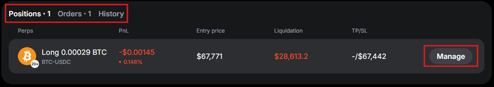

To manage an open position or a limit order, click the **Manage** button next to it. You can do the following:

- Enable or disable **Auto-Close**, setting **Take Profit** and **Stop Loss** if needed. 
- To close your position or cancel order, click **Close**/**Cancel Order** and confirm. You'll see the closed position in the **History** tab.
- To cancel all orders, click **Cancel All** in the **Orders** tab.

:::tip Tips
- Next to each position, you can see its [liquidation price](#liquidation). You can avoid liquidation by enabling [Auto-Close](#order-parameters).
- You can also manage your active trades and view historical trades on the [live chart](#analyze-the-market).
:::

### Order parameters

When [creating an order](#create-an-order), you can set the following parameters in the configuration panel:

- **Long**/**Short**: A setting indicating whether your position will benefit when the [spot price](#spot-price) moves up (long) or down (short).
- **Order Type**: The order type.
  - **Market**: Orders that fill immediately at the best available perp price.
  - **Limit**: Orders that fill at a price you set (or better).
- **Price** (only for limit orders): The price at which you wish to open your position. Long orders fill at the target price or lower, and shorts at the target price or higher.
- **Amount**: The token amount to trade, set in USDC.
- **Leverage**: Your [leverage](#leverage)—a multiplier defining how strongly the token's price movements affect your gains and losses. It can be **2–40x** depending on the token.
- **Auto-Close**: Automatically close your position when the market price reaches the thresholds you set:
    - **Take Profit**: The upper price where your position closes to secure profit.
    - **Stop Loss**: The lower price where your position closes to cut losses. This helps prevent [liquidation](#liquidation).

:::tip
You can adjust **Auto-Close** even after creating an order. See [Manage your trade](#manage-your-trade).
:::

:::note
When you enable **Auto-Close** (**Take Profit**/**Stop Loss**), Warden creates additional conditional orders that work alongside your main order.
:::

There are also additional parameters that are automatically calculated based on your settings:

- **Margin**: Your security deposit ([learn more](#margin)).
- **Entry**: The estimated price at which your position would open if your order were executed now.
- **Liquidation**: The price at which your position will be automatically closed to prevent further losses.
- **Size**: The total value (overall exposure) of your position, determined by your margin and leverage.
- **Est. fee**: The total fee for opening a position. See [trading fees](fees#trading-fees).

## Trading with Strategies

### Understand Strategies

Instead of executing trades manually, you can use **Strategies on Warden**.

A **Strategy** is an automated trading system that executes, rebalances, and optimizes positions on your behalf. Once you allocate funds to a Strategy, it operates automatically while you retain full control of your capital and benefit from advanced trading infrastructure.

Warden currently offers a curated selection of **Hyperliquid Strategies**, giving you exposure to multiple assets through highly liquid markets and fast order execution.

More Strategies will be added over time.

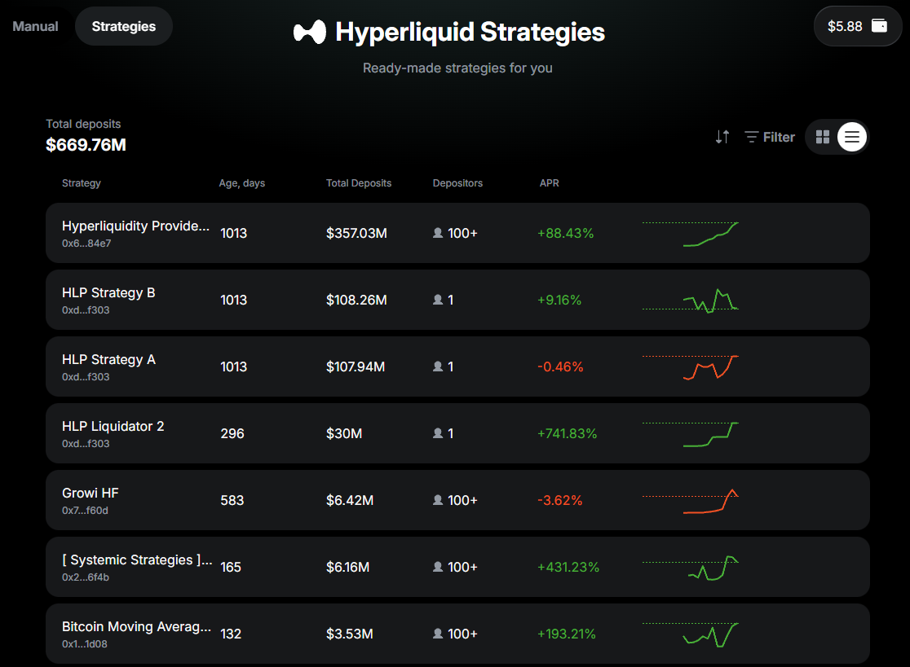

### Use a Strategy

Once you [prepare funds](#prepare-funds) in your trading wallet, you can start using Strategies.

[Open the AI Trading Terminal](#access-the-trading-terminal) and do this:

1. On the top of the screen, switch to the **Strategies** tab.
2. Explore available Strategies. Use the search bar to discover more.
3. Click the preferred Strategy and view its metrics and details.
4. If you wish to use this Strategy, click **Use Strategy**.
5. Allocate **$5 or more** from your [trading wallet](#trading-wallet).
6. Confirm the transaction.

:::important
Upon allocation, your funds will be temporarily locked: you'll be able to [withdraw your deposit](#manage-your-portfolio) only after the **lockup period**. You can check the exact time on the deposit screen, before confirming the transaction. 
:::

:::tip
Each Strategy displays the key metrics to help you make an informed decision:
- TVL: Total Value Locked
- Period: The investment timeframe
- APR %: Projected annual returns
- Number of users: Community participation
:::

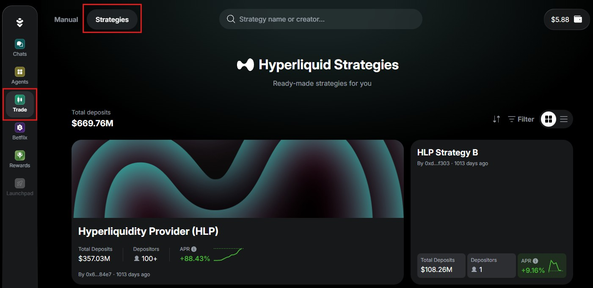
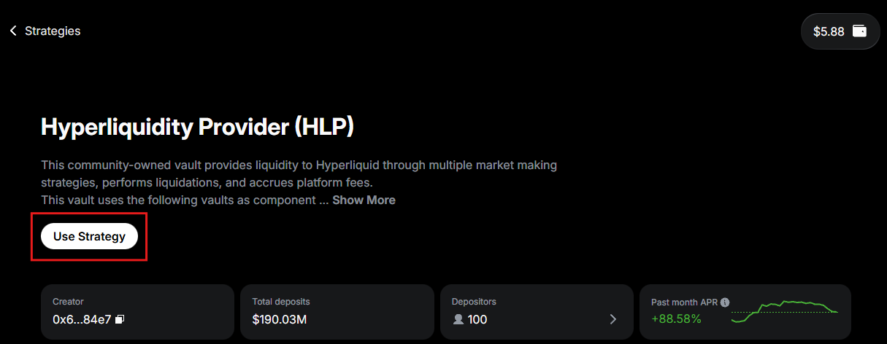
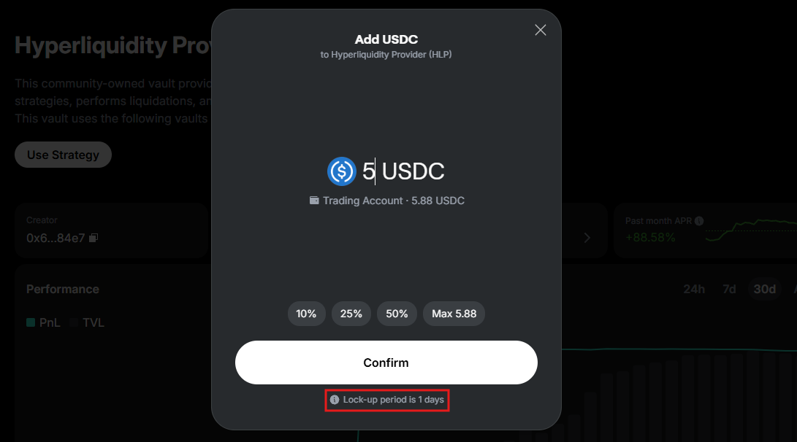

### Manage your portfolio

After [allocating funds](#use-a-strategy) to a Strategy, you can track and manage your positions in [the AI Trading Terminal](#access-the-trading-terminal):

1. Open the **Strategies** tab. You'll see your positions under **Portfolio**.
2. Click **View** next to any position to open its Strategy.
3. At the top of the screen, you can do this:
   - View your position details
   - Click **Add USDC** to allocate more funds to the Strategy
   - Click **Withdraw** to withdraw or check the lockup period

:::tip
Strategies support both partial and full withdrawal.
:::

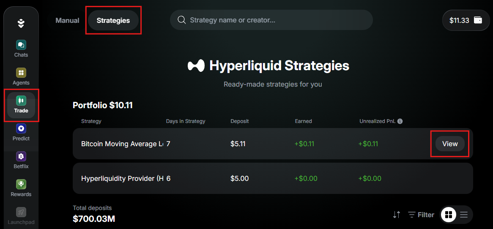
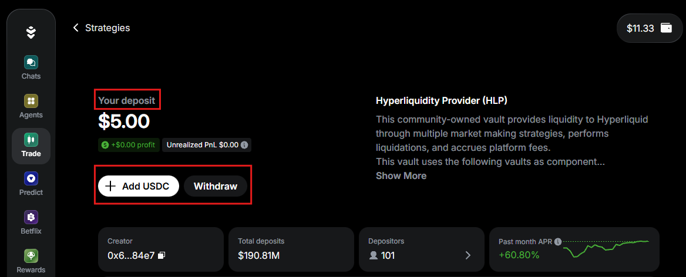
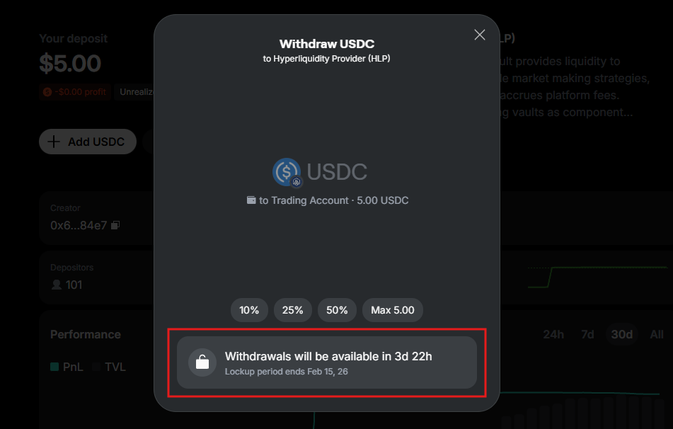

## Trading wallet

### Access

Warden stores your perpetual trading balance in a separate **trading wallet**, held as **USDC on Arbitrum**. This protects assets in your [main account](manage-your-wallets#main-account) from being [liquidated](#liquidation).

To switch between the main and trading wallets at any time, click the wallet icon at the top right and select **Trading** or **Main Account**.

:::note
The balance you see here is only your **withdrawable amount**.
:::

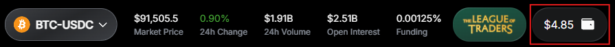

### Deposit

The trading wallet holds its balance on **Arbitrum**, but you can fund it from almost any of the supported chains (see below), as long as you have **USDC** in your main account:

1. Open the trading wallet.
2. Click **Deposit**.
3. Enter the amount and confirm. Deposits start from **$6**.
4. Warden will transfer USDC from your main account.

Depositing is [subject to fees](fees#trading-wallet-fees), which vary depending on the chain.

:::tip
To deposit, make sure your main account has **USDC** on these chains:

- **Arbitrum**
- **Ethereum**
- **Base**
- **BNB Smart Chain (BSC)**
:::

:::note
When depositing, you'll see your **consolidated USDC balance** across all the supported chains. Depositing on Arbitrum is a **native transaction**, so it's the fastest. Deposits from other chains are **automatically bridged to Arbitrum**. You don't have to handle gas fees or bridging—Warden does everything for you.
:::

### Withdraw

The balance you see in the trading wallet is your **withdrawable amount** of **USDC on Arbitrum**. This is how you can withdraw to the main account:

1. Open the trading wallet.
2. Click **Withdraw**.
3. Enter the amount and confirm. Withdrawals start from **$2**.
4. Warden will transfer USDC to your main account.

:::warning
Each withdrawal is subject to a [Hyperliquid fee](fees#trading-wallet-fees) of **1 USDC**.
:::

### Check your stats

In the trading wallet, you can also view your statistics:

- The **Leaderboard** tab displays your [League of Traders](#earn-rewards) ranking:
  - You can select the **Weekly** and **Monthly** leagues, **PnL** or **Volume**.
  - To see rewards for each rank, click the information icon next to the winners list.
- The **Activity** tab displays your activity in the wallet.

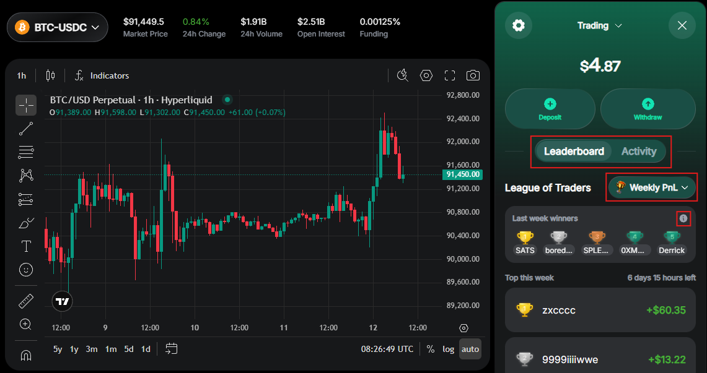

## Extras

### Analyze the market

In the [AI Trading Terminal](#access-the-trading-terminal), you can access various market analysis tools helping you make informed decisions on your trades:

- **The live chart** displays perp price movements. It supports multiple chart types, technical indicators, drawing tools, and more. Here you can also view your historical trades and [manage your active trades](#manage-your-trade).
- **The order book** is a real-time list of all active buy and sell orders. It shows available amounts at each price level, letting you see market liquidity and the spread between bids and asks.
- **Messari Signals** powered by [Messari](https://messari.io) are AI-generated token reports. For deeper insights, use the [Messari Deep Research](explore-ai-agents#messari-deep-research) Agent.

:::note
The market data for the chart and order book is provided by [Hyperliquid](https://hyperfoundation.org).
:::

### Earn reWARDs

Once your all-time total trade volume reaches **$100**, you qualify to join the **League of Traders** and start receiving [reWARDs](earn-rewards#earn-reward-points)—points that reward your activity in Warden.

You earn rewards for every position closed within a **15-minute** cycle (when reWARDs are distributed):

- Reward (reWARDs) = **trade volume (USD) x 30 x your multiplier**.
- Trade volume  = **price x size (base currency) x leverage**.
- The multiplier is based on your total trade volume:
  - 1x for volume >= $100
  - 2x for volume >= $500
  - 3x for volume >= $1,000
  - 5x for volume >= $10,000

In the **League of Traders**, there are two **weekly** and two **monthly** leaderboards based on **PnL** and **volume**. Top traders in each ranking earn extra reWARDs:

- Weekly PnL & Volume leagues: 1st–5th ranks
- Monthly PnL & Volume leagues: 1st–5th ranks

To view all leaderboards and the exact rewards, [check your trading wallet](#check-your-stats) or click the League of Traders icon at the top right:

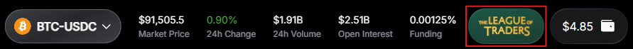

:::note
Since distributions of reWARDs run at 15-minute intervals, leaderboard stats may update with a delay.
:::

### Glossary

#### Trade perp

A **trade perp** (**perpetual contract**) is a never-expiring derivative that tracks the [spot price](#spot-price) of a specific token. Such contracts allow you to do the following:

- Trade on future price movements without owning the underlying tokens
- Maintain your [positions](#position) for as long as you meet the required [margin](#margin)

#### Position

A **position** is your participation (exposure) in a [perp](#trade-perp), typically with [leverage](#leverage). Positions are created or changed when [orders](#order) are executed (filled). Opening positions on Warden is subject to [trading fees](fees#trading-fees).

There are two position types you can take:

- A **long position** means you expect the [spot price](#spot-price) to increase and will profit from it.
- A **short position** will profit when the price moves down.

:::note
Perps use a single combined position per token. For example, if you already have a position in BTC and place another BTC order in the same direction, the fill will update the effective leverage and size (total value) of the position.
:::

#### Margin

**Margin** is the security deposit that keeps your [positions](#position) open. If your margin drops too low because the position is losing money, a [liquidation](#liquidation) will happen: Warden will automatically close the position. Note that Warden uses **cross-margin**: there is one shared margin pool for all positions.

#### Leverage

**Leverage** is a tool that lets you control a larger [position](#position) than the amount of money you commit as [margin](#margin). This magnifies the impact of price changes on your margin. For example, with a 5x leverage, a 1% price move feels like a 5% move on your position.

:::warning
Trading with leverage amplifies gains and losses, increasing the risk of [liquidation](#liquidation).
:::

#### Liquidation

**Liquidation** happens when losses on your [leveraged position](#leverage) reduce your [margin](#margin) to the point where it can no longer cover the risk. To prevent your balance from going negative, Warden automatically closes your position and finalizes the loss.

#### Spot price

The **spot price** is the current market price at which a token can be immediately bought or sold. The [perp](#trade-perp) price remains close to the spot price as a result of [funding rates](#funding-rates).

#### Funding rates

**Funding rates** are small payments that keep the [perp](#trade-perp) price close to the token's [spot price](#spot-price). When the perp price drifts away from the spot price, [long and short](#position) traders pay each other:

- When the perp price is above the spot price, longs pay shorts.
- When the perp price is below the spot price, shorts pay longs.

:::note
No action is needed: Warden handles these payments automatically.
:::

#### Order

An **order** is an instruction to buy or sell a [perp](#trade-perp). Executing (filling) an order may open new [positions](#position), modify existing ones, or partially close them.

Warden supports two order types with different fill conditions:

- A **market order** fills immediately at the best available price.
- A **limit order** fills when its price reaches your selected price or better:
  - Long orders fill at the target price or lower.
  - Short orders fill at the target price or higher.

:::note
Limit orders rest on the [order book](#analyze-the-market) until they can execute. Your order fills only if there are enough buyers or sellers at the target price to match the amount placed on the order book. If only part of the amount is matched, the order fills partially.
:::
